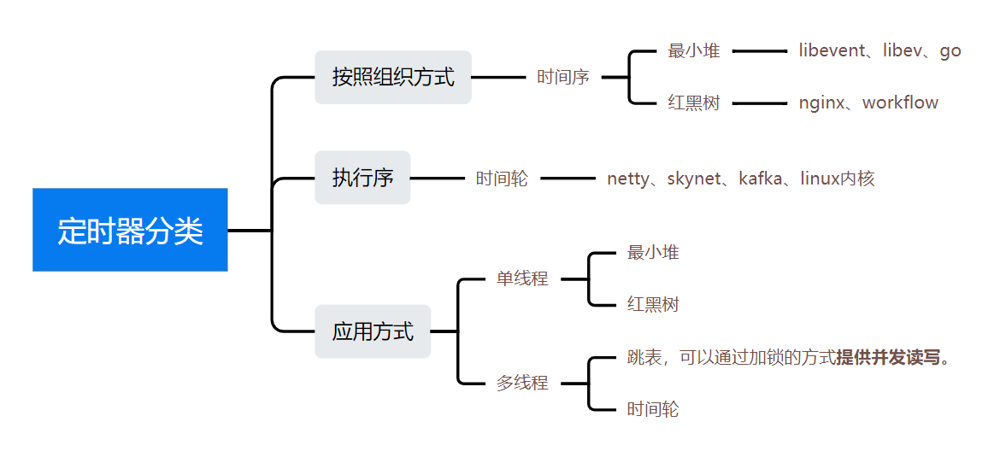
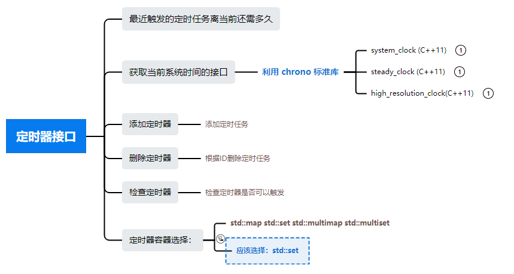

### [C++ 系统组件之定时器 Timer](#)
**介绍**:  定时器是一个系统的基本组件，有许多实现方式：

---

**目录：**

* 时间轮基本知识 [-->](./contents/timer01.md)
* 时间轮的CPP实现 [-->](./contents/timewhell.md)

**定时器分类：**

**接口设计：**

参考链接：

* https://www.zhihu.com/question/38427301/answer/2292652292

