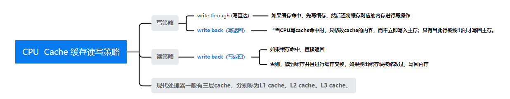
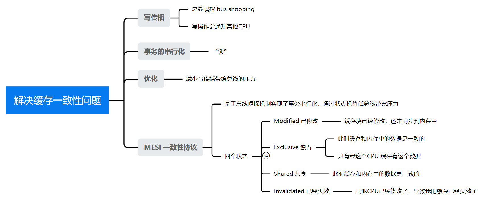

### [C++ 内存模型和原子操作](#)
**介绍**：动态内存模型可以理解为**存储一致性模型**，主要是从行为上来看多个线程对同一个对象读写操作时所做的约束，动态内存理解起来会有少许复杂，涉及到内存、Cache、CPU的各个层次的交互。


-----
- [x] [1. C++ 内存模型](#1-c-内存模型)
- [x] [2. C++ 原子操作](#2-c-原子操作)
- [x] [3. std::atomic](#3-stdatomic)
- [x] [4. std::atomic_flag](#4-stdatomic_flag)
- [x] [5. 内存序](#5-内存序)
- [x] [6. 原子操作相关API](#6-原子操作相关api)
- [x] [7. ABA问题](#7-aba问题)

-----

### [1. C++ 内存模型](#)
**内存模型精确定义了基础构建单元应该如何运转，唯有以内存模型为基石，线程工具才能可靠的工作**。

C++ 内存模型牵涉到两个方面：基本结构和并发，基本机构关系到整个程序在内存中的布局，对并发很重要。就C++而言，基本结构就是对象和内存区域。

<span style="color:#2c73ff;font-weight:600;font-family:宋体" >在C++中对象定义：</span>是某一存储范围，这些对象有些是内置基本类型(int、short、flost...), 还有自定义数据类型例如 机构体、类。其本身是一个对象，由子对象构成！

#### 1.1  <span style="color:red;" >C++内存模型主要涉及以下两个方面</span>

内存模型，准确来说应该是**多线程内存模型**，也叫动态内存模型，**多个线程对同一个对象同时读写时所做的约束**，该模型理解起来要复杂一些，涉及了内存、Cache、CPU各个层次的交互，尤其是在多核系统中为了保证多线程环境下执行的正确性，需要对读写事件加以严格限制。

* **原子操作**：<span  style="color:blue;"> 原子操作是指不能被中断的操作,轻量级的线程同步方案，提供程序并发性能！</span>。在多线程程序中，多个线程可能同时对同一个内存地址进行读写操作，如果这些操作不是原子的，就会发生一些意料之外的错误比如 std::atomic，用于对变量进行原子操作，以保证多线程程序中的正确性。

* **Memory Order**：Memory Order 定义了**读写操作之间的顺序**，C++ 中引入了一些 Memory Order 的概念，用于**约束多线程程序中的读写操作顺序**。例如，C++ 中的 std::memory_order_acquire 和 std::memory_order_release 分别表示在执行读操作之前必须先执行一个同步操作，在执行写操作之后必须执行一个同步操作，以保证多线程程序中的顺序性。
  * std::memory_order就是用来做这事的，它实际上是程序员、编译器以及CPU之间的契约，遵守契约后大家各自优化，从而可能提高程序性能。 std::memory_order，它表示机器指令是以什么样的顺序被处理器执行的 ，一般现代的处理器不是逐条处理机器指令的。


**C++ 中提供了一些原子操作，除了当前线程所在CPU核心能够对这个内存区域进行读写以外，其他核心不能读写**。


**除了原子操作和 Memory Order，C++ 内存模型还涉及以下几个方面：**

* **对象的生命周期**：C++ 中的对象有生命周期，即对象的创建、使用和销毁过程。对于多线程程序，需要考虑对象的生命周期与线程的关系，以避免使用已经被销毁的对象或未被创建的对象。

* **内存分配**：C++ 中的内存分配和释放也可能会影响多线程程序的正确性。例如，如果多个线程同时申请和释放内存，可能会导致内存泄漏或野指针等问题。因此，在多线程程序中，需要使用线程安全的内存分配和释放机制。

* **线程间通信**：在多线程程序中，不同的线程可能需要进行通信，以共享数据或协调工作。C++ 中提供了一些线程间通信的机制，例如 mutex、condition_variable、future 等，用于实现线程间的同步和通信。

* **处理器的缓存**：现代处理器通常会有多级缓存，对于多线程程序，不同的线程可能会访问同一块内存，但它们所在的处理器缓存可能不同。这可能会导致缓存一致性问题，需要使用一些技术来解决，例如缓存一致性协议、MESI 等。


#### [1.2 为什么需要引入原子操作](#)

计算机的内存由一系列的字节组成，每个字节都有一个唯一的地址。程序可以通过变量来引用内存中的某个地址，从而读取或写入该地址的内容。内存模型定义了程序中变量在内存中的存储方式以及读写变量时的规则。

**并发与内存模型的关系**，首先要理解对于一条C++程序代码，可能会被翻译成好几条汇编代码，然后到CPU层面，又会对应好多条指令，即使在同一线程中，彼此没有依赖关系的指令会被乱序执行，再考虑到编译器优化、 处理器优化、Cache。

> 现代处理器允许指令乱序执行，以避免因指令等待资源而导致处理器处于闲置状态，提高执行速度。

> C++程序员想要写出高性能的多线程程序必须理解内存模型，编译器会给你的程序做静态优化，CPU为了提升性能也有动态乱序执行的行为。
```cpp
x = 1;//没有依赖关系，随便它们哪个先执行
y = 2;
```
然后又由于采用多线程来执行代码，程序最终执行的结果，是多个线程交织执行的结果， 指令的乱序执行是必然的事情，我们知道任何线程对数据(对象)的改动都有可能引起条件竞争，同时一些数据对象(双端链表)的修改必须采取正确的修改顺序，不然会导致未定义行为。

总之，实际编程中程序不会完全按照你原始代码的顺序来执行，因此内存模型就是程序员、编译器、CPU之间的契约。编程、编译、执行都会在遵守这个契约的情况下进行，在这样的规则之上各自做自己的优化，从而提升程序的性能。

[**你可能回想，我们利用互斥量加锁的方式来解决这个问题**, 通过互斥量确实可以解决，使得写操作原子化，但是C++还提供了**原子操作**，不用加锁来解决这个问题！](#)


#### [1.3 C++中的原子操作及其类别](#)

在 C++ 编程中引入原子操作是为了确保多个线程之间的并发访问共享变量时，**不用加锁就能够保证操作的原子性和可见性**，从而避免出现数据竞争和不一致的情况。

**原子操作是指在执行期间不能被中断的操作**。原子操作能够保证所有的操作在一个原子操作中执行，要么全部执行成功，要么全部失败，不会出现部分执行的情况。原子操作通常是由硬件提供支持的。

在多线程编程中，共享变量的访问可能存在竞争条件，导致数据不一致或程序崩溃等问题。通过使用原子操作，程序员可以确保每个线程都能够安全地访问共享变量，避免了这些问题。

C++11 引入了 std::atomic 类模板，用于实现原子操作。**std::atomic 提供了各种操作，例如读取、写入和交换操作，以确保并发访问共享变量时的原子性和可见性**。


为 bool 和所有上面列出的整数类型提供如下类型别名：

| 所有 `std::atomic\<type>` 别名     | 说明                                                         |
| --------------------------------- | ------------------------------------------------------------ |
| **atomic_bool**(C++11)            | std::atomic\<bool\> (typedef)                                |
| **atomic_char**(C++11)            | std::atomic\<char> (typedef)                                 |
| **atomic_schar**(C++11)           | std::atomic\<signed char> (typedef)                           |
| **atomic_uchar**(C++11)           | std::atomic\<unsigned char> (typedef)                         |
| **atomic_short**(C++11)           | std::atomic\<short> (typedef)                                 |
| **atomic_ushort**(C++11)          | std::atomic\<unsigned short> (typedef)                        |
| **atomic_int**(C++11)             | std::atomic\<int> (typedef)                                   |
| **atomic_uint**(C++11)            | std::atomic\<unsigned int> (typedef)                          |
| **atomic_long**(C++11)            | std::atomic\<long> (typedef)                                  |
| **atomic_ulong**(C++11)           | std::atomic\<unsigned long> (typedef)                         |
| **atomic_llong**(C++11)           | std::atomic\<long long> (typedef)                             |
| **atomic_ullong**(C++11)          | std::atomic\<unsigned long long> (typedef)                    |
| **atomic_char8_t**(C++20)         | std::atomic\<char8_t> (typedef)                               |
| **atomic_char16_t**(C++11)        | std::atomic\<char16_t> (typedef)                              |
| **atomic_char32_t**(C++11)        | std::atomic\<char32_t> (typedef)                              |
| **atomic_wchar_t**(C++11)         | std::atomic\<wchar_t> (typedef)                               |
| **atomic_int8_t**(C++11)(可选)    | std::atomic\<[std::int8_t](http://zh.cppreference.com/w/cpp/types/integer)\> (typedef) |
| **atomic_uint8_t**(C++11)(可选)   | std::atomic\<[std::uint8_t](http://zh.cppreference.com/w/cpp/types/integer)> (typedef) |
| **atomic_int16_t**(C++11)(可选)   | std::atomic\<[std::int16_t](http://zh.cppreference.com/w/cpp/types/integer)\> (typedef) |
| **atomic_uint16_t**(C++11)(可选)  | std::atomic\<[std::uint16_t](http://zh.cppreference.com/w/cpp/types/integer)> (typedef) |
| **atomic_int32_t**(C++11)(可选)   | std::atomic\<[std::int32_t](http://zh.cppreference.com/w/cpp/types/integer)\> (typedef) |
| **atomic_uint32_t**(C++11)(可选)  | std::atomic\<[std::uint32_t](http://zh.cppreference.com/w/cpp/types/integer)\> (typedef) |
| **atomic_int64_t**(C++11)(可选)   | std::atomic\<[std::int64_t](http://zh.cppreference.com/w/cpp/types/integer)> (typedef) |
| **atomic_uint64_t**(C++11)(可选)  | std::atomic\<[std::uint64_t](http://zh.cppreference.com/w/cpp/types/integer)> (typedef) |
| **atomic_int_least8_t**(C++11)    | std::atomic\<[std::int_least8_t](http://zh.cppreference.com/w/cpp/types/integer)> (typedef) |
| **atomic_uint_least8_t**(C++11)   | std::atomic\<[std::uint_least8_t](http://zh.cppreference.com/w/cpp/types/integer)> (typedef) |
| **atomic_int_least16_t**(C++11)   | std::atomic\<[std::int_least16_t](http://zh.cppreference.com/w/cpp/types/integer)> (typedef) |
| **atomic_uint_least16_t**(C++11)  | std::atomic\<[std::uint_least16_t](http://zh.cppreference.com/w/cpp/types/integer)> (typedef) |
| **atomic_int_least32_t**(C++11)   | std::atomic\<[std::int_least32_t](http://zh.cppreference.com/w/cpp/types/integer)> (typedef) |
| **atomic_uint_least32_t**(C++11)  | std::atomic\<[std::uint_least32_t](http://zh.cppreference.com/w/cpp/types/integer)> (typedef) |
| **atomic_int_least64_t**(C++11)   | std::atomic\<[std::int_least64_t](http://zh.cppreference.com/w/cpp/types/integer)> (typedef) |
| **atomic_uint_least64_t**(C++11)  | std::atomic\<[std::uint_least64_t](http://zh.cppreference.com/w/cpp/types/integer)> (typedef) |
| **atomic_int_fast8_t**(C++11)     | std::atomic\<[std::int_fast8_t](http://zh.cppreference.com/w/cpp/types/integer)> (typedef) |
| **atomic_uint_fast8_t**(C++11)    | std::atomic\<[std::uint_fast8_t](http://zh.cppreference.com/w/cpp/types/integer)> (typedef) |
| **atomic_int_fast16_t**(C++11)    | std::atomic\<[std::int_fast16_t](http://zh.cppreference.com/w/cpp/types/integer)> (typedef) |
| **atomic_uint_fast16_t**(C++11)   | std::atomic\<[std::uint_fast16_t](http://zh.cppreference.com/w/cpp/types/integer)> (typedef) |
| **atomic_int_fast32_t**(C++11)    | std::atomic\<[std::int_fast32_t](http://zh.cppreference.com/w/cpp/types/integer)> (typedef) |
| **atomic_uint_fast32_t**(C++11)   | std::atomic\<[std::uint_fast32_t](http://zh.cppreference.com/w/cpp/types/integer)> (typedef) |
| **atomic_int_fast64_t**(C++11)    | std::atomic\<[std::int_fast64_t](http://zh.cppreference.com/w/cpp/types/integer)> (typedef) |
| **atomic_uint_fast64_t**(C++11)   | std::atomic\<[std::uint_fast64_t](http://zh.cppreference.com/w/cpp/types/integer)> (typedef) |
| **atomic_intptr_t**(C++11)(可选)  | std::atomic\<[std::intptr_t](http://zh.cppreference.com/w/cpp/types/integer)> (typedef) |
| **atomic_uintptr_t**(C++11)(可选) | std::atomic\<[std::uintptr_t](http://zh.cppreference.com/w/cpp/types/integer)> (typedef) |
| **atomic_size_t**(C++11)          | std::atomic\<[std::size_t](http://zh.cppreference.com/w/cpp/types/size_t)> (typedef) |
| **atomic_ptrdiff_t**(C++11)       | std::atomic\<[std::ptrdiff_t](http://zh.cppreference.com/w/cpp/types/ptrdiff_t)> (typedef) |
| **atomic_intmax_t**(C++11)        | std::atomic\<[std::intmax_t](http://zh.cppreference.com/w/cpp/types/integer)> (typedef) |
| **atomic_uintmax_t**(C++11)       | std::atomic\<[std::uintmax_t](http://zh.cppreference.com/w/cpp/types/integer)> (typedef) |


#### [1.4 原子操作使用注意](#)

需要注意的是，std::atomic类型的对象一般是被声明为全局变量或静态变量，以便在多个线程间进行共享访问。在使用原子类型时，还需要注意保证操作的原子性，以避免竞争条件的出现。

大部分原子类型都有一个共同成员函数：**is_lock_free()**

1. **该函数主要用于检查一个原子类型是否支持无锁操作(lock-free operation)**。
2. 所谓无锁操作是指一个原子类型的操作可以在不使用互斥锁的情况下进行，通常使用CPU的硬件支持来实现。在支持无锁操作的平台上，原子类型的操作可以比使用互斥锁更高效地进行。
3. is_lock_free()成员函数返回一个bool值，表示一个原子类型是否支持无锁操作。如果返回true，则表示该原子类型支持无锁操作；如果返回false，则表示该原子类型不支持无锁操作。
4. 需要注意的是，**is_lock_free()成员函数的返回值不保证在所有平台上都相同，因此在编写跨平台代码时，需要谨慎使用该函数的返回值。此外，即使一个原子类型支持无锁操作，使用互斥锁进行操作仍然是一种安全的做法**。


**当使用std::atomic<>泛化模板时，其具备的操作包括**：

* **加载(load)操作**：用于从原子对象中读取当前值并返回。可以使用std::memory_order参数指定内存序(memory order)来控制原子操作的同步方式。
* **存储(store)操作**：用于将给定的值存储到原子对象中。同样可以使用std::memory_order参数控制同步方式。
* **交换(exchange)操作**：用于原子地交换原子对象中的值和给定的值，并返回原来的值。也可以使用std::memory_order参数来指定同步方式。
* **比较并交换(compare_and_exchange, CAS)操作**：用于原子地比较原子对象的当前值和期望值，如果相等则将新值存储到原子对象中。CAS操作可以帮助解决多线程编程中的竞争条件。也可以使用std::memory_order参数来指定同步方式。 
  * compare_exchange_weak
  * compare_exchange_strong
* **原子操作(compare_exchange_strong, compare_exchange_weak)**：与CAS操作类似，不过在比较和交换期间可能进行额外的检查，以避免不必要的CAS操作。compare_exchange_strong()保证CAS操作的强一致性，而compare_exchange_weak()则提供了弱一致性的保证。
* **原子递增(increment)和递减(decrement)操作**：用于原子地增加或减少原子对象的值。也可以使用std::memory_order参数来指定同步方式。

除此之外，std::atomic<>泛化模板还支持一些其他的操作，如fetch_add、fetch_sub、fetch_and、fetch_or、fetch_xor等，这些操作可以原子地执行加法、减法、按位与、按位或和按位异或等运算，并返回操作前的值。同样可以使用std::memory_order参数来指定同步方式。


#### [1.5 存储一致性模型](#)
通常来说，存储一致性模型对访存事件次序施加的限制越弱，越有利于提高性能，但增加了编程难度。且限制越强的存储器模型程序可以在限制较弱的存储器模型上运行，很少会导致错误。

> 如果学习过分布式系统应该好理解一点。

* **顺序一致性模型（SC）**
* **完全存储定序模型（TSO）**
* **部分存储定序模型（PSO）**
* **处理器一致性模型（PC）**
* **弱一致性模型（WO）**
* **释放一致性模型（RC）**
* **松散一致性模型（RMO）**


C++11 提供了**五种内存模型** memory_order_relaxed、memory_order_acquire、memory_order_release、memory_order_acq_rel 和memory_order_seq_cst。


#### [1.6 CPU Cache缓存读写策略](#)
内存的顺序描述了计算机CPU获取内存的顺序，内存的排序可能静态也可能动态的发生：
* 静态内存排序：编译器期间，编译器对内存重排

* 动态内存排序：运行期间，CPU乱序执行


单核CPU的缓存读写策略。



对于多核CPU，那么对同一个内存区域可能会有多个缓存对应多个CPU，多核CPU对缓存的读写就会存在**缓存一致性问题**，原因总结为：

* CPU是多核的，导致缓存是多份的。
* 基于写回策略将会出现缓存不一致的问题。

解决方案：**缓存一致性协议 MESI**！ 



**原子操作只需要阻止M,E两个状态发生改变，就可以实现原子操作**。  避免M可能变成I， 阻止其他核心修改数据，避免M变成S，别让其他核心读此数据，不能看到中间状态。避免E->S 防止其他核心读，避免E->I 防止写核心写当先内存。

 


### [2. C++ 原子操作](#) 
我们都知道为了避免 race condition，线程就要规定代码语句(语句块)的执行顺序。通常我们都是使用 mutex 加锁，后一线程必须等待前一线程解锁才能继续执行。第二种方式是使用原子操作来避免竞争访问同一内存位置。

所谓**原子操作是指不会被线程调度机制打断的操作；这种操作一旦开始，就一直执行到结束，在执行完毕之前不会被任何其它任务或事件中断。原子操作是不可分割的操作，要么做了要么没做，不存在做一半的状态**。

**原子操作**： 在C++程序中不会被打断的程序执行片段！ 比互斥量更加底层，所以效率更高，但是互斥量也有一个好处，就是它可以给一个大代码段进行操作，但是原子操作是作用到单个变量上面！

[**真理: 代码段用互斥量生成临界区，单个变量作为临界资源直接上原子操作！**](#)

使用互斥量解决，运行时间(real    0m0.091s)
```cpp
std::mutex mtx;
int i = 0;

auto add = [](std::mutex &mx,int & value, int times)->void {
    for (int c = 0; c < times; c++) {
        std::lock_guard<std::mutex> guard(mx);
        value++;
    }
};

//最后 i的值 = 两百万
std::thread task1(add, std::ref(mtx), std::ref(i), 1000000);
std::thread task2(add, std::ref(mtx), std::ref(i), 1000000);

task1.join();
task2.join();
std::cout << "the actually value: "<< i << std::endl;
```
原子操作解决，运行时间(real    0m0.027s) 
```cpp
std::atomic\<int> i = 0;
auto add = [](std::atomic\<int> & value, int times)->void {
    for (int c = 0; c < times; c++) value++;
};
//最后 i的值 = 两百万
std::thread task1(add,std::ref(i), 1000000);
std::thread task2(add,  std::ref(i), 1000000);
task1.join();
task2.join();
std::cout << "the actually value: "<< i << std::endl;
```

### [3. std::atomic](#) 
标准原子类型在头文件 **#include \<atomic\>** 和头文件 **\<memory\>** 中定义，这些类型的操作全部都是原子化的，并且C++内置的
原子操作也仅仅支持这些类型。通过互斥量加锁的方式，我们自己也可以自己实现相关操作的原子化！

这些原子类型几乎都具备成员函数 **is_lock_free** 准许使用者判断某一给定类型上的操作是能够由 **原子指令** 直接实现(true)，还是要
**借助编译器和程序库的内部锁**来实现(false)。

```cpp
template< class T >
struct atomic;

//定义在 头文件 <memory> 中！
template< class U >
struct atomic\<U*>;

template<class U>
struct atomic\<std::shared_ptr<U>>;

//<stdatomic.h> 定义 C++ 20
template<class U>
struct atomic\<std::weak_ptr<U>>;
```

#### [3.1 支持原子操作的类型](#)
每个 std::atomic 模板的实例化和全特化定义一个原子类型， 可以在多线程中实现对单个变量操作的原子化，相当于在底层加锁了， 
[相关API https://zh.cppreference.com/w/cpp/atomic/atomic](https://zh.cppreference.com/w/cpp/atomic/atomic) 。

**对整数类型的特化**

以下列整数类型之一实例化时，std::atomic 提供适合于整数类型的额外原子操作，例如 fetch_add、fetch_sub、fetch_and、fetch_or、fetch_xor：

* 字符类型 char、char8_t (C++20 起)、char16_t、char32_t 和 wchar_t；
* 标准有符号整数类型：signed char、short、int、long 和 long long；
* 标准无符号整数类型：unsigned char、unsigned short、unsigned int、unsigned long 和 unsigned long long；

任何标头 \<cstdint\> 中的 typedef 所需的额外整数类型。
另外，结果的 std::atomic\<整数> 特化拥有标准布局、平凡默认构造函数 (C++20 前)和平凡析构函数。定义有符号整数算术为使用补码；无未定义结果。

**对浮点类型的特化**

以无 cv 限定的浮点类型（float、double、long double 和无 cv 限定的扩展浮点类型 (C++23 起)）实例化时，std::atomic 提供适合于浮点类型的额外原子操作，例如 fetch_add 和 fetch_sub。

另外，结果的 std::atomic\<浮点> 特化拥有标准布局和平凡析构函数。

无操作导致未定义行为，即使结果不能以浮点类型表示。有效的浮点环境可能与调用方线程的浮点环境不同。

**对指针类型的特化** 对所有指针类型的部分特化 `std::atomic\<U*>`。

#### [3.2 构造函数](#)
原子对象不支持拷贝构造函数操作！

```cpp
atomic() noexcept = default;
constexpr atomic( T desired ) noexcept;
atomic( const atomic& ) = delete;
```

**operator=**, 不支持返回引用，或者赋值操作！

```cpp
T operator=( T desired ) noexcept;
T operator=( T desired ) volatile noexcept;

atomic& operator=( const atomic& ) = delete;
atomic& operator=( const atomic& ) volatile = delete;
```
#### [3.3 成员函数](#)
成员函数很许多，看看就懂！ **只有可以使用的成员函数支持原子操作**

|函数|说明|
|:----|:----|
|bool is_lock_free()|检查原子对象是否免锁|
|store(T arg,std::memory_order order)|原子地以非原子对象替换原子对象的值|
|load|原子地加载并返回原子变量的当前值|
| **静态 is_always_lock_free** |指示该类型是否始终免锁|
| compare_exchange_weak ||
| compare_exchange_strong ||
|fetch_add(T arg,std::memory_order order)|原子地将参数加到存储于原子对象的值，并返回先前保有的值|
|fetch_sub(T arg,std::memory_order order)|原子地从存储于原子对象的值减去参数，并获得先前保有的值|
|fetch_and(T arg,std::memory_order order)|原子地进行参数和原子对象的值的逐位与，并获得先前保有的值|
|fetch_or(T arg,std::memory_order order)|原子地进行参数和原子对象的值的逐位或，并获得先前保有的值|
|fetch_xor(T arg,std::memory_order order)|原子地进行参数和原子对象的值的逐位异或，并获得先前保有的值|
|自增、自减运算符| `operator++`、`operator++(int)`、`operator--`、`operator--(int)`|
|其他运算符|`operator+=`、`operator-=`、`operator&=`、`operator\|=`、`operator^=`|

```cpp
std::atomic\<int> count;

count++; //支持原子操作

count = count + 1; //不支持原子操作！ cout 的结果不确定！

count.fetch_add(2, std::memory_order_relaxed); //原子操作
```


#### 3.3 compare_exchange_weak和compare_exchange_strong

**这两个函数的区别在于它们在无法成功进行比较和交换时的行为不同** `compare_exchange_weak`函数执行比较和交换操作，并返回一个bool值，表示操作是否成功。如果比较和交换失败，它可能会放弃操作并返回false，也可能重新尝试一次。因此，它的语义更弱一些。

`compare_exchange_strong`函数也执行比较和交换操作，并返回一个bool值。但是，如果比较和交换失败，它保证不会重试，并通过参数返回当前的值。因此，它的语义更强一些。

由于`compare_exchange_weak`可能会重试，所以在一些情况下可能会导致性能损失，但在另一些情况下可能会更加高效。相比之下，`compare_exchange_strong`不会重试，因此在某些情况下可能更适合使用，特别是当你不需要重试且希望获取当前值时。

选择使用哪个函数取决于你的具体需求和代码上下文。你需要权衡使用重试机制带来的性能开销和获取当前值的需求。

```cpp
bool compare_exchange_weak( T& expected, T desired,
     std::memory_order success,
     std::memory_order failure ) noexcept;

bool compare_exchange_weak( T& expected, T desired,
     std::memory_order success,
     std::memory_order failure ) volatile noexcept;

bool compare_exchange_strong( T& expected, T desired,
     std::memory_order success,
     std::memory_order failure ) noexcept;

bool compare_exchange_strong( T& expected, T desired,
     std::memory_order order =
     std::memory_order_seq_cst ) noexcept;
```

|参数|-|说明|
| -------- | ---- | ------------------------------------------------------------ |
| expected | -    | 到期待在原子对象中找到的值的引用。若比较失败则被存储 `*this` 的实际值。 |
| desired  | -    | 若符合期待则存储于原子对象的值                               |
| success  | -    | 若比较成功，则读修改写操作所用的内存同步顺序。容许所有值。   |
| failure  | -    | 若比较失败，则加载操作所用的内存同步顺序。不能为 [std::memory_order_release](https://zh.cppreference.com/w/cpp/atomic/memory_order) 或 [std::memory_order_acq_rel](https://zh.cppreference.com/w/cpp/atomic/memory_order) ，且不能指定强于 `success` 的顺序 (C++17 前) |
| order    | -    | 两个操作所用的内存同步顺序                                   |


```cpp
#include <iostream>
#include <atomic>
#include <thread>
#include <mutex>

std::atomic<short> count {5};


int main()
{	
	static_assert(std::atomic<short>::is_always_lock_free, "not support atomic!");

	std::mutex coutMtx;

	std::thread task1([&] {
		short exp = 0;
		short desire = 10;
		bool result = count.compare_exchange_strong(
			exp, desire
		);
		{
			std::lock_guard<std::mutex> lock(coutMtx);
			std::cout << "0 -> 10: " << std::boolalpha << result << std::endl;
		}
	});

	std::thread task2([&] {
		short exp = 5;
		short desire = 100;
		bool result = count.compare_exchange_strong(
			exp, desire
		);
		{
			std::lock_guard<std::mutex> lock(coutMtx);
			std::cout << "5 -> 100: " << std::boolalpha << result << std::endl;
		}
	});

	task1.join();
	task2.join();

	short result = count.load(std::memory_order::memory_order_relaxed);

	std::cout << "count " << result << std::endl;

}
```


#### [3.5 std::memory_order](#)

**对于原子类型上的每一种操作，我们都可以提供额外的参数** std::memory_order， 它指定内存访问，包括常规的非原子内存访问，如何围绕原子操作排序。

[**通常情况下，默认使用 memory_order_seq_cst，所以你如果不确定怎么这些 memory order，就用这个。**](#)
```cpp
typedef enum memory_order {
    memory_order_relaxed,
    memory_order_consume,
    memory_order_acquire,
    memory_order_release,
    memory_order_acq_rel,
    memory_order_seq_cst
} memory_order;
```

```cpp
void do_work()
{
    data.fetch_add(1, std::memory_order_relaxed);
}
```


### [4. std::atomic_flag](#) 
std::atomic_flag 是原子布尔类型。不同于所有 std::atomic 的特化，它保证是免锁的。不同于 std::atomic\<bool\> ， std::atomic_flag 不提供加载或存储操作。

c++11 \<atomic\> 头文件中最简单的原子类型: 。atomic_flag 一种简单的原子布尔类型，只支持两种操作，test-and-set 和 clear,只有两种状态，`0/1` 。

**只能如此操作！**，永远以置0状态开始，
```cpp
std::atomic_flag flag = ATOMIC_FLAG_INIT; //置 0
```

#### [4.1 构造](#)
std::atomic_flag 构造函数如下, std::atomic_flag **只有默认构造函数，拷贝构造函数已被禁用**，因此不能从其他的 std::atomic_flag 对象构造一个新的 std::atomic_flag 对象。
```cpp
atomic_flag() noexcept = default;
atomic_flag (const atomic_flag&T) = delete;
```
如果在初始化时没有明确使用 ATOMIC_FLAG_INIT初始化，那么新创建的 std::atomic_flag 对象的状态是未指定的（unspecified）（既没有被 set 也没有被 clear。）另外，atomic_flag不能被拷贝，也不能 move 赋值。

ATOMIC_FLAG_INIT: 如果某个 std::atomic_flag 对象使用该宏初始化，那么可以保证该 std::atomic_flag 对象在创建时处于 clear 状态。

#### [4.2 test_and_set](#)
**原子地设置标志为 true 并返回其先前值** , std::atomic_flag 的 test_and_set 函数原型如下：

```cpp
bool test_and_set (memory_order sync = memory_order_seq_cst) volatile noexcept;
bool test_and_set (memory_order sync = memory_order_seq_cst) noexcept;
```
test_and_set() 函数检查 std::atomic_flag 标志，如果 std::atomic_flag 之前没有被设置过，则设置 std::atomic_flag 的标
志，并返回先前该 std::atomic_flag 对象是否被设置过，如果之前 std::atomic_flag 对象已被设置，则返回 true，否则返回 false。

#### [4.3 clear](#)
**原子地设置标志值为 false** , 清除 std::atomic_flag 对象的标志位，即设置 atomic_flag 的值为 false。clear 函数原型如下：

```cpp
void clear (memory_order sync = memory_order_seq_cst) volatile noexcept;
void clear (memory_order sync = memory_order_seq_cst) noexcept;
```
清除 std::atomic_flag 标志使得下一次调用 std::atomic_flag::test_and_set 返回 false。


#### [4.4 例子](#)
下面先看一个简单的例子，main() 函数中创建了 10 个线程进行计数，率先完成计数任务的线程输出自己的 ID，后续完成计数任务的线程不会输出自身 ID：

```cpp
#include <iostream>              // std::cout
#include <atomic>                // std::atomic, std::atomic_flag, ATOMIC_FLAG_INIT
#include <thread>                // std::thread, std::this_thread::yield
#include <vector>                // std::vector

std::atomic\<bool> ready(false);    // can be checked without being set
std::atomic_flag winner = ATOMIC_FLAG_INIT;    // always set when checked

void count1m(int id)
{
    while (!ready) {
        std::this_thread::yield();
    } // 等待主线程中设置 ready 为 true.

    for (int i = 0; i < 1000000; ++i) {
    } // 计数.

    // 如果某个线程率先执行完上面的计数过程，则输出自己的 ID.
    // 此后其他线程执行 test_and_set 是 if 语句判断为 false，
    // 因此不会输出自身 ID.
    if (!winner.test_and_set()) {
        std::cout << "thread #" << id << " won!\n";
    }
};

int main()
{
    std::vector<std::thread> threads;
    std::cout << "spawning 10 threads that count to 1 million...\n";
    for (int i = 1; i <= 10; ++i)
        threads.push_back(std::thread(count1m, i));
    ready = true;

    for (auto & th:threads)
        th.join();

    return 0;
}
```


### [5. 内存序](#) 
memory_order 枚举值的解释，请参考 <b>《C++ 并发编程实战》Edition 2 P149-167</b> 的内容，属于理论内容！std::memory_order 指定内存访问，包括常规的非原子内存访问，如何围绕原子操作排序。在没有任何制约的多处理器系统上，多个线程同时读或写数个变量时，一个线程能观测到变量值更改的顺序不同于另一个线程写它们的顺序。其实，更改的顺序甚至能在多个读取线程间相异。一些类似的效果还能在单处理器系统上出现，因为**内存模型**允许编译器变换。

C++原子库中所有原子操作的**默认行为**是**序列一致的顺序**(memory_order_seq_cst, 见后述讨论)。该默认行为可能有损性能，不过也可以传递给线程对原子操作额外的 std::memory_order 参数，以指定附加制约，在原子性外，编译器和处理器还必须强制该操作。

C++中定义了几种内存序，它们用于指定多线程环境下对共享数据进行读写的顺序和可见性。以下是对每种内存序的解释：

1. `memory_order_relaxed`：松散序。这是最弱的内存序，不提供同步或顺序保证。对于使用该内存序的操作，线程可以以任意顺序执行或重排，并且不会对其他操作产生影响。适用于不需要同步的简单场景，例如简单的计数器。
2. `memory_order_acquire`：获取序。确保当前线程对共享数据的加载操作不会被放置在该操作之前的加载/存储操作之后。换句话说，这个序列语义保证当前线程可以获取其他线程对共享数据所做的更改。适用于需要获取其他线程更新值的场景，例如读取共享数据。
3. `memory_order_release`：释放序。确保当前线程对共享数据的存储操作不会被放置在该操作之后的加载/存储操作之前。换句话说，这个序列语义保证当前线程的存储操作对其他线程可见。适用于需要向其他线程发布更新值的场景，例如写入共享数据。
4. `memory_order_acq_rel`：获取释放序。结合了获取序和释放序的特性。确保当前线程的加载和存储操作不会被放置在该操作之前的加载/存储操作之后，并且当前线程的存储操作不会被放置在该操作之后的加载/存储操作之前。适用于需要进行读-修改-写操作并确保一致性的场景。
5. `memory_order_seq_cst`：顺序一致序。这是最强的内存序，提供全局顺序保证。所有操作按照其在源代码中的顺序执行，且禁止所有指令重排。适用于需要强制所有线程按照特定顺序执行的场景，但它也是最慢的内存序。

选择合适的内存序取决于具体的并发需求和对数据同步的要求。需要根据数据的依赖关系和所需的同步保证来选择正确的内存序。

```cpp
typedef enum memory_order {
  memory_order_relaxed,  // 无同步或顺序限制，只保证当前操作原子性
  memory_order_consume,  // 标记读操作，依赖于该值的读写不能重排到此操作前
  memory_order_acquire,  // 标记读操作，之后的读写不能重排到此操作前
  memory_order_release,  // 标记写操作，之前的读写不能重排到此操作后
  memory_order_acq_rel,  // 仅标记读改写操作，读操作相当于 acquire，写操作相当于 release
  memory_order_seq_cst   // sequential consistency：顺序一致性，不允许重排，所有原子操作的默认选项
} memory_order;
```


#### [5.1 memory_order_seq_cst](#)
该内存模型是最严格的一种内存模型，可以保证所有的操作都按照程序中指定的顺序执行。在该内存模型下，所有的读取和写入都是按照全局的顺序进行的，因此可以保证所有线程所看到的数据都是一致的。但是，由于要保证全局的顺序，因此会带来一定的性能损失。


**顺序一致性**： <span style="color:#136377;font-size:17px; font-weight:600;font-family:仿宋" >memory_order_seq_cst，这个是默认的内存序，我们上面也多次提到，顺序一致性不能很好的利用硬件的资源才有了其他的内存序，大家都知道，在多核情况下，每个CPU核都有自己的cache，一个变量可能被多个CPU核读到自己的cache中运算，顺序一致性要求每一个CPU核修改了变量就要与其他CPU核的cache进行同步，这样就牵扯到CPU核之间的通信。所以顺序一致会增加CPU之间通信逻辑，因此相对消耗更多指令。</span> 


顺序一致性内存次序，所有以它为标记的操作形成但一的**全局总操作顺序** (分布式系统中的线性一致性模型)，它要求在所有线程间进行全局同步，代价最高，使用不当造成严重性能顺序。

**整个多线程的执行就好像在一个单线程上面执行一样**！


#### [5.2 memory_order_relaxed](#)
该内存模型是最弱的一种内存模型。使用该内存模型，不保证原子操作的顺序和其他线程所见到的顺序一致，也不保证操作的可见性。该内存模型可以提高程序的性能，但是需要开发者自行处理数据的一致性。  <span style="color:#136377;font-size:17px; font-weight:600;font-family:仿宋" >仅仅保证操作的原子性！</span>

**松散序。不提供同步或顺序保证，允许所有指令重排。适用于不依赖于其他原子操作的简单场景。**

**宽松次序**：我不管你们多线程之间的代码谁先执行，谁后执行，但是单个线程内部的**原子操作**代码一定是先后执行的！

```cpp
void threaTask(){
    x.store(true, std::memory_order::memory_order_relaxed); //先执行
    y.store(23, std::memory_order::memory_order_relaxed);//后执行
}
```
#### [5.3 memory_order_acquire](#)
该内存模型用于读取操作，可以保证在读取 atomic 变量之前的所有内存访问都被完成。也就是说，其他线程对 atomic 变量的写入必须在当前线程进行读取之前完成，否则当前线程可能看不到最新的数据。

`memory_order_acquire` 是 C++ 中的一种内存序，用于原子操作或原子类型的加载操作。它提供了一定的同步保证，确保当前线程的加载操作不会被放置在该操作之前的加载/存储操作之后。

具体而言，当一个线程使用 `memory_order_acquire` 内存序进行加载操作时，它将确保在该加载操作之前的所有存储或加载操作都在内存中完成，并且对其他线程可见。这意味着，如果一个线程先于当前线程进行了对共享数据的存储操作，并且使用了 `memory_order_release` 内存序进行发布，那么当前线程在使用 `memory_order_acquire` 进行加载操作时，将能够获得该线程所存储的最新值。

`memory_order_acquire` **主要适用于需要获取其他线程更新值的场景，例如读取共享数据**。通过使用 `memory_order_acquire`，可以确保当前线程能够看到其他线程的最新修改，从而避免数据竞争和不一致性。

需要注意的是，`memory_order_acquire` 仅适用于加载操作，不适用于存储操作。对于存储操作，应该使用 `memory_order_release` 或 `memory_order_acq_rel` 内存序来提供适当的同步保证。同时，还应该根据具体的并发需求和线程间的依赖关系选择正确的内存序。

**memory_order_acquire**和 **memory_order_release** 前者可以理解为读操作，后者可以理解为写操作，比起 **宽松次序** 多的就是在多线程之间维持 `写-读` 顺序！
如下锁是，线程2先执行，因为要读数据得等写操作完成。

```cpp
//后执行 线程1 
void threaAcquire(){
    v.store(true, std::memory_order::memory_order_release); //后执行  读
}

//先执行 线程2 
void threaRelease(){
    int result = v.load(std::memory_order::memory_order_acquire); //先执行 写
}
```

#### [5.4 memory_order_release](#)

该内存模型用于写入操作，可以保证在写入 atomic 变量之后的所有内存访问都被完成。也就是说，当前线程对 atomic 变量的写入必须在其他线程进行读取之前完成，否则其他线程可能看不到最新的数据。

`memory_order_release` 是 C++ 中的一种内存序，用于原子操作或原子类型的存储操作。它提供了一定的同步保证，确保当前线程的存储操作不会被放置在该操作之后的加载/存储操作之前。

具体而言，当一个线程使用 `memory_order_release` 内存序进行存储操作时，它将确保该存储操作完成并对其他线程可见。这意味着，如果一个线程在当前线程之后对共享数据进行加载操作，并且使用了 `memory_order_acquire` 内存序进行获取，那么当前线程在使用 `memory_order_release` 进行存储操作时，将能够确保其对其他线程的存储操作可见。

`memory_order_release` **主要适用于需要向其他线程发布更新值的场景，例如写入共享数据**。通过使用 `memory_order_release`，可以确保其他线程在使用 `memory_order_acquire` 进行加载操作时，能够看到当前线程所存储的最新值。

需要注意的是，`memory_order_release` 仅适用于存储操作，不适用于加载操作。对于加载操作，应该使用 `memory_order_acquire` 或其他适当的内存序来提供适当的同步保证。同时，还应该根据具体的并发需求和线程间的依赖关系选择正确的内存序。


#### [5.5 memory_order_acq_rel](#)

该内存模型是 memory_order_acquire 和 memory_order_release 的组合，即同时包含读取和写入的同步机制。这种内存模型可以保证在写入 atomic 变量之后的所有内存访问都被完成，并且其他线程对 atomic 变量的读取必须在当前线程进行写入之前完成，从而确保线程之间的数据同步。


#### [5.6 memory_order_consume](#)
数据依赖 - （前序依赖 和 携带依赖） 消费者的意思，它的执行一定在  memory_order_acq_rel、memory_order_release、memory_order_seq_cst 标记的原子操作之后执行～

>  根据 cppreference 的**[文档](https://link.zhihu.com/?target=https%3A//en.cppreference.com/w/cpp/atomic/memory_order)**说明：不鼓励使用 memory_order_consume 这个内存顺序。
>
> 释放消费顺序的规范正在修订中，而且暂时不鼓励使用 memory_order_consume 。(C++17 起)
>

### [6. 原子操作相关API](#)
为了内存同步顺序提供了许多的API！

#### [6.1 atomic_thread_fence](#)
建立非原子和宽松原子访问的以 order 指示的内存同步顺序，而无关联的原子操作，栅栏也被称为 **内存卡**、**内存屏障** 。

```cpp
//线程1 肯定后执行完 因为 memory_order_acquire
void threaRelease(){
    while(!y.load(stf::memory_order_relaxed));
    std::atomic_thread_fence(std::memory_order::memory_order_acquire); 
    z = x.load( std::memory_order::memory_order_relaxed);
}

//线程2 先执行 因为 memory_order_release
void threaAcquire(){
    x.store(true, std::memory_order::memory_order_relaxed); //先执行
    std::atomic_thread_fence(std::memory_order::memory_order_release); // 栅栏
    y.store(true, std::memory_order::memory_order_relaxed); //先执行
}
```


### [7.  ABA 问题](#)

在使用 CAS 操作时，存在 ABA 问题，即线程可能错过其他线程修改队列节点的过程，从而导致操作失效或产生错误。为了解决这个问题，可以引入一个计数器或者时间戳，以标记节点被修改的次数，从而避免 ABA 问题。

1. 在多线程的环境中，线程a从共享的地址X中读取到了对象A。
2. 在线程a准备对地址X进行更新之前，线程b将地址X中的值修改为了B。
3. 接着线程b将地址X中的值又修改回了A。
4. 最新线程a对地址X执行CAS，发现X中存储的还是对象A，对象匹配，CAS成功。


> 一个小偷，把别人家的钱偷了之后又还了回来，还是原来的钱吗，你老婆出轨之后又回来，还是原来的老婆嘛？ABA问题也一样，如果不好好解决就会带来大量的问题。最常见的就是资金问题，也就是别人如果挪用了你的钱，在你发现之前又还了回来。但是别人却已经触犯了法律。


-----

