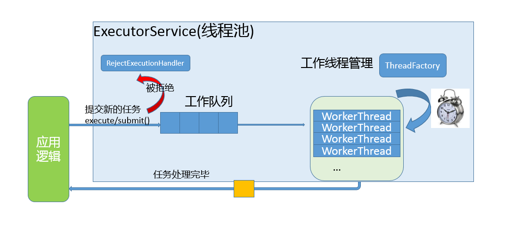

### [C++ 线程池](#)
 **介绍**：计算机的资源是有限的，线程也需要栈空间，线程切换也需要付出代价，频繁的创建和销毁线程会产生大量的程序资源消耗，为此线程池孕育而生！

-----
- [x] [1. 线程池概述](#1-线程池概述)
- [x] [2. ](#2-)
- [x] [3. ](#3-)
- [x] [4. ](#4-)
- [x] [5. ](#5-)
-----

### [1. 线程池概述](#)
**线程本身需要栈空间本身也需要消耗内存，线程的启动和切换具有固定开销，运行的线程越多，OS所做的上下文切换就越频繁！**

* 编写代码中，“时不时地突然”创建一个线程，这种写法，一般情况下不会出错，但是不稳定的；
* 把一堆线程弄到一起，统一管理调度，循环利用的方式，就叫做线程池。
* 程序启动时，一次性创建好一定数量的线程。这种方式让人更放心，觉得程序代码更稳定。

线程池的本质就是提前创建一堆线程，在程序需要使用线程来执行任务的时候，将任务放置到线程池中交给未执行任务的线程执
行，从而提高了程序的运行效率，提高了线程的利用率。

#### [1.1 线程池数量问题](#)
实际要看具体的业务需求还有服务性配置情况，创建多线程完成业务；考虑可能被阻塞的线程数量，创建多余最大被阻塞线
程数量的线程，如100个线程被阻塞再充值业务，开110个线程就是很合适的。

#### [1.2 线程池组成部分](#)
线程池的组成主要分为3个部分，这三部分配合工作就可以得到一个完整的线程池：

* **任务队列**，存储需要处理的任务，由工作的线程来处理这些任务
    * 通过线程池提供的API函数，将一个待处理的任务添加到任务队列，或者从任务队列中删除
    * 已处理的任务会被从任务队列中删除
    * 线程池的使用者，也就是调用线程池函数往任务队列中添加任务的线程就是生产者线程
* **工作线程**（任务队列任务的消费者） ，N个
    * 线程池中维护了一定数量的工作线程, 他们的作用是是不停的读任务队列, 从里边取出任务并处理
    * 工作的线程相当于是任务队列的消费者角色，
    * 如果任务队列为空, 工作的线程将会被阻塞 (使用条件变量/信号量阻塞)
    * 如果阻塞之后有了新的任务, 由生产者将阻塞解除, 工作线程开始工作
* **管理者线程**（不处理任务队列中的任务），1个
    * 它的任务是周期性的对任务队列中的任务数量以及处于忙状态的工作线程个数进行检测
    * 当任务过多的时候, 可以适当的创建一些新的工作线程
    * 当任务过少的时候, 可以适当的销毁一些工作的线程

#### [1.3 线程池模式](#)
线程池根据其中线程的数量可以区分为两种模式：
* **fixed模式线程池**：线程池里面的线程个数是固定不变的，一般是ThreadPool创建时根据当前机器的CPU核心数量进行指定。
* **cached模式线程池**：线程池里面的线程个数是可动态增长的，根据任务的数量动态的增加线程的数量，但是会设置一个线程
数量的阈值（线程过多的坏处上面已经讲过了），任务处理完成，如果动态增长的线程空闲了60s还没
有处理其它任务，那么关闭线程，保持池中最初数量的线程即可。fixed模式线程池：
线程池里面的线程个数是固定不变的，一般是ThreadPool创建时根据当前机器的CPU核心数量进行指
定。

### [2.](#) 

|方法|返回值|参数个数|说明|
|:---|:---|:---|:----|
|||||
|||||
|||||

### [3.](#) 

### [4.](#) 

### [5.](#) 

-----
时间: [] 