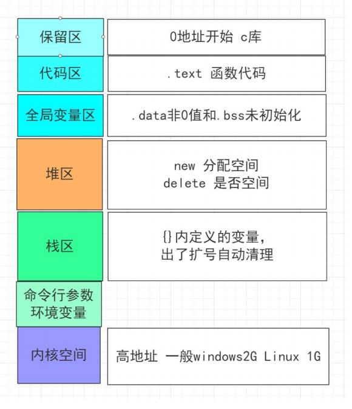

### [C++ 代码组织、编译、内存区域](#)
我们需要理解C++ 项目如何组织，编译如何进行，什么是链接， 内存模型有哪些！

-----
- [x] [1. 编译链接](#1-编译链接)
- [x] [2. C++ 内存存储](#2-c-内存存储)
- [x] [3. 名称空间](#3-名称空间)
- [x] [4. 代码组织](#4-代码组织)
- [x] [5. 程序内存划分](#5-程序内存划分)

-----

### [1. 编译链接](#)
编译： 将用指用源语言(C++, Java, C#...)写的待翻译的程序,通过翻译程序加工以后生成计算机可以理解的机器语言程序， 计算机只能理解二进制。  

即：**源程序 ---> 目标程序  ---> 链接**:

源程序经过编译以后，会变成了二进制形式的目标文件。后缀名可能是.obj或者 .o。此时的代码还不能运行起来。因为它还需要和系统提供的组件（比如标准库）结合起来，这些组件都是程序运行所必须的，这就是链接，经过链接才会生成 可执行程序 （如 win 平台上的exe）。

C++允许并且鼓励程序员将组件函数放在独立的文件中。  
1. 头文件 .h: 包含结构声明和使用这些结构的函数的原型。  
2. 源代码文件:包含与结构相关的函数的代码。

切勿将函数定义或变量声明放在头文件,不然很可能发生在同一个程序包含同一个函数的两个定义。 头文件中常包含的内容：
1. 函数原型 
2. 使用#define const定义的符号常量 
3. 类 结构声明 
4. 模板声明 
5. 内联函数  果一个函数是内联的，那么在编译时，编译器会把该函数的代码副本放置在每个调用该函数的地方。 所以内联函数的声明定义都在 .h文件中！

自定义头文件引用的时候请用双引号例如 **#include "coordin.h"**; 不要使用 #include 来包含源代码文件，这样将导致多重声明。 同一个文件中只能将同一个头文件包含一次，记住规则很难，有一种标准的C/C++技术可以避免多次包含同一个头文件，使用预处理器编译指令 **#ifndef**

```cpp
#ifndef COORDIN_H_
#define COORDIN_H_

#define MAXIMUM 4096;
//...
//各种声明

#endif
```
这种方法并不能防止编译器将文件包含两次，而只是让他忽略第一次包含之外的所有内容。

例子:coordin.h 包含结构体 和有关的函数声明

```cpp
#ifndef COORDIN_H_

#define COORDIN_H_
//定义一个结构体
struct Pointer2D
{
    float x;
    float y;
};

float distance(const Pointer2D one, const Pointer2D two);
#endif
```

coordin.cpp 对函数的定义
```cpp
#include "coordin.h"
#include<cmath>
#include <iostream>

float distance(const Pointer2D one,const Pointer2D two) {
    return sqrt(pow(abs(one.x - two.x), 2) + pow(abs(one.y - two.y), 2));
}
```
main.cpp 函数调用
```cpp
#include<iostream>
#include "coordin.h"

int main(int argc, char const* argv[])
{
    Pointer2D p1 = { 1.0,5.0 };
    Pointer2D p2 = { 3.0,7.0 };
    std::cout << distance(p1, p2) << std::endl;//2.82843
    return 0;
}
```
在链接编译模块的时候，请确保所有对象文件或库都是由同一个编译器生成的，如果有源代码，通常可以用自己的编译器重新编译源代码来消除链接错误。 如果链接不同编译器编译的二进制模块很容易不兼容。例如函数生成的修饰名不同的编译器就可能不同。

1) 经历预处理阶段，执行如下命令：
```
[root@bogon ~]# g++ -E main.cpp -o main.i
[root@bogon ~]# g++ -E coordin.cpp -o coordin.i
```
* -E 选项用于限定 g++ 编译器只进行预处理而不进行后续的 3 个阶段；
* -o 选项用于指定生成文件的名称。

Linux 系统中，通常用 ".i" 作为 C++ 程序预处理后所得文件的后缀名。 感兴趣的读者可自行运行cat main.i指令查看 main.i 文件中的内容（coordin.i文件也可以用此方式查看）。

2) 经历编译阶段，即对预处理阶段得到的 -i 文件做进一步的语法分析，生成相应的汇编代码文件。继续执行如下命令：

```shell
[root@bogon ~]# g++ -S main.i -o main.s
[root@bogon ~]# g++ -S coordin.i -o coordin.s
```
* -S 选项用于限定 g++ 编译器对指定文件进行编译，

得到的汇编代码文件通常以“.s”作为后缀名。 感兴趣的读者可以使用 cat 命令查看生成文件的内容。

3) 经历汇编阶段，即将汇编代码文件转换成可以执行的机器指令。继续执行如下命令：

```shell
[root@bogon ~]# g++ -c main.s -o main.o
[root@bogon ~]# g++ -c coordin.s -o coordin.o
```
* -c 指令用于限定 g++ 编译器只进行汇编操作，

最终生成的目标文件（本质就是二进制文件，但还无法执行）通常以“.o”作为后缀名。

4) 经历链接阶段，即将所有的目标文件组织成一个可以执行的二进制文件。执行如下命令：

```shell
[root@bogon ~]# g++ main.o coordin.o -o coordin.exe
```

可能觉得整个执行过程非常繁琐，直接执行如下命令即可生成最终的可执行文件：

```shell
[root@bogon ~]# g++ main.cpp coordin.cpp -o student.exe
[root@bogon ~]# ./student.exe
```

#### 1.1 使用错误
一个经典的使用错误, 因为没有搞清楚定义和声明的区别

mysqldbo.h
```cpp
#pragma once
#include <iostream>
#include <string>


#ifndef MYSQLDBO_H_H
#define MYSQLDBO_H_H
namespace MySQLAdo {
    //变量声明且定义了，而且没有使用 extern 关键字修饰
    int connection_max = 1024;
    std::string dbName = "";
    std::string ipAddress = "0.0.0.0";
    unsigned short port = 3306;
    std::string user = "root";
    std::string pwd = "";

    struct Table
    {
        std::string Name;
        bool isEmpty;
    };

    struct DataBase
    {
        std::string Name;
        int TableCount;
        Table* Tables;
    };

    namespace transaction {
        //函数声明且定义了
        bool beginTransaction(DataBase* db) {
            std::cout << "begin transaction" << std::endl;
            return true;
        };
        bool bendTransaction(DataBase* db) {
            return true;
        };
        bool rollback(DataBase* db) {
            return true;
        };
    }
}
#endif // !MYSQLDBO_H_H
```

mysqldbo.cpp
```cpp
#include <iostream>
#include <string>
#include "mysqldbo.h"

namespace mysqldbo{

    namespace transaction {
        bool beginTransaction(DataBase* db){
            std::cout << "begin transaction" << std::endl;
            return true;
        };
        bool bendTransaction(DataBase* db) {
            std::cout << "end transaction" << std::endl;
            return true;
        };
        bool rollback(DataBase* db) {
            return true;
        };
    }
}
```

main.cpp
```cpp
#include <iostream>
#include <string.h>
#include "coordin.h"
#include "mysqldbo.h"

using namespace std;

int main(int argc, char const* argv[])
{
    MySQLAdo::DataBase db = { "myweb", 0, nullptr};

    MySQLAdo::transaction::beginTransaction(&db);

    return 0;
}
```

然后你会发现程序根本无法运行，总是提醒你已经定义了，已经定义了。为啥会这样呢？  因为 

1. 在头文件里只声明不定义  
2. 把定义定义在Cpp文件里

**这叫声明定义代码, 是不能写在头文件中的！**

```cpp
int age;
int connection_max = 1024;
std::string dbName = "";
std::string ipAddress = "0.0.0.0";
unsigned short port = 3306;
std::string user = "root";
std::string pwd = "";
```
如何处理呢！ 将定义和声明分开，或者只用.h文件。

### [2. C++ 内存存储](#) 
C++ 使用四种不同的方案来存储数据，C++11新增了线性存储连续性。

1. **自动存储连续性 (栈区)**：在函数/代码块中声明定义的变量（包括形参），在函数调用/代码块运行时初始化，在函数返回时或代码块执行完后销毁。  
2. **静态存储连续性 (全局区)**：在程序的整个运行周期内一直存在。  static定义的变量的都是静态的。  C++ 有三种存储持续性为静态的变量。
3. **动态存储连续性 (堆区)**：用new运算符申请的内存将一直存在，直到手动的调用delete回收内存， 有时被称为自由存储 free store或 堆 heap  
4. **线程存储连续性**：C++11标准引入的新的存储连续性，变量的生存周期即线程的运行周期。  如果变量使用关键字 thread_local声明的，则其声明周期与所属的线程一样长。


操作系统区域：




作用域：描述的变量/常量/名称在程序中多大范围内可见。例如函数中定义的变量可在该函数中使用，但不能在其他函数中使用。代码块定义的变量是局部的，静态变量的作用域是全局或者局部取决于它的定义方式，名称空间中定义的名称作用域是整个命名空间。

C++11标准开始，auto关键字用于变量的类型推断，而这之前，auto是指变量具有自动存储连续性的意思
#### [2.1 自动存储连续性](#)
默认情况下在函数/代码块中声明定义的变量（包括形参），的存储连续性是自动的，作用域也是局部的。

C++ 留出一段内存，并使用栈这种结构来使用它，以管理变量的增减。函数调用就创建变量压栈，函数返回就弹出。根据LIFO原则管理自动存储变量。

register  关键字 C++ 11之前用于建议编译器使用CPU寄存器来存储自动变量, 旨在提高变量的访问速度
```cpp
register int count_fast;
```

C++11 中。关键字 register 只是显示地之处变量是自动的，这与C语言 auto 显示指出变量具有自动存储连续性是一个意思。

#### [2.2 静态存储连续性](#)
静态变量的链接性质有 三种： 所有函数存储连续性都自动位静态的，即在整个程序执行期间都一直存在！ 
1. **外部链接性** - 可以在其他文件中访问
2. **内部链接性** - 只能在当前文件中访问 
3. **无链接性** -- 只能在函数或者代码块中访问。

静态变量在程序运行期间是不变的，变量在整个程序执行期间一直在。如果不显示初始化，那么默认设置为0. 创建外部链接性必须在代码块外面声明它， 创建内部链接性 需要在代码块外面声明它并且使用static限定符。 创建无链接静态变量必须在代码块内声明它。

```cpp
int global = 200; //外部链接性
static int year_version = 2021; //内部链接性 作用域为文件 其他文件访问不到

int main(int argc, char const* argv[])
{
    Pointer2D p1 = { 1.0,5.0 };
    Pointer2D p2 = { 3.0,7.0 };
    cout << distance(p1, p2);//2.82843
    return 0;
}

double timeQart(double val) {
    static int time = 3;  // 无链接性 作用域为函数代码块
    return sqrt(val) * time;
}
```

在每个使用外部变量的文件中，都必须声明它。C++ 规定变量只能定义一次 (单定义规则)。 C++ 提供了两种变量声明。一种是定义声明(defining declaration) 或简称为定义(difinition). 它给变量分配存储空间；
另一种是引用声明或简称声明(declaration)。它不给变量分配存储空间，因为它引用已有的变量。 引用变量声明使用关键字 extern。且不进行初始化;

如果要多个文件中使用外部变量,只需在一个文件中包含该变量的定义，但在使用该变量的其他所有文件中，都必须使用关键字extern声明它：

file01.cpp
```cpp
double PI = 3.14159;
int dogs_count_max = 999;
int files = 10;
```

file02.h
```cpp

extern int dogs_count_max;
extern int files;
```

file03.h
```cpp
extern double PI;
```

**感觉：** 这玩意儿有些麻烦啊，就不能类似于 C# Grammar.Ling.Variables.PI 的方式引用吗？

所有函数的存储连续性都自动为静态的，可以在函数原型中使用关键字 extern 来之处函数是在另一个文件中定义的，这是可选的。还可以用static将函数的链接性设置为内部的

```cpp
#pragma once
#ifndef COORDIN_H_
#define COORDIN_H_

struct Pointer2D
{
    float x;
    float y;
};

extern float distance(const Pointer2D one, const Pointer2D two);
#endif // !COORDIN_H_
```

内部函数 PPow
```cpp
#include "coordin.h";
#include <iostream>

static float PPow(float val);

float distance(const Pointer2D one,const Pointer2D two) {
    return sqrt(PPow(abs(one.x - two.x)) + PPow(abs(one.y - two.y)));
}

static float PPow(float val) {
    return val * val;
}
```

**静态连续性， 无连接性** 将static 用于在代码块中定义的变量。该变量在代码块不处于活动状态时任然存在。多次调用函数，静态局部变量的值保持不变。如果初始化了静态局部变量，则程序只在启动时进行一次初始化。以后调用函数的时候，就不会再初始化了！

```cpp
#include <iostream>
#include <string.h>

static double rate = 6.94;

bool phoneUserlogin(const std::string & phone, const std::string & code);

int main(int argc, char const* argv[])
{
    std::string userPhone = "17725953482";
    std::string code = "584751";

    bool (*login)(const std::string & , const std::string & ) = phoneUserlogin;

    login(userPhone, code);
    login(userPhone, code);
    login(userPhone, code);
    login(userPhone, code);
    login(userPhone, code);

    //rmb:694
    return 0;
}

//统计登录人数
static bool phoneUserlogin(const std::string & phone, const std::string & code){
    static long loginCount = 0; //统计登录人数 只会运行一次
    loginCount ++;
    std::cout<< code <<" is right!" << std::endl;
    std::cout<< "successfully login the web system! as the "<< loginCount << " user" << std::endl;
    return true; 
}
```
static 返回参数类型 函数名(函数参数) 会让当前函数的链接性变成内部的！ 即只在当前文件可见！ 也可以在函数原型中使用关键字 extern来指定函数是在另一个文件中定义的！
函数连接性默认都是外部的，存储性都是静态的！


#### [2.3 动态存储连续性](#)
C++ 运算符new (或者C语言的 malloc calloc)分配的内存，这种内存为动态内存。动态内存是new和delete来控制。通常编译器使用三块独立的内存：分别用于静态变量，自动变量和动态存储。new 负责在堆中找到一个足以能够满足要求的内存块。

```cpp
float *scores = new float[60]; //分配80个字节的内存
```
C++ 11 可以为内置的标量类型分配存储空间并且初始化, 使用 (初始值) 对于结构体或者数据就使用大括号初始化 {初始化} ;

```cpp
float* x_p1 = new float(1.0);
int* pointerSum = new int(52);

Pointer2D p1 = { *x_p1, 5.0 };
Pointer2D* p2 = new Pointer2D{ 3.0,7.0 };
cout << distance(p1, *p2) <<endl;//2.82843
cout << "sum:" << *pointerSum;

delete x_p1, pointerSum;
```

如果分配失败，最初C++ 会让new返回空指针。现在将引发异常 std::bad_alloc。

##### 2.3.1 new 和 new []
运算符new 和 new []分配调用如下函数, 他们被称为分配函数

* void * operator new(std::size_t);
* void * operator new[](std::size_t);

```cpp
//可以在new后面直接赋值
int *p = new int(3);
//也可以单独赋值
//*p = 3;
```


##### 2.3.2 delete 和 delete[]
释放函数delete 和 delete[]分别调用如下的函数

* void  operator new(void *);
* void  operator new[](void *);

所以，也可以是使用 typedef。指定大小。
```c
int *pi = new int;
int *p2 = new(sizeof(int))

int *p3 = new(40 * sizeof(int));
int *p4 = new int[40];

delete pi, p2;
delete [] p3, p4;
```

##### 2.3.4 定位new运算符
定位new运算符，让你能够指定要使用的位置。可能使用这种特性来设置其内存管理规程，处理需要通过特定地址进行访问的硬件或在特定位置创建对象。需要包含头文件 #include <new>

```cpp
#include<iostream>
#include <new>
using namespace std;

char buffer[500];

int main()
{
	int* p1, * p2;
	p1 = new int[20];
	p2 = new (buffer)int[20];
	for (int i = 0; i < 20; i++)
	{
		p1[i] = p2[i] = i;
	}
	cout << "内存地址:\n" << "p1： " << p1 << endl;
	cout << "p2地址:  " << p2 << endl;
	cout << "buffer地址: " << (void*)buffer << endl;
	delete [] p1;
    //delete [] buffer; 
	/*
	p1： 01175E38
	p2地址:  00F4D3E0
	buffer地址: 00F4D3E0
	*/
}
```
与常规new运算符不同的是：
* 常规new运算符查找一个新的内存块；但定位new运算符使用传递给它的地址，它不跟踪哪些内存单元已被使用，也不查找未经使用的内存块。
* 对于常规new运算符必须要delete掉，才能再次使用该内存块；buffer指定的是静态内存，而delete只能用于指向常规new运算符分配的堆内存。也就是说，**数组buffer位于delete的管辖区域之外， 不能用delete直接回收**。

1. p2和buffer的地址相同，说明确实将数组p2放在数组buffer中了。p1位于动态管理的堆中。
2. 由于buffer是char指针，将cout运用于char指针时，会从第一个字符开始打印，直到遇到空字符为止。因此使用(void *)对 buffer进项强制转化。
3. 定位new运算符使用传递给它的地址，不跟踪那些内存单元被使用，也不查找未使用的内存块。因此，第二次定位new运算符分配了与第一次相同的内存块。这将一些内存管理的负担交给了程序员。

```cpp
//偏移量为40bytes
pd2 = new (buffer + N * sizeof(double)) double[N];
```
4. 用定位new运算符来创建新的类对象后，当该对象消亡时，程序并不会自动地调用其析构函数，所以必须显式地调用析构函数。这个少数的需要显示调用析构函数的情况之一。

```cpp
char *buffer = new char[512];
Student *stu = new (buffer)Student("2016110418", 18, true);
/*
 操作
*/
stu->~Student();

delete [] buffer;
```

上面的程序中没有用delete来释放定位new运算符分配地内存。buffer指定的内存是静态内存，而delete只用用于这样的指针：指向常规new分配的堆内存。也就是说，数组buffer位于delete的管辖区域之外，下面的语句将引发运行阶段错误：
```cpp
delete [] pd2;//won't work
```
如果buffer是使用常规new运算符创建的，便可使用常规delete运算符来释放整个内存块。
```cpp
char * buffer = new char[BUF];
delete [] buffer;
delete [] buffer;
```
释放使用常规new运算符分配的整个内存块，但没有为定位new运算符在该内存块中创建的对象调用析构函数。这种问题的解决方法是，显式地为使用定位new运算符创建的对象调用析构函数。显式地调用析构函数时，必须指定要销毁的对象。由于有指向对象的指针，因此可以使用这些指针：
```cpp
String *pd = new (buffer) String("hello",5);
pd->~String();
```
需要注意的是，对于使用定位new运算符创建的对象，应以与创建顺序相反的顺序进行删除。原因在于，晚创建的对象可能依赖于早创建的对象。另外，仅当所有对象都被销毁后，才能释放用于储存这些对象的缓冲区。

5. new运算符只是返回传递给它的地址，并将其强制转换为void *，以便能够赋给任何指针类型。

#### [2.4 作用域解析运算符](#)
:: 放在变量前面，该运算符表示使用变量的全局版本！ ::变量名 访问全局变量

```cpp
#include <iostream>
#include <string.h>

static double rate = 6.94;

double doller_to_rmb(double & dollar);

int main(int argc, char const* argv[])
{
    double change = 100.0;

    double (*correspondent_bank)(double &) = doller_to_rmb;

    std::cout << "rmb:" << correspondent_bank(change) << std::endl;
    //rmb:694
    return 0;
}

double doller_to_rmb(double & dollar){
    double rate = 6.879;
    dollar = dollar > 0? dollar: 0;
    return dollar * (::rate); //使用6.94 而不是  6.879
}
```

### [3. 名称空间](#) 
C++ 提供了名称空间工具，用于防止项目过大，导致的命名冲突.只是他是前人的探索，设计并不优秀！ 名称空间：声明名称的区域    一个名称区域不会和另一个名称区域中的名称发生冲突
使用using编译指令时，将进行名称解析，就像在包含using声明和名称空间本身的最小申明区域中声明了名称一样。

名称空间可以嵌套，可以取别名，可以匿名

名称空间可以嵌套
```cpp
namespace Tom{
    double pail;
    void   fetch();
    int pal;
    struct Well {..};
    namespace Jerry{
        char other;
        void   fetch();
        int pal;
        struct Hill {..};
    }
}
```
可以给名称空间创建别名
```cpp
namespace TJ=Tom::Jerry;
```
未命名的名称空间
```cpp
namespace 
{
    int ice;
}
```

使用名称空间的主旨——简化大型编程项目的管理工作
* 使用在已命名的名称空间中声明的变量，而不是使用外部全局变量
* 使用在已命名的名称空间中声明的变量，而不是使用静态全局变量
* 如果开发了一个函数库或者类库，放在一个名称空间中
* 仅将编译指令using作为一种将旧代码转换成使用名称空间的权益之计
* 不要在头文件中使用using编译指令（会掩盖要让哪些名称可用)
* 导入名称时，首选使用域作用解析符或using声明的方法
* 对于using声明，首选将其作用域设置为局部而非全局

你可以使用namespace创建两个命名空间 MySQLAdo， Company。 命名空间可以是全局的，也可以位于另一·个名称空间中。但不能位于代码块中。
```cpp
#pragma once
#include <iostream>
#include <string>
#ifndef MYSQLDBO_H_H  //没有卵用  如果在多个文件 #include "mysqldbo.h" 同样会重复定义
#define MYSQLDBO_H_H
namespace MySQLAdo {
    int connection_max = 1024;
    std::string dbName = "";
    std::string ipAddress = "0.0.0.0";
    unsigned short port = 3306;
    std::string user = "root";
    std::string pwd = "";

    struct Table
    {
        std::string Name;
        bool isEmpty;
    };

    struct DataBase
    {
        std::string Name;
        int TableCount;
        Table* Tables;
    };

    namespace transaction {
        bool beginTransaction(DataBase* db) {
            std::cout << "begin transaction" << std::endl;
            return true;
        };
        bool bendTransaction(DataBase* db) {
            return true;
        };
        bool rollback(DataBase* db) {
            return true;
        };
    }
}

namespace Company {
    std::string CompanyName;

    struct Worker
    {
        std::string WrokerName;
        int age;
        bool sex;
    };
}

#endif // !MYSQLDBO_H_H
```

#### [3.1 重复定义文件](#)
int b; 属于声明并定义，而在.h的命名空间中只能放声明，.h被引用多少次，int b就声明和定义了几次，为了解决这个问题，有如下解决方法：

##### 3.1.1 使用函数闭包思想
.h文件
```cpp
namespace JNLDD {
int getb();
int setb(int b);
}
```
.cpp
```cpp
//源文件
namespace JNLDD {
   // int m_tb;
   static  int m_tb;//师父说此处加上static会更显专业
    int getb()
    {
        return m_tb;
    }
    int setB(int b)
    {
        m_tb = b;
        return m_tb;
    }
}
```

**我迷茫了，不知道代码该如何阻止， 重复定义问题，太严重了**
##### [3.1.2 使用extern将定义变成声明](#)
extern是c++引入的一个关键字，它可以应用于一个全局变量，函数或模板声明，说明该符号具有外部链接(external linkage)属性。也就是说，这个符号在别处定义。一般而言，C++全局变量的作用范围仅限于当前的文件，但同时C++也支持分离式编译，允许将程序分割为若干个文件被独立编译。于是就需要在文件间共享数据，这里extern就发挥了作用。

```cpp
//MyLib.h文件
namespace MyLib{
    extern int i;//记住这是变量i的声明，不是i的定义
    void fun();
}//注意名字空间不像类的定义一样，右大括号后有分号
```

### [4. 代码组织](#)
加入了namespace后如何组织代码呢？其实和之前的差不多！ 在.h中声明，在cpp中定义！把变量声明定义在cpp文件中

mysqldbo.h
```cpp
#pragma once
#include <iostream>
#include <string>

#ifndef MYSQLDBO_H_H
#define MYSQLDBO_H_H
namespace mysqldbo {
    
    extern int connection_max;
    extern std::string dbName;
    extern std::string ipAddress;
    extern unsigned short port;
    extern std::string user;
    extern std::string pwd;

    struct Table
    {
        std::string Name;
        bool isEmpty;
    };

    struct DataBase
    {
        std::string Name;
        int TableCount;
        Table* Tables;
    };

    namespace transaction {
        bool beginTransaction(DataBase* db);
        bool bendTransaction(DataBase* db);
        bool rollback(DataBase* db);
    }
}

namespace Company {
    extern std::string CompanyName;
}
#endif // !MYSQLDBO_H_H
```

mysqldbo.cpp
```cpp
#pragma once
#include <iostream>
#include <string>
#include "mysqldbo.h"

namespace mysqldbo{
        //变量初始化
    int connection_max = 1024;
    std::string dbName = "";
    std::string ipAddress = "0.0.0.0";
    unsigned short port = 3306;
    std::string user = "root";
    std::string pwd = "";

    namespace transaction {
        bool beginTransaction(DataBase* db){
            std::cout << "begin transaction" << std::endl;
            return true;
        };
        bool bendTransaction(DataBase* db) {
            std::cout << "end transaction" << std::endl;
            return true;
        };
        bool rollback(DataBase* db) {
            return true;
        };
    }
}
```

main.cpp
```cpp
#include <iostream>
#include <string.h>
#include "mysqldbo.h"
using namespace std;
using namespace mysqldbo;

int main(int argc, char const* argv[])
{
    DataBase db = {"mydb", 0, nullptr};
    transaction::beginTransaction(&db);
    cout << "链接服务器IP:" << ipAddress << endl;
    return 0;
}
```

### [5. 程序内存划分](#)
C++ 程序在执行的时候，将程序占用的内存大致分为四个区域
1. 代码区： 存放函数体的二进制代码，由操作系统进行管理
2. 全局区： 存放全局变量，静态变量和 全局常量
3. 栈区： 存放函数代码块中参数，局部变量
4. 堆区： 由程序员使用new delete 管理。程序结束的时候，操作系统进行回收！

程序运行前只有两个区域 代码区 全局区。 代码区存放CPU执行的机器指令,代码区是 **共享** 和 **只读** 的。共享可以执行程序多开，只读是防止修改程序！

千万不要返回栈区中局部变量的地址，栈区中开辟的数据会在函数调用或者代码块执行完后自动释放掉！

### [6. 说明符和限定符](#)
auto register static extern thread_local mutable 都是存储说明符 const volatile 是 cv 限定符

* register 用于在声明中指示寄存器存储！C++11 其指示显示的支出变量是自动存储连续性 等价于 c语言 auto float score = 36.25; 
* static 用于作用域为整个文件的变量/函数/其他的时候用于表示其位内部链接性，如果是局部声明中，表示局部变量位静态存储连续性，但是是无连接性的！ 
* extern是表面引用声明，即声明引用在其他地方定义的变量
* mutable 用于结构体/类，即使结构体/类变量被声明为const， 那么其内部某个成员也可以被修改

```cpp
#include <iostream>
#include <string.h>

struct Node{
    mutable float data;
    Node * prev;
    Node * next;
};

int main(int argc, char const* argv[])
{

    const Node head {25, nullptr, nullptr};
    head.data = 30;

    std::cout << head.data << std::endl; //30
    return 0;
}
```

在c++中 const限定符会对默认存储类型有影响，默认全局变量的连接性位外部的，但const全局变量的连接性位内部的！ 全局const 定义就像使用了static说明符一样！

```cpp
const int fingers = 10;
```
c++修改了常量类型的规则， 将一组常规变量放在头文件中，并在同一个程序的多个文件中使用该头文件，那么预处理器将头文件的内容都包含到每个源文件中，所有的源文件都包含如下的代码：

```cpp
const int fingers = 10;
```
如果全局const声明链接性为外部，则根据单定义规则，会出错。只能有一个文件可以包含前面的声明，而其他的文件只能使用extern关键字来提供引用声明。

volatile用于修饰成员或变量，指示其修饰对象可能随时变化，编译器不要对所修饰变量进行优化（缓存），每次取值应该直接读取内存。
由于volatile的变化来自运行期，其可以与const一起使用。两者一起使用可能让人费解，如果考虑场景就容易许多：CPU和GPU通过映射
公用内存中的同一块，GPU可能随时往共享内存中写数据。对CPU上的程序来说，const修饰变量一直是右值，所以编译通过。但其变量内存
中的值在运行期间可能随时在改变，volatile修饰是正确做法。

在多线程环境下，volatile可用作内存同步手段。例如多线程爆破密码：

```cpp
volatile bool found = false;

void run(string target) {
  while (!found) {
    // 计算字典口令的哈希
    if (target == hash) {
      found = true;
      break;
    }
  }
}
```
在volatile的修饰下，每次循环都会检查内存中的值，达到同步的效果。

需要注意的是，volatile的值可能随时会变，期间会导致非预期的结果。例如下面的例子求平方和：

```cpp
double square(volatile double a, volatile double b) {
  return (a + b) * (a + b);
}
```
a和b都是随时可变的，所以上述代码中的第一个a + b可能和第二个不同，导致出现非预期的结果。这种情况下，正确做法是将值赋予常规变量，然后再相乘：

```cpp
double square(volatile double a, volatile double b) {
  double c = a + b;
  return c * c;
}
```
-----
时间: [2022/4/10] 