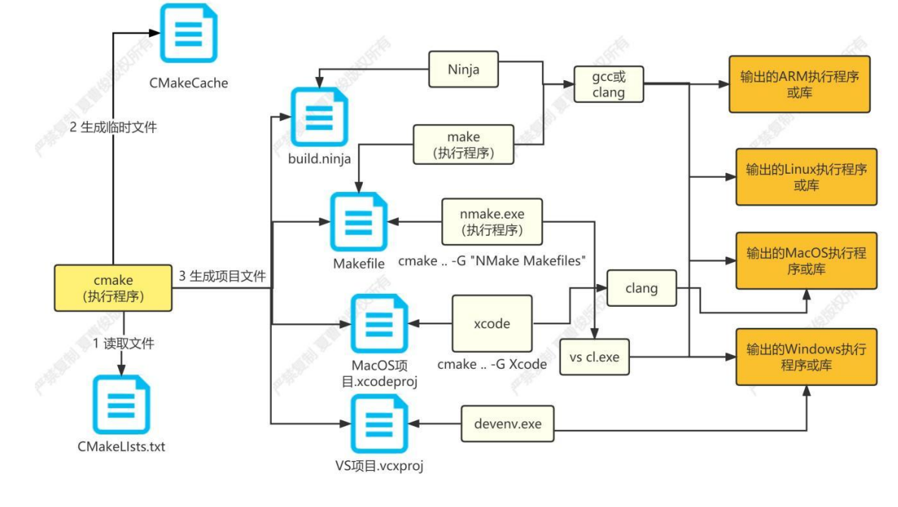

### [CMake 基础知识](#)
**介绍**：CMake是一个跨平台的高级编译配置工具，可以用简单的语句来描述所有平台的安装(编译过程)。 能够输出各种各样的makefile或者project文件, Cmake **并不直接**建构出最终的软件，而是**产生**其他工具的脚本（如Makefile ），然后再依这个工具的构建方式使用。

-----

- [x] [1. 基本概念](#1-基本概念区分)
- [x] [2. CMake的构建方式](#2-cmake的构建方式)
- [x] [3. CMakeLists.txt](#3-CMakeLists.txt)
- [x] [4. 多目录项目](#4-多目录项目)

-----

```cmake
cmake_minimum_required(VERSION 3.25 FATAL_ERROR)

project(muse
        VERSION         0.0.1
        DESCRIPTION     "cmake demo"
        HOMEPAGE_URL    "https://github.com/sorise"
        LANGUAGES       C CXX
)

MESSAGE(STATUS "This is BINARY dir " ${PROJECT_BINARY_DIR})  #构建路径
MESSAGE(STATUS "This is SOURCE dir " ${PROJECT_SOURCE_DIR})  #源代码路径

set(CMAKE_CXX_STANDARD 17)
set(CMAKE_CXX_STANDARD_REQUIRED  ON)

#公共头文件目录
include_directories(include)

#各平台差异
if(CMAKE_SYSTEM_NAME STREQUAL "Linux")
    message(STATUS "Configuring on/for Linux")

elseif(CMAKE_SYSTEM_NAME STREQUAL "Darwin")
    message(STATUS "Configuring on/for macOS")

elseif(CMAKE_SYSTEM_NAME STREQUAL "Windows")
    message(STATUS "Configuring on/for Windows")

else()
    message(STATUS "Configuring on/for ${CMAKE_SYSTEM_NAME}")

endif()

add_executable(main main.cpp)
```

### [1. 基本概念](#)
CMake有好多个内容, 例如 **CTest和CPack**：
* **CTest** 是CMake集成的一个测试工具，在使用CMakeLists.txt文件编译工程的时候，CTest会自动配置、编译、测试并给出测试结果。 
* **CPack** 是 CMake 2.4.2 之后的一个内置工具,用于创建软件的二进制包和源代码包完成程序部署。

**G++和CMake的区别**： GCC（GNU Compiler Collection）/g++ 将源文件编译（Compile）成可执行文件或者库文件； g++是编译器，CMake是指挥编译器如何编译的！

**编译与构建**: 
* **编译（compile）**：指将源代码翻译为机器码的过程
* **构建（build）**：指包括编译在内的一系列处理过程。在大型工程中，构建涵盖了对源代码的编译、对库文件的链接，还有可能包含映像文件打包等其它附加操作。
#### [1.1 持续集成](#)
使用CMake可以帮助我们实现持续集成：

* 每次集成都通过**自动化**的制造（包括提交、发布、自动化测试）来验证，准确地发现集成错误。
* 快速定位错误，每完成一点更新，就集成到主干，可以快速发现错误，定位错误也比较容易。
* 各种不同的更新主干，如果不经常集成，会导致集成的成本变大。
* 让产品可以快速地通过，同时保持关键测试合格。
* **自动化测试**，只要有一个测试用例不通过就不能集成。
* 集成并不能删除发现的错误，而是让它们很容易和改正。


#### [1.2 CMake 特性](#)
* 自动搜索可能需要的程序、库和头文件的能力
* 独立的构建目录，可以安全清理
* 创建复杂的自定义命令
* 配置时选择可选组件的能力
* 从简单的文本文件（CMakeLists.txt）自动生成工作区和项目的能力
* 在静态和共享构建之间轻松切换的能力
* 在大多数平台上自动生成文件依赖项并支持并行构建

#### [1.3 CMake 编译原理](#)
CMake的工作原理可以分为三个步骤:配置、生成和构建。



CMake会读取CMakeLists.txt文件，这个文件描述了项目的结构和依赖关系。

* **在配置阶段**，CMake会根据CMakeLists.txt文件中的指令和变量，生成一个CMake缓存文件，这个文件包含了所有的配置信息，例如编译器、库文件、头文件路径等等。CMake 缓存文件可以通过命令行参数或者CMakeGUI进行修改。
* **接下来是生成阶段**，CMake 会根据CMake缓存文件生成Makefile或者Visual Studio 等IDE所需的项目文件。这个过程中，CMake 会.根据不同的平台和编译器生成不同的项目文件，从而实现跨平台的构建。生成的项目文件包含了编译选项、链接选项、依赖关系等等。
* 最后是**构建阶段**，CMake会调用底层的构建工具(例如make、ninja等)来进行实际的构建。在构建阶段，CMake会根据生成的项目文件进行编译、链接等操作，最终生成可执行文件或者库文件。

#### [1.4 CMake 概念](#)

CMake有三个关键概念：**target**、**generator** 和 **command**。
* **target** ：就是cmake最终要生成的目标，通常是一个可执行文件或者是库文件。
    * **add_library** ：生成一个库目标；
    * **add_executable**：生成一个可执行目标；
    * **add_custom_target**：生成一个自定义目标，这个用途也很大，
* **command**：CMake 命令，例如 `add_executable、include_directories...`
* [**generator**](https://cmake.org/cmake/help/latest/manual/cmake-generators.7.html)： 生成器, cmake会通过cmakelist.txt文件，生成适用于不同项目类型的makefile文件，然后makefile文件被不同的编译器使用进行编译，考虑到C/C++的开发环境之多，有非常多的种类的项目开发环境，所以有很多生成器。
    * NMake Makefiles: 生成NMake makefile。
    * Unix Makefiles: 生成标准的UNIX makefile。 
    * Ninja：生成.ninja工程
    * Xcode：生成Xcode工程

### [2. CMake的构建方式](#) 
CMake构建有两种基本构建模式，外部构建是最常用的构建方式！

* **内部构建** : 也就是源代码在CMakeLists.txt同一级目录进行编译，上述例子就是内部构建，他生产的临时文件特别多，不方便清理。
* **外部构建**: 就会把生成的临时文件放在build目录下，不会对源文件有任何影响强烈使用外部构建方式。

#### [2.1 内部构建](#)
内部构建文件列表：
```shell
cmake .  #进行构建生成

make    #直接编译运行
```

```shell
-rw-rw-r-- 1 remix remix 13783  8月 30 10:28 CMakeCache.txt
drwxrwxr-x 5 remix remix  4096  8月 31 15:55 CMakeFiles
-rw-rw-r-- 1 remix remix  1638  8月 30 10:28 cmake_install.cmake
-rw-rw-r-- 1 remix remix   241  8月 31 15:55 CMakeLists.txt
-rwxrwxr-x 1 remix remix 16520  8月 30 10:57 hello
-rw-rw-r-- 1 remix remix   120  8月 30 10:57 main.cpp
-rw-rw-r-- 1 remix remix  5114  8月 31 15:55 Makefile
```


#### [2.2 外部构建](#)
在项目目录下新建一个 build目录，用来存放临时文件！

文件目录：
```shell
drwxrwxr-x 2 remix remix 4096  8月 31 16:29 build
-rw-rw-r-- 1 remix remix  231  8月 31 16:29 CMakeLists.txt
-rw-rw-r-- 1 remix remix  120  8月 30 10:57 main.cpp
```

使用命令将生成的文件全都放到 build目录中 -S . 表示源代码目录为当前路径，生成文件存放路径是 build ：
```shell
cmake -S . -B build   #进行构建生成
cmake --build build   #直接编译运行
```

### [3. CMakeLists.txt](#)
CMakeLists.txt文件是cmake用来生成Makefile文件需要的一个描述编译链接的规则文件, 使我们使用CMake所编写的配置脚本工具，每一个项目目录之下一定会有一个 CMakeLists.txt 文件。

#### [3.1 基本语法规则](#)
**指令是大小写无关的**， **参数和变量是大小写相关的**, 但推荐你全部使用大写指令。

下面是一个意思
```
project(TSM)

PROJECT(TSM)
```
变量使用 **${}** 方式取值，但是在 **IF** 控制语句中是直接使用变量名。 
```
IF(DEBUG){

}
```

指令(参数 1 参数 2...) 参数使用括弧括起，参数之间使用**空格**或**分号**分开。 以上面的 **ADD_EXECUTABLE** 指令为例，如果存在另外一个func.cpp源文件 就要写成如下两种形式  
```shell
ADD_EXECUTABLE(tsm main.cpp func.cpp)
```

```shell
ADD_EXECUTABLE(tsm main.cpp;func.cpp)
```

* **注意事项**: SET(SRC_LIST main.cpp) 可以写成 SET(SRC_LIST “main.cpp”)，如果源文件名中含有空格，就必须要加双引号。
* **注意事项**: ADD_EXECUTABLE(tsm main) 后缀可以不写，因为cmake会自动去找.c和.cpp，但是不推荐这样写，因为可能会有这两个文件: main.cpp 和 main。

#### [3.2 变量](#)
CMake支持用户自定义变量、环境变量、同时自己也内置了许多变量! 

变量和C++变量作用差不多，用来存放文件路径，文件名，配置选项之类的。 变量使用 **${}** 方式取值，但是在 IF 控制语句中是直接使用变量名。

```cmake
#用户自定义变量
set(CPR_TOP_DIR "/root/workspace/code/cpr")
#用户自定义变量
set(CPR_BASE_SOURCE "a.cpp;b.cpp")  #列表

set(CPR_CORE_SOURCE core1.cpp core2.cpp)  #列表

set(PROJECT_IS_NEED_STRINGS "Need" "Doll" "Mike")

#内置变量
set(CMAKE_ARCHIVE_OUTPUT_DIRECTORY  ${CMAKE_CURRENT_LIST_DIR}/lib)  #静态库存放目录
set(CMAKE_RUNTIME_OUTPUT_DIRECTORY  ${CMAKE_CURRENT_LIST_DIR}/bin)  #可执行文件存放目录
set(CMAKE_LIBRARY_OUTPUT_DIRECTORY  ${CMAKE_CURRENT_LIST_DIR}/bin)  #动态库存放目录

foreach(a ${PROJECT_IS_NEED_STRINGS}) #列表打印
    MESSAGE(STATUS "string: ${a}")
endforeach()

set(CPR_BUILD_CMD [[
#!/bin/bash

cmake -S . -B build
cmake --build build
]])

set(shellScript [=[
#!/bin/bash
[[ -n "${USER}" ]] && echo "Have USER"
]=])

SET(my_list “kicker;miner kicker”)
MESSAGE(STATUS ${my_list}) #当作列表了

LIST(LENGTH my_list len)
MESSAGE(STATUS "my_list len: ${len}") #my_list len: 3
```

#### [3.3 关键字命令](#)
关键字即CMake的命令，也可以理解为指令，也可以理解为CMake的函数，或者C++ 语言的标准库函数:

cmake_minimum_required 关键字 指定需要最低版本的cmake, FATAL_ERROR指示如果版本不对，CMake构建失败, project 关键字声明项目信息。
```cpp
cmake_minimum_required(VERSION 3.25 FATAL_ERROR)

project(muse
        VERSION         0.0.1
        DESCRIPTION     "cmake demo"
        HOMEPAGE_URL    "https://github.com/sorise"
        LANGUAGES       C CXX
)
```
**指令是大小写无关的**， **参数和变量是大小写相关的**, 但推荐你全部使用大写指令。

#### [3.4 CMake 注释](#)
CMake支持单行注释和多行注释！

```cmake
# my_script.cmake
# author:               kicker
# create time :         2023/03/28 10:38:11
# last alter time:      2023/03/28 10:38:11
# last alter author:    kicker

string(TIMESTAMP CURRENT_DATETIME "%Y/%m/%d %H:%M:%S")
message(STATUS "running at: ${CURRENT_DATETIME}")

#[[
    多行注释
    message(STATUS "running at: ${CURRENT_DATETIME}")
]]#

#[=[
    多行注释
    message(STATUS "running at: ${CURRENT_DATETIME}")
]=]#
```

### [4. 多目录项目](#)
一个非常简单的项目，**文件目录**:
```
.
├── CMakeLists.txt
├── build
├── doc
├── include
│   ├── prints.h
│   └── toolkits.hpp
├── main.cpp
└── src
    └── prints.cpp
```

CMakeLists.txt 内容：
```cmake
cmake_minimum_required(VERSION 3.22.1)

project(network)

#include 目录
include_directories(${PROJECT_SOURCE_DIR}/include)

#c++ 版本设置为 c++17
set(CMAKE_CXX_STANDARD 17)
set(CMAKE_CXX_STANDARD_REQUIRED  ON)

#发现一个目录下所有的源代码文件并将列表存储在一个变量中，这个指令临时被用来自动构建源文件列表。
aux_source_directory(./src SRC_CPP)

add_executable(network main.cpp)

add_library(prints SHARED SRC_CPP)
#什么都不写就是静态库
#中间写一个 SHARED 就是动态库

target_link_libraries(network prints)
#将动态库 prints 连接到 network
```