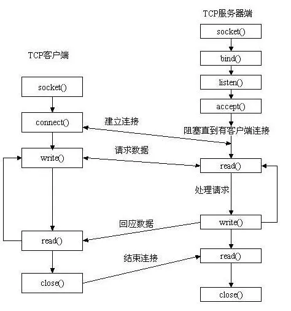
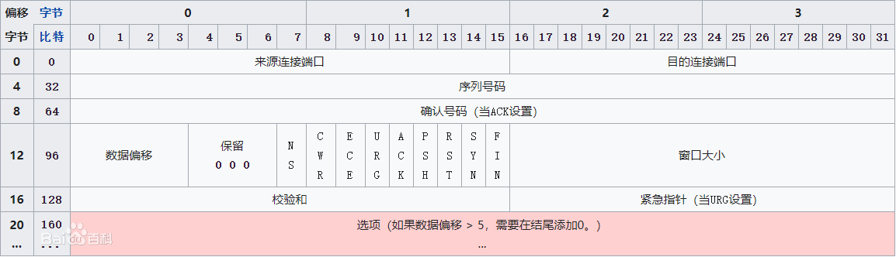
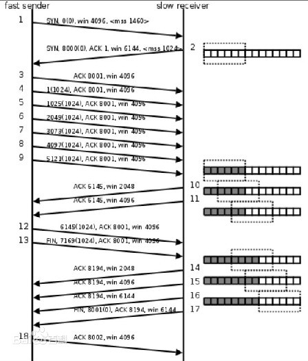

### [C++ Socket 创建流程](#)
 **介绍**： 继续学！

-----
- [x] [1. Socket创建流程](#1-socket创建流程)
- [x] [2. Socket接发函数](#2-socket接发函数)
- [x] [3. Socket的一些问题](#3-socket的一些问题)
- [x] [4. TCP 单连接迭代服务器](#4-tcp-单连接迭代服务器)
- [x] [5. TCP连接](#5-tcp连接)
- [x] [6. 封装错误处理](#6-封装错误处理)

-----

### [1. Socket创建流程](#)
socket创建流程可以用一张经典的流程图来表示出来，**建立一个连接，至少会存在三个套接字，服务器两个，客户端一个！**，因为服务器有一个监听套接字，还有一个与客户端进行配对的套接字！
每个套接字都有一个自己的描述符(句柄);

* int **socket**(int domain,int type,int protocol);  创建socket。
* int **bind**(int sockfd,const struct sockaddr *addr,socklen_t addrlen); 将fd和本地的IP+端口进行绑定
* int **listen**(int sockfd,int backlog); 监听这个socket上的连接
    * sockfd:通过socket()函数得到的文件描述符
    * backlog:未连接的和、已连接的和的最大值
* int **accept**(int sockfd,struct sockaddr *addr,socklen_t *addrlen); 接收客户端连接，默认是一个阻塞的函数，阻塞等待客户端连接
    * sockfd:用于监听的文件描述符
    * addr:传出参数，记录连接成功后客户端的地址信息(ip、port)
    * addrlen:指定第二个参数的对应的内存大小
* int **close**(int fd);
* int **connect** (int sockfd,struct sockaddr * serv_addr,int addrlen);



#### [1.1 socket](#)
创建一个套接字， 注意在不同操作系统中头文件的不一样！

```cpp
/* ------------------ linux ------------------ */
#include <sys/types.h>          /* See NOTES */
#include <sys/socket.h>
int socket(int domain,int type,int protocol);
```
成功则返回套接口描述符，失败返回-1。

* domain: 
    * AF_INET 表示地址为IPv4
    * AF_INET6 地址为IPV6
    * AF_UNIX  用于本地socket
* type
    * 流套接字 SOCK_STREAM
    * 数据报套接字 SOCK_DGRAM
    * 原始套接字 SOCK_RAW：
* protocol
    * 0  使用默认协议，使用SOCK_STREAM则为TCP，使用SOCK_DGRAM则为UDP！
    * IPPROTO_TCP 使用TCP协议；
    * IPPROTO_UDP 使用UDP协议；

#### [1.2 bind](#)
给socket绑定一个IP和端口号
```cpp
/* ------------------ linux ------------------ */
#include <sys/types.h>          /* See NOTES */
#include <sys/socket.h>

int bind(int sockfd, const struct sockaddr *addr, socklen_t addrlen);
```
成功则返回 0，失败返回-1,并适当设置errno。
* sockfd 为前面 socket 的返回值。
* addr   为结构体指针变量，如果使用sockaddr_in需要类型转为sockaddr指针！
* addrlen 长度使用，sizeof取得！

```cpp
int fd = socket(AF_INET, SOCK_STREAM, 0);
in_addr ip_address;

if (inet_aton("127.0.0.1",&ip_address) == 0){
    throw std::runtime_error("ip address is not right!");
}
sockaddr_in addr{
    AF_INET,
    htons(15000),
    ip_address
};
auto result = bind(fd, (const struct sockaddr*)&addr, sizeof(addr));
```

#### [1.3 listen](#)
使服务器的这个端口和 IP 处于监听状态，等待网络中某一客户机的连接请求。如果客户端有连接请求，端口就会接受这个连接。

```cpp
/* ------------------ linux ------------------ */
#include <sys/types.h>          /* See NOTES */
#include <sys/socket.h>

int listen(int sockfd, int backlog);
```
成功则返回 0，失败返回-1,并适当设置errno。

* sockfd   为前面 socket 的返回值.即 sfd
* backlog 指定同时能处理的最大连接要求，通常为 10 或者 5。最大值可设至 128

#### [1.4 accept](#)
用在TCP连接中，阻塞等待客户端的连接请求，接受远程计算机的连接请求，建立起与客户机之间的通信连接。*
```cpp
#include <sys/types.h>          /* See NOTES */
#include <sys/socket.h>

int accept(int sockfd, struct sockaddr *addr, socklen_t *addrlen);
```
成功则返回新的 socket 处理代码 new_fd，失败返回 -1。

* sockfd 为前面 socket 的返回值.即 sfd
* addr (传出参数)为结构体指针变量，和 bind 的结构体是同种类型的，系统会把远程主机的信息（远程主机的地址和端口号信息）保存到这个指针所指的结构体中。
* addrlen (传入传出参数)表示结构体的长度，为整型指针
    * 传入 addr的大小
    * 传出 客户端的socketaddr的实际大小！

#### [1.5 connect](#)
用来请求连接远程服务器，将参数 sockfd 的 socket 连至参数 serv_addr 指定的服务器IP 和端口号上去。
```cpp
#include <sys/types.h>          /* See NOTES */
#include <sys/socket.h>

int connect(int sockfd, const struct sockaddr *addr, socklen_t addrlen);
```
成功则返回 0，失败返回-1,并适当设置errno。

* sockfd 客户端socket
* serv_addr 为结构体指针变量，存储着 **远程服务器** 的 IP 与端口号信息。
* addrlen 表示结构体变量的长度

#### [1.6 close](#)
close函数,当使用完文件后若已不再需要则可使用 close()关闭该文件，并且 close()会让数据写回磁盘并释放该文件所占用的资源。

```cpp
#include <unistd.h>

int close(int fd);
```
若文件顺利关闭则返回 0，发生错误时返回-1,并适当设置errno。

### [2. socket接发函数](#) 
对于socket的读写有两对函数，read/write 和send/recv 需要区分！
* [由于在Linux中套接字也是文件，因而可以通过文件IO函数read,write进行数据传输。而Windows中却将文件和套接字区分开来，所以只能用send/recv进行数据传输！](#)
* [linux中两者都有，windows只有后者！](#)

#### [2.1 read](#)
服务器和客户端的连接已经建立好了，就剩调用网络I/O函数进行读写操作了。其中最简单的就属read()和write()函数了，它输入的参数较少，能够适应一般的应用场景，其函数返回值为接受/写入的字节数，函数原型如下：
其实这个read和write就是c语言文件读写的函数。
```cpp
#include <unistd.h>

ssize_t read (int __fd, void *__buf, size_t __nbytes)
```
成功则返回实际接收到的字符数，可能会少于你所指定的接收长度。失败返回-1
* `>` 1 表示实际接收到的字符数
* `=` 0 已经读到结尾，对端已经关闭
* -1 需要进一步派段 errno的值
    * **EINTR**：在读取到数据以前调用被信号所中断。 读的过程中，调用被信号中断,于是返回一个EINTR错误，read读取失败。由于没有读到数据而被意外中断，所以需要从新读数据。
    * **EAGAIN**：使用 O_NONBLOCK 标志指定了非阻塞式输入输出,但当前没有数据可读或者使用了阻塞操作。
    * **EWOULDBLOCK**：用于非阻塞模式，表示不需要重新读或者写。
    * **ECONNRESET**: 受到RST报文，需要关闭close！
    * EIO：输入输出错误.可能是正处于后台进程组进程试图读取其控制终端,但读操作无效,或者被信号SIGTTIN所阻塞,或者其进程组是孤儿进程组.也可能执行的是读磁盘或者磁带机这样的底层输入输出错误。
    * EISDIR：fd 指向一个目录。
    * EBADF：fd 不是一个合法的文件描述符,或者不是为读操作而打开。
    * EINVAL：fd 所连接的对象不可读。
    * EFAULT：buf 超出用户可访问的地址空间。

#### [2.2 write](#)
写操作！

```cpp
#include <unistd.h>

ssize_t write (int __fd, const void *__buf, size_t __n)
```
成功则返回实际传送出去的字符数，可能会少于你所指定的发送长度。失败返回-1
* __fd为对应的文件描述符（服务器端为accept建立的，客户端为socket建立的）。
* __buf为要读取和写入的缓冲区地址，由于数据的传输只能以字符串的形式，因此这里要强制类型转换为（char*）。
* __n/__nbytes为要读取/写入数据的字节数

**失败情况**
* 连接已经关闭。0
* 滑动窗口没有空间了 EWOULDBLOCK 
* 网卡写缓存已满 EAGAIN
* 中断  EINTR

#### [2.3 send](#)
**send和recv实际上分别是write和read函数的基础上扩展了第四个参数：**

```cpp
#include <sys/types.h>
#include <sys/socket.h>

ssize_t send(int sockfd, const void *buf, size_t len, int flags);
```
成功则返回实际传送出去的字符数，可能会少于你所指定的发送长度。失败返回-1
* sockfd 为前面 accept 的返回值.即 new_fd
* msg 一般为常量字符串
* len 表示长度
* flags 通常为 0
    * 0：接收的是正常数据，无特殊行为。
    * MSG_DONTWAIT:将单个I／O操作设置为非阻塞模式
    * MSG_OOB:指明发送的是带外信息
    * MSG_PEEK:可以查看可读的信息，在接收数据后不会将这些数据丢失
    * MSG_WAITALL:通知内核直到读到请求的数据字节数时，才返回。

**失败情况**
* 连接已经关闭。
* 滑动窗口没有空间了
* 网卡写缓存已满
* 中断

#### [2.4 recv](#)
接受数据！ 
```cpp
#include <sys/types.h>
#include <sys/socket.h>

int recv(int sockfd,void *buf,int len,unsigned int flags);
```
成功则返回实际接收到的字符数，可能会少于你所指定的接收长度。失败返回-1
* sockfd 为前面 accept 的返回值.即 new_fd，也就是新的套接字。
* buf 表示缓冲区
* len 表示缓冲区的长度
* flags 通常为 0
    * MSG_DONTROUTE:告诉内核，目标主机在本地网络，不用查路由表
    * MSG_DONTWAIT:将单个I／O操作设置为非阻塞模式
    * MSG_OOB:指明发送的是带外信息

### [3. socket的一些问题](#) 
一些关于socket的基本问题！

#### [3.1 服务器需要绑定端口号，但是客户端不需要绑定，这是为什么？](#)
客户端不需要绑定端口号和ip，但是客户端也有自己的端口号和ip, 但是它是操作系统来分配的！

一台电脑有很多个客户端，如果你想要客户端强行绑定端口号，那么就需要所有的公司进行协商，每个客户端使用不同的端口号。但这是不可能的。如果你强行让客户端绑定端口号，那么就极有可能引起冲突，使得某些客户端启动失败。

但是服务器不一样，因为服务器一般只有一个，而且服务器一般是一个公司内部的东西，可以协商。而且服务器的端口号和ip地址必须是确定的，众所周知的，因为一台服务器连接着很多客户端，否则就可能找不到服务器。

**客户端也需要唯一性，但是不要求确定性**。我们可以让操作系统来帮助我们分配端口号。因为端口号资源也有上限(16位)，操作系统需要管理端口号。所以哪些端口号没有被使用，只有操作系统知道。

客户端也有ip地址和端口号，在recv和send的时候，**操作系统会帮助我们自动绑定**。

#### [3.2 INADDR_ANY](#)
实际上，服务器的绑定时不需要传入ip地址的。我们将网络地址设置为INADDR_ANY，这个宏表示本地任意的ip地址。
因为服务器可能有多张网卡，每张网卡可能连接多个ip地址。这样设置可以在所以的ip地址上监听，直到与某个客户端建立连接时才确定用哪个ip地址。

```cpp
sockaddr_in addr{
    AF_INET,
    htons(15000),
    {htonl(INADDR_ANY)}
};
```
因为ip地址时标识唯一主机的，那么我们通过任一关联该主机的ip地址，应该都可以与该主机通信。但是如果绑定确定的ip，那么就会导致只有通过该ip地址才能与主机通信。

这个宏起到一个判定的作用，如果检测到你绑定的ip == INADDR_ANY，那么操作系统收到的所有ip报文都交给服务器。如果绑定具体ip，那么只有从这个ip上来的报文才交给你。


#### [3.3 recv相对于read有什么区别](#)
recv跟read函数功能一样，都可以从套接口缓冲区sockfd中取数据到buf, 但是recv仅仅只能够用于套接口IO，并不能用于文件IO以及其它的IO，而read函数可以用于任何的IO；
recv函数相比read函数多了一个flags参数，通过这个参数可以指定接收的行为。

### [4. TCP 单连接例子](#) 
服务端接受数据，客户端发送数据!

#### [4.1 服务器](#)
只能处理一个客户端的连接，接受客户端数据，并且回写一些数据！

```cpp
#include <iostream>
#include <thread>
#include <sys/types.h>
#include <sys/socket.h>
#include <netinet/in.h>
#include <arpa/inet.h>
#include <exception>
#include <ctype.h>
#include <stdio.h>
#include <unistd.h>

int main() {
    std::cout << "start server:" << "\n";
    //创建套接字
    auto fd = socket(AF_INET, SOCK_STREAM, 0);
    if (fd == -1) throw std::runtime_error("create the socket failed!");
    sockaddr_in server_address{
            AF_INET,
            htons(15001),
            htonl(INADDR_ANY)
    };
    //绑定端口号 和 IP
    auto result = bind(fd, (const struct sockaddr*)&server_address, sizeof(server_address));
    if (result == -1) throw std::runtime_error("bind occur error,the socket failed!");

    //开启监听模式
    auto lis =listen(fd, 20);
    if (lis == -1) throw std::runtime_error("listen occur error,the socket failed!");
    //等待连接
    sockaddr_in link_addr{};
    socklen_t len = sizeof(link_addr);
    auto new_socket_fd = accept(fd, (struct sockaddr*)&link_addr, &len);
    if (new_socket_fd == -1) throw std::runtime_error("accept occur error,the socket failed!");

    //获得连接
    char buffer[4096];
    while (true){
        auto read_count = read(new_socket_fd, buffer, 4096);
        if (read_count <= 0) {
            std::cout << "the connect has been end!" << std::endl;
            break;
        }
        std::cout << buffer << std::endl << std::flush;
        char* addr_ip = inet_ntoa(link_addr.sin_addr);
        std::string  message = "Get Message:" + std::to_string(read_count) + 
            " from "+ addr_ip + " - " + std::to_string(link_addr.sin_port) + "\n";
        auto write_count = write(new_socket_fd, message.c_str() , sizeof(char)*message.size());
        if(write_count <= 0)
        {
            std::cout << "write error" << std::endl;
            break;
        }
    }
    close(new_socket_fd);
    close(fd); //关闭socket
    return 0;
}

```
#### [4.2 客户端](#)
向服务器发送信息！

```cpp
//
// Created by remix on 23-4-17.
//
#include <iostream>
#include <thread>
#include <sys/types.h>
#include <sys/socket.h>
#include <netinet/in.h>
#include <arpa/inet.h>
#include <exception>
#include <ctype.h>
#include <stdio.h>
#include <unistd.h>
#include <cstring>
#include <string>
#include <chrono>

int main(int argc, char *argv[]){
    std::cout << "start client:" << "\n";
    auto client_fd = socket(AF_INET, SOCK_STREAM, 0);
    if (client_fd == -1) throw std::runtime_error("create the socket failed!");
    //服务器端口 + IP
    sockaddr_in server_address{
            AF_INET,
            htons(15001),
    };
    if (inet_aton("127.0.0.1",&server_address.sin_addr) == 0){
        throw std::runtime_error("ip address is not right!");
    }
    auto isSuccess = connect(client_fd, (struct sockaddr *)&server_address, sizeof(server_address));
    if (isSuccess != -1){
        int count = 10;
        while (count-- > 0){
            std::string message = "count: " + std::to_string(count * 100);
            write(client_fd, message.c_str(), sizeof(char)*message.size());
            std::this_thread::sleep_for(std::chrono::seconds(1));
            char buffer[4096];
            auto read_count = read(client_fd, buffer, 4096);
            if (read_count < 0) {
                std::cout << "the connect has been end!" << std::endl;
            }
            for (int i = 0; i < read_count; ++i) {
                if (buffer[i] == '\0') break;
                printf("%c", buffer[i]);
            }
        }
    }else{
        throw std::runtime_error("connect error!");
    }
    close(client_fd);
    return 0;
}

```

### [5. TCP连接](#) 
传输控制协议（TCP，Transmission Control Protocol）是一种 **面向连接的**、**可靠的**、**基于字节流** 的传输层通信协议，
TCP的三次握手和四次挥手实质就是TCP通信的连接和断开, 这个需要记忆的，买本计算机网络看把！

#### [5.1 TCP 报文格式](#)
TCP报文里面有很多的字段，需要了解一些基本知识，比如说以太网帧传输的数据量大小是46-1500字节，其中IP首部20字节，TCP首部20字节，剩下的才是数据的存储空间，极限大小是1460字节！



共6个，即URG、ACK、PSH、RST、SYN、FIN等。具体含义如下
* URG：紧急指针（urgent pointer）有效。
* ACK：确认序号有效,确认接收到消息；
* PSH：接收方应该尽快将这个报文交给应用层。
* RST：重置连接。
* SYN：发起一个新连接。
* FIN：释放一个连接。

#### [5.2 TCP 三次握手、四次挥手](#)
三次握手： 为了对每次发送的数据量进行跟踪与协商，确保数据段的发送和接收同步，根据所接收到的数据量而确认数据发送、接收完毕后何时撤消联系，并建立虚连接。

四次挥手： 即终止TCP连接，就是指断开一个TCP连接时，需要客户端和服务端总共发送4个包以确认连接的断开。


#### [5.3 为啥要四次挥手](#)
**由于TCP连接是全双工的，因此每个方向都必须单独进行关闭**。 这原则是当一方完成它的数据发送任务后就能发送一个FIN来终止这个方向的连接。
收到一个 FIN只意味着这一方向上没有数据流动，一个TCP连接在收到一个FIN后仍能发送数据。首先进行关闭的一方将执行主动关闭，而另一方执行被动关闭。

四次挥手​​​​​​​原理：
* 第1次挥手：客户端发送一个FIN，用来关闭客户端到服务端的数据传送，客户端进入FIN_WAIT_1状态；
* 第2次挥手：服务端收到FIN后，发送一个ACK给客户端，确认序号为收到序号+1（与SYN相同，一个FIN占用一个序号），服务端进入CLOSE_WAIT状态；
* 第3次挥手：服务端发送一个FIN，用来关闭服务端到客户端的数据传送，服务端进入LAST_ACK状态；
* 第4次挥手：客户端收到FIN后，客户端t进入TIME_WAIT状态，接着发送一个ACK给Server，确认序号为收到序号+1，服务端进入CLOSED状态，完成四次挥手。

其中：FIN标志位数置1，表示断开TCP连接。


终止一个连接要经过4次握手。这由TCP的半关闭（half-close）造成的。既然一个TCP连接是全双工（即数据在两个方向上能同时传递，可理解为两个方向相反的独立通道），因此每个方向必须单独地进行关闭。
#### [5.4 滑动窗口协议](#)
滑动窗口协议（Sliding Window Protocol），属于TCP协议的一种应用，用于网络数据传输时的流量控制，以避免拥塞的发生。
该协议允许发送方在停止并等待确认前发送多个数据分组。由于发送方不必每发一个分组就停下来等待确认。因此该协议可以加速数据的传输，提高网络吞吐量。



在拥塞控制上，采用广受好评的TCP拥塞控制算法（也称AIMD算法）。该算法主要包括四个主要部分：
* **慢启动**

每当建立一个TCP连接时或一个TCP连接发生超时重传后，该连接便进入慢启动阶段。进入慢启动后，TCP实体将拥塞窗口的大小初始化为一个报文段，
即：cwnd=1。此后，每收到一个报文段的确认（ACK），cwnd值加1，即拥塞窗口按指数增加。当cwnd值超过慢启动阈值（ssthresh）或发生报文段丢失重传时，
慢启动阶段结束。前者进入拥塞避免阶段，后者重新进入慢启动阶段。

* **拥塞避免**

在慢启阶段，当cwnd值超过慢启动阈值（ssthresh）后，慢启动过程结束，TCP连接进入拥塞避免阶段。在拥塞避免阶段，每一次发送的cwnd
个报文段被完全确认后，才将cwnd值加1。在此阶段，cwnd值线性增加。

* **快速重传**

快速重传是对超时重传的改进。当源端收到对同一个报文的三个重复确认时，就确定一个报文段已经丢失，因此立刻重传丢失的
报文段，而不必等到重传定时器（RTO）超时。以此减少不必要的等待时间。

* **快速恢复**

快速恢复是对丢失恢复机制的改进。在快速重传之后，不经过慢启动过程而直接进入拥塞避免阶段。每当快速重传后，置ssthresh=cwnd/2、cwnd=ssthresh+3。
此后，每收到一个重复确认，将cwnd值加1，直至收到对丢失报文段和其后若干报文段的累积确认后，置cwnd=ssthresh，进入拥塞避免阶段。

#### [5.5 TCP状态转换图](#) 


* **只有主动关闭TCP连接的一端会有2MSL等待！也就是TIME_WAIT状态！**

### [6. 封装错误处理](#)
在socket建立过程中，各个API都有出错的可能，错误处理就显得很重要，但是每个地方都写if判断就很麻烦，所以可以进行简单的封装，
避免每个地方都进行麻烦的错误处理！

#### [6.1 简单的函数封装](#)
如下所示，只是简单的错误判断！

```cpp
int Socket(int domain,int type,int protocol){
    auto socket_fd = socket(AF_INET, SOCK_STREAM, 0);
    if (socket_fd == -1) {
        throw std::runtime_error("create the socket failed!");
    }
    return socket_fd;
}

int Bind(int socket_fd, const struct sockaddr *addr, socklen_t addrlen){
    auto result = bind(socket_fd, addr, addrlen);
    if (result == -1) {
        throw std::runtime_error("bind occur error, please check the data sockaddr!");
    }
    return result;
}

void Listen(int socket_fd, int backlog){
    auto result =  listen(socket_fd, backlog);
    if (result == -1) {
        throw std::runtime_error("listen occur error,the socket failed!");
    }
}

int Accept(int socket_fd, struct sockaddr *addr, socklen_t *addrlen){
    auto new_socket_fd = accept(socket_fd, addr, addrlen);
    if (new_socket_fd == -1) {
        throw std::runtime_error("accept occur error,the socket failed!");
    }
    return new_socket_fd;
}
```

#### [6.2 面向对象式的封装](#)
基本思想很简单，只是麻烦些，需要良好的面向对象设计能力！

```cpp
class Socket
{
public:
	Socket();
	Socket(SOCKET sock, const char* ip, int port);
	~Socket();
 
	//Windows系统中使用socket函数需要先调用WSAStartup需要初始化版本
	static bool InitSocket();
	//Windows系统中使用socket函数完毕后需要调用WSACleanup释放
	static void UnInitSocket();
 
	//设置可重用地址
	void SetReuseAddr();
	//设置非阻塞
	void SetSockNonBlock();
	//设置接收缓冲区大小
	void SetRecvBuffSize(int size);
	//设置发送缓冲区大小
	void SetSendBuffSize(int size);
	//地址绑定
	bool Bind(const char* ip, int port);
	//启动监听
	bool Listen(int backlog);
 
	//接收连接,返回一个已分配内存上的Socket指针, 需要手动管理释放,失败返回 nullptr
	Socket* Accept();
	//接收连接, 返回连接的socket
	SOCKET Accept(struct sockaddr_in * addr, int * addrlen);
 
	//发起连接
	int Connect(const char* ip, int port);
	//发起连接
	int Connect(SOCKET sock, const char* ip, int port);
	//发送数据
	int Send(const char* buf, int size);
	//接收数据
	int Recv(char* buf, int size);
	//关闭套接字
	int Close();
 
public:
	SOCKET m_Sock;
	char m_Ip[16];
	short m_Port;
};
```
-----
