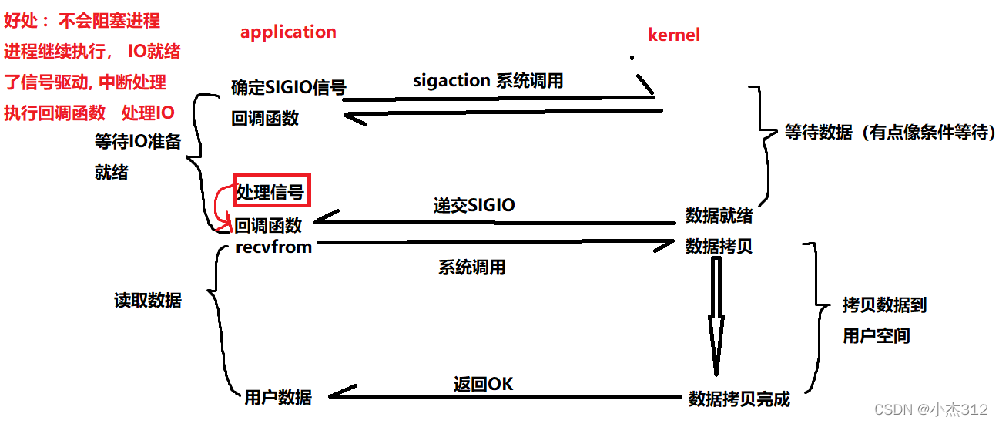
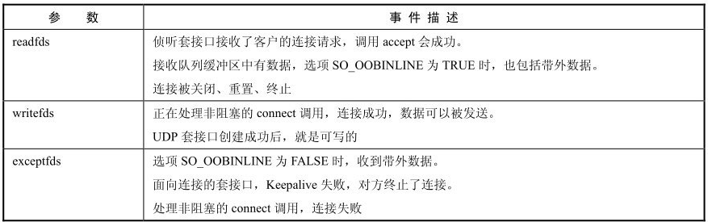
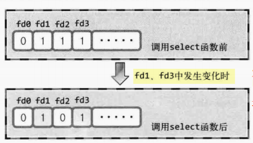
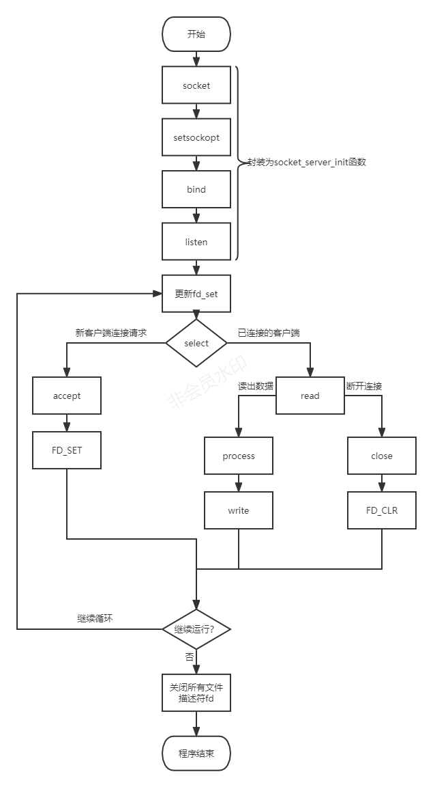

### [C++ IO 多路复用 select](#)
**介绍**： 对于高并发服务器而言，每个连接一个线程去处理是不可能应付得了成千上万的客户请求的，为提高性能提出了许多IO复用方案！

-----

- [x] [1. IO操作模式](#1-io操作模式)
- [x] [2. select 多路复用](#2-select-多路复用)
- [x] [3. select实现socket服务器流程](#3-select实现socket服务器流程)
- [x] [4. 设置socket为非阻塞](#4-设置socket为非阻塞)
- [x] [5. 多线程select模式并发服务器设计](#5-多线程select模式并发服务器设计)

-----

### [1. IO操作模式](#)
O从英文本身去解释就是输入输出(Input/Output)，是指 **数据流的操作**，比如说网络编程的I/O操作，串口的读写等等可以称为I/O操作。可以理解为将数据`(二进制)`
输入到计算机中，或者将数据从计算机输入到其他的硬件设备，如磁盘，网卡、其他外设之类的。

网络IO： 将数据从内存写到网卡，或者网卡读取到远端传过来的数据，写入到内存，然后再由计算机程序去处理的一个交互的过程。

**五种I/O操作模式：**
* 阻塞I/O `blocking I/O`
* 非阻塞I/O `nonblocking I/O`
* I/O复用  `I/O multiplexing`
* 信号驱动I/O `signal driven I/O (SIGIO)`
* 异步I/O `asynchronous I/O (the POSIX aio_functions)`


#### [1.1 阻塞型I/O](#)
linux系统默认的 `I/O` 下操作模式为阻塞模式，也是最常见的I/O操作模式， 在网络编程中，套接字默认也是阻塞模式。

阻塞型I/O：应用程序调用一个I/O函数，导致应用程序阻塞，直到数据准备好, 等数据准备好了，从内核拷贝到用户空间（或者反过来）,I/O函数返回成功！

创建套接字，bind和listen后，以及使用accept连接上后就会使用read/recv函数去等待数据到来，等对方通过socket将数据发送到内核，
内核就会通知进程有数据到来，此时这个函数就会返回，返回接收数据的字节数，**否则一直会在阻塞状态等待数据的到来**。

没有新的连接，accept函数就一直阻塞！
```cpp
auto new_socket_fd = Accept(fd, (struct sockaddr*)&link_addr, &len);
```
如果来了连接，但是没有新的数据到来,read函数就一直阻塞！
```cpp
auto read_count = read(socketId, buffer, 4096);
```

#### [1.2 阻塞I/O的问题](#)
在多线程并发服务器中，我们通常使用主线程去监听用户请求，有请求了就启动一个子线程去处理这个socket连接，这看起来效率还行，但是有一个致命问题。
* 主线程在没有收到新的连接请求的时候，一直阻塞等待，一般在while循环中，陷入忙等。
* 子线程虽然获得了连接，但是由于read/write,recv/send默认是阻塞的，如果用户数据没有发过来，那么也陷入阻塞等待，甚至是空连接攻击，导致创建大量的没有即使销毁的线程，使得系统崩溃！

有没有想过另一种模式，就是启动一个线程，如果有新的连接来，那么就建立一个客户连接socket，存放在本地。那么这个线程就有许多个socket对象+一个监听socket。
一旦有一个socket有接+发操作，就把一个操作让一个工作线程去处理，这样工作线程是不是就总是处于工作了,io多路复用就是这个思想，如何监听socket需要操作系统
底层支持，也就是select、poll、epoll了。


#### [1.3 非阻塞型I/O](#)
当应用程序调用非阻塞I/O完成某个操作，内核立即返回，不会把CPU时间切换给某个其他进程，应用程序在返回后，可以得到足够的CPU时间继续完成其他事情。


设置套接字为非阻塞套接字。
```cpp
int setSocketNonBlocking( int fd )   //自定义函数，用于设置套接字为非阻塞套接字
{
    int old_option = fcntl( fd, F_GETFL );
    int new_option = old_option | O_NONBLOCK;
    fcntl( fd, F_SETFL, new_option );        //设置为非阻塞套接字
    return old_option;
}
```
非阻塞模式的使用并不普遍，因为反复调用IO函数（系统多次查询）,非阻塞模式会浪费大量的CPU资源。

当用户线程发起一个read操作后，并不需要等待，而是马上就得到了一个结果。如果结果是一个error时，它
就知道数据还没有准备好，于是它可以再次发送read操作。一旦内核中的数据准备好了，并且又再次收到了用户线程的请求，那么它马上就将数据拷贝到了用户线程，然后返回。

#### [1.4 同步I/O和异步I/O](#)
* 同步IO：如果一个线程请求进行IO操作，在IO操作完成之前，该线程会被阻塞；
* 异步IO：如果一个线程请求进行IO操作，IO操作不会导致请求线程被阻塞。

**同步IO和异步IO模型是针对用户线程和内核的交互来说的：**
* 同步IO：当用户发出IO请求操作之后，如果数据没有就绪，需要通过用户线程或者内核不断地去轮询数据是否就绪，当数据就绪时，再将数据从内核拷贝到用户线程；
* 异步IO：只有IO请求操作的发出是由用户线程来进行的，IO操作的两个阶段都是由内核自动完成，然后发送通知告知用户线程IO操作已经完成。也就是说在异步IO中，不会对用户线程产生任何阻塞。

这是同步IO和异步IO关键区别所在，同步IO和异步IO的关键区别反映在数据拷贝阶段是由用户线程完成还是内核完成。所以说异步IO必须要有操作系统的底层支持。
注意同步IO和异步IO与阻塞IO和非阻塞IO是不同的两组概念。

[**知识点**](#)
* 同步和异步着重点在于多个任务的执行过程中，一个任务的执行是否会导致整个流程的暂时等待；
* 而阻塞和非阻塞着重点在于发出一个请求操作时，如果进行操作的条件不满足是否会返会一个标志信息告知条件不满足。

#### [1.5 I/O复用](#)
I/O多路复用：关键是实现同时对多个IO端口进行监听。I/O是指 **网络I/O**，**多路** 是指 **多个TCP连接（socket或channel）**，**复用**是指复用**一个线程或几个线程**。
就是说 **一个或一组线程处理多个TCP连接**，最大的优势是减少了系统开销，不必创建过多的线程/进程，也不用维护这些进程/线程。

I/O多路复用是使用两个系统调用`select/poll/epoll`和 `recvfrom`），blocking I/O只调用了 `recvfrom`。


select/poll/epoll核心是可以同时处理多个connection，在连接数不高的情况下，其性能并不一定比多线程+阻塞I/O好，**多路复用模型中，每一个socket，都设置为non-blocking**，阻塞是被
select这个函数阻塞，而不是被socket阻塞。

[**在多路复用IO模型中，会有一个线程不断去轮询多个socket的状态，只有当socket真正有读写事件时，才真正调用实际的IO读写操作**](#)。因为在多路复用IO
模型中，只需要使用一个线程就可以管理多个socket，系统不需要建立新的进程或者线程，也不必维护这些线程和进程，并且只有在真正有socket读写事
件进行时，才会使用IO资源，所以它大大减少了资源占用。

#### [1.6 信号驱动I/O](#)
信号驱动IO: 内核将数据准备好的时候, 使用SIGIO信号通知应用程序进行IO操作，此方式属于同步IO（实际读取数据到用户进程缓存的工作仍然是由用户进程自己负责的）

信号驱动IO, 我们提前在信号集合中设置好IO信号等待， 注册好对应的IO处理函数  handler，IO数据准备就绪后，会递交SIGIO信号，通知
应用程序中断然后开始进行对应的IO处理逻辑. 但是通知处理IO的时候存在将数据从  内核空间拷贝到用户空间的过程。




### [2. select 多路复用](#) 
Select IO多路复用是IO复用模式中的一种，它建立在内核提供的多路分离函数select基础之上，我们使用select函数可以避免同步非阻塞IO模型中轮询等待的问题，此外poll、epoll都是这种模型。

```cpp
#include <sys/select.h>

struct timeval{      
    long tv_sec;  //秒 
    long tv_usec; //微秒 
}


int select(int nfds, fd_set *readfds, fd_set *writefds,  fd_set *exceptfds, struct timeval *timeout);

//下面四个是 宏函数
void FD_CLR(int fd, fd_set *set);//将给定的描述符从文件中删除
int  FD_ISSET(int fd, fd_set *set);//判断指定描述符是否在集合中
void FD_SET(int fd, fd_set *set);//将给定的描述符加入集合
void FD_ZERO(fd_set *set);//清空集合 
```
**参数:**
* int maxfd：指集合中所有文件描述符的范围，即文件描述符的最大值加1（默认最大值为1024）, 内核只需要在我们打开的最大值的描述符以内进行轮询，已减少轮询时间和系统开销。
* readfds `(传入传出参数)`： 需要监视的可读的描述符fd的集合，传入要监听的，返回有读事件的集合！
* writefds `(传入传出参数)`：需要监视的可写的描述符fd的集合，传入要监听的，返回有写事件的集合！
* exceptfds `(传入传出参数)`：需要监视的异常事件的描述符fd的集合，传入要监听的，返回有异常事件的集合！
* timeout：
    * timeout == NULL **阻塞**
        * 等待无限长的时间
        * 等待可以被一个信号中断,如果捕获到一个信号， select函数将返回 -1,并将变量 erro设为 EINTR。
        * 当有一个描述符做好准备或者是捕获到一个信号时函数会返回。
    * timeout->tv_sec == 0 && timeout->tv_usec == 0  **非阻塞，需要轮询**
        * 不等待，直接返回
        * 加入描述符集的描述符都会被测试，并且立即返回
        * 这种方法通过轮询，无阻塞地获得了多个文件描述符状态 
    * timeout->tv_sec !=0 ||timeout->tv_usec!= 0 **超时等待**
        * 等待指定的时间(期间也会被信号中断)
        * 当有描述符符合条件或者超过设定的时间，函数返回



**返回值：**	
* retval > 0 :三个集合中有事件发送，总共有多少个，比如说读文件描述符集中有数据到来时，内核(I/O)根据状态修改文件描述符集，并返回一个大于0的数
* retval = 0 :当没有满足条件的文件描述符，且设置的timeval监控时间超时，select函数会返回 0！
* retval < 0 :出错返回-1（信号中断等）


select()函数有着很好的跨平台性，几乎所以平台都支持，它允许进程指示内核等待多个事件(文件描述符)中的任何一个发生，并只在有一个或多个事件发生或经历一段指定时间
后才唤醒它，然后接下来判断究竟是哪个文件描述符发生了事件并进行相应的处理。但是select也有着系统开销很大和单个进程能够监视的文件描述符的数量存在最大限制的缺点。

### [2.1 Linux select 事件](#)
select用于检测在一组socket中是否有事件就绪，主要分为以下三类：

* **读事件就绪**
    * 在socket 内核中，接收缓冲区中的字节数大于或者等于低水位标记 SO_RCVLOWAT，此时调用recv或者read函数可以无阻塞地读该文件描述符，并且返回值大于0。
    * TCP 连接的对端关闭连接，此时本端调用recv或read函数对socket进行读操作，recv或read函数会返回0值。
    * 在监听socket上有新的连接请求。
    * 在socket上有未处理的错误。
* **写事件就绪**
    * 在socket内核中，发送缓冲区中的可用字节数（发送缓冲区的空闲位置大小）大于或者等于低水位标记SO_SNDLOWAT时，可以无阻塞地写，并且返回值大于0。
    * socket 的写操作被关闭（调用了close或shutdown函数）时，对一个写操作被关闭的socket进行写操作，会触发SIGPIPE信号。
    * socket使用非阻塞connect连接成功或失败时。
* **异常事件就绪**


#### [2.2 fd_set](#)
select()机制中提供一fd_set的数据结构，**实际上是一long类型的数组**，每一个数组元素都能与一打开的文件句柄（不管是socket句柄，还是其他文件或命名管道或设备句柄）建
立联系，建立联系的工作由程序员完成，当调用select()时，由内核根据IO状态修改fd_set的内容，由此来通知执行了select()的进程哪一socket或文件发生了可读或可写事件。

```cpp
//#include<bits/typesizes.h>
define __FD_SETSIZE		1024
//#include<bits/typesizes.h>

typedef long int __fd_mask;

/* __fd_mask == long int */
#undef	__NFDBITS //取消其他对 __NFDBITS 已定义的#define指令。

#define __NFDBITS	(8 * (int) sizeof (__fd_mask)) //位的数量 8 个  long int = 8 * (int) sizeof (long int)
#define	__FD_ELT(d)	((d) / __NFDBITS)
#define	__FD_MASK(d)	((__fd_mask) (1UL << ((d) % __NFDBITS)))

/* fd_set for select and pselect.  */
typedef struct
{
    /* XPG4.2 requires this member name.  Otherwise avoid the name
       from the global namespace.  */
#ifdef __USE_XOPEN
    __fd_mask fds_bits[__FD_SETSIZE / __NFDBITS];
# define __FDS_BITS(set) ((set)->fds_bits)
#else
    __fd_mask __fds_bits[__FD_SETSIZE / __NFDBITS];
# define __FDS_BITS(set) ((set)->__fds_bits)
#endif
} fd_set;
```

如果未定义 `__USE_XOPEN` 整理代码：
```cpp
typedef struct
{
    long in fds_bits[16];

} fd_set;
```
#### [2.3 fd_set 工作方式](#)
**fd_set 本质上就是一个 位图，大小是64*16=1024位！**, 每个位对应一个 `socket_fd`。
* 函数调用前传递参数: 将需要监听文件描述符加入集合，fd_set会将对应位设置为1，表示需要监听其行为。
* 函数调用后返回的参数： 如果集合中某个文件描述符发生了事件，返回的fd_set的会将对应位设置为1，没有事件发生就是0。



需要和四个宏函数相互配合使用！
```cpp
auto fd = Socket(AF_INET, SOCK_STREAM, 0);
auto udp_fd = Socket(AF_INET, SOCK_DGRAM, 0);
fd_set read_set;

FD_ZERO(&read_set); // 蜻蛉
FD_SET(fd, &read_set);

std::cout << FD_ISSET(fd, &read_set) << std::endl; //1
std::cout << FD_ISSET(udp_fd, &read_set) << std::endl; //0
```

### [3. select实现socket服务器流程](#) 
实现一个基于select模式的服务器！

#### [3.1 基本流程图](#)
基本流程图如下所示：



#### [3.2 select 简单实现](#)
暂时未按照上面的流程图写！ 可以自定义一个数据结构，存储所有的fd!

```cpp
#include <netinet/in.h>
#include "must.h"
#include "socket_wrap.hpp"

int initServer(unsigned short port, unsigned short max_connection){
    auto fd = Socket(AF_INET, SOCK_STREAM,0);
    /* 允许地址复用 */
    int opt = 1;
    if (setsockopt(fd, SOL_SOCKET, SO_REUSEADDR, (void *)&opt, sizeof(opt)) == -1){
        throw std::runtime_error("set socket error！");
    }
    int recvBufSize = 0;
    int len = sizeof(recvBufSize);
    getsockopt( fd, SOL_SOCKET, SO_RCVBUF, &recvBufSize, ( socklen_t* )&len );
    printf("默认buf大小: %d \n",recvBufSize);

    sockaddr_in serverAddress{
            AF_INET,
            htons(port),
            htonl(INADDR_ANY)
    };
    Bind(fd, (const struct sockaddr *)&serverAddress, sizeof(serverAddress));
    Listen(fd, max_connection);
    std::cout << "start server at 127.0.0.1 running in "<< std::to_string(port) <<":" << "\n";
    return fd; //返回套接字
}

int main() {
    auto listenSocketFd = initServer(15555, 20);
    fd_set readSet, allSet;
    FD_ZERO(&allSet);
    auto maxSocketFd = listenSocketFd; //最大文件描述符

    FD_SET(listenSocketFd, &allSet); //加入

    auto readyCount = 0;

    while (1){
        readSet = allSet;
        readyCount = select(maxSocketFd + 1, &readSet, nullptr, nullptr, nullptr);
        //阻塞等待
        if (readyCount < 0){
            throw std::runtime_error("error happen in select function!"); //发生错误
        }
        //新连接事件
        if (FD_ISSET(listenSocketFd, &readSet)){
            //有新的客户端连接
            sockaddr_in link_addr{};
            socklen_t len = sizeof(link_addr);
            auto newFd = Accept(listenSocketFd, (struct sockaddr *)&link_addr, &len);
            FD_SET(newFd, &allSet); //放进去
            std::cout << "the socket " << std::to_string(newFd) << " has been join!" << std::endl;
            if (maxSocketFd < newFd) maxSocketFd = newFd;
            if (readyCount == 1) continue;
        }
        //读事件
        for (auto i = listenSocketFd + 1; i <= maxSocketFd ; i++) {
            if (FD_ISSET(i, &readSet)){
                char buffer[4096]; //缓冲区
                auto read_count = read(i, buffer, 4096);
                if (read_count == 0) {
                    close(i); //关闭了
                    FD_CLR(i, &allSet);
                    std::cout << "the connect " << std::to_string(i) <<" has been end!" << std::endl;
                    continue;
                }
                if (read_count == -1){
                    if (errno == EINTR){
                        i--; //被中断 重新读取
                        continue;
                    }
                    throw std::runtime_error("read error!"); //发生错误
                }
                buffer[read_count] = '\0';
                std::cout << "message: " << buffer << std::flush;
            }
        }
    }
    close(listenSocketFd);
    return 0;
}
```

#### [3.3 select 优缺点](#)
由于select设计的时期较为早，所有优缺点有些明显， 但是毫无疑问相对于单纯的多进程线程服务器，性能已经好很多了。

**缺点：**
* 每次调用都需要重新设置fd_set
* 单个进程可监视的fd数量被限制，select 支持监听的fd有限，监听上限受制于文件描述符，最大值为1024。
* 底层采用轮询机制，大量连接下效率很低
* 能监视文件描述符个数为int型，当所支持的文件描述符个数足够大时，数据会溢出。
* 需要维护一个用来存放大量fd的数据结构，这样会使得用户空间和内核空间在传递该结构时复制开销大。 
* 对fd进行扫描时是线性扫描。fd剧增后，IO效率较低，因为每次调用都对fd进行线性扫描遍历，所以随着fd的增加会造成遍历速度慢的性能问题 
* select() 函数的超时参数在返回时也是未定义的，考虑到可移植性，每次在超时之后在下一次进入到select之前都需要重新设置超时参数。

**优点**
* 完全跨平台实现！

### [4. 设置socket为非阻塞](#)
在使用select以后，就可以把socket设置为非阻塞模式。当然设置有多种方式！ 由于在服务端有监听套接字和服务客户端套接字，所以
如果要都设置为非阻塞就要分别设置！

#### [4.1 通过fcntl函数](#)

```cpp
#include <fcntl.h>
int newSocketFlag = fcntl(fd, F_GETFL, 0) | O_NONBLOCK;
fcntl(fd,F_GETFL, newSocketFlag);
```

#### [4.2 通过socket函数](#)
在创建的时候设置, 只需要在type参数天一个 SOCK_NONBLOCK 标志！

```cpp
auto socket_fd = socket(AF_INET, SOCK_STREAM | SOCK_NONBLOCK, 0);
```

#### [4.3 将accept函数返回的socket设置为非阻塞](#)
linux提供了扩展函数 accept4, 参数如下所示, 给flags传递 SOCK_NONBLOCK即可！
```cpp
int accept4(int socket_fd, struct sockaddr *addr, socklen_t *addrlen, int flags);
```


### [5. 多线程select模式并发服务器设计](#) 
首先由于select，最多只能监听1024个套接字，如果套接字的fd的大小超过1024就无法运行了，正常情况，没法设计一种多线程程序，
一个线程负责接受连接，多个工作线程负责读写，因为连接套接字fd大小超过1024就无法将其加入监听列表了。
因为每个工作线程都只能接受0～1024范围内的套接字，

解决方法： 开多个线程，实现端口复用，每个线程都作一模一样的事情，接受连接请求，处理读写事件！

#### [5.1 端口复用](#)
默认情况下，一个 IP、端口组合只能被一个套接字绑定，Linux 内核从 3.9 版本开始引入一个新的 socket 选项 SO_REUSEPORT，又称为 port sharding，允许多个套接字监听同一个IP 和端口组合。

为了充分发挥多核 CPU 的性能，多进程的处理网络请求主要有下面两种方式

主进程 + 多个 worker 子进程监听相同的端口
多进程 + REUSEPORT


-----