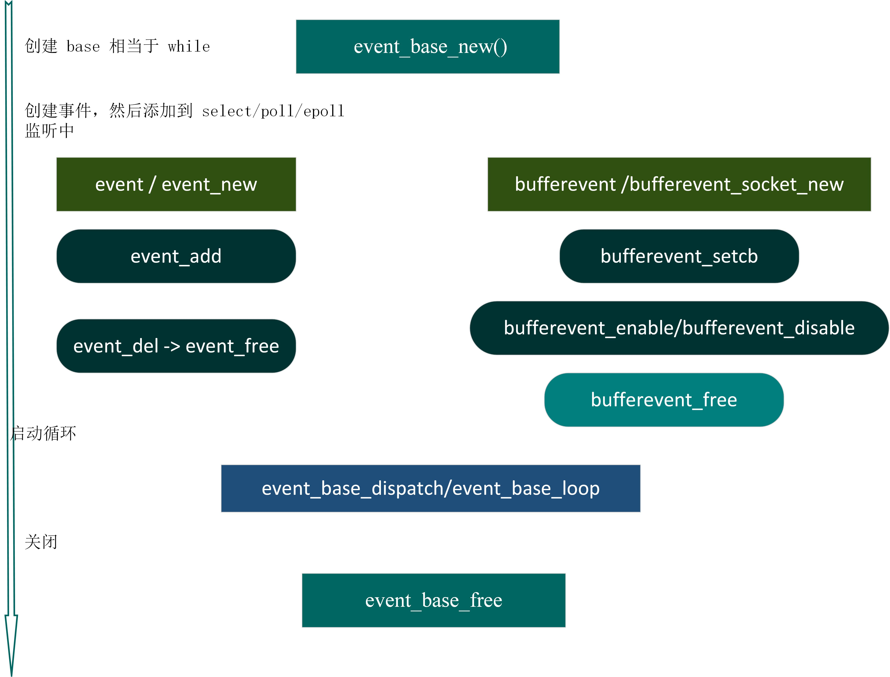
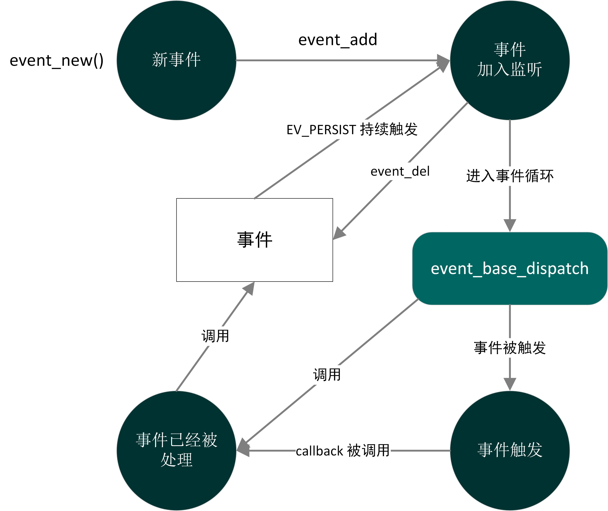

### [libevent 基操](#)
 **介绍**： Reactor模式的基本流程：应用程序需要提供相应的接口并且注册到reactor反应器上，如果相应的事件发生的话，那么reactor将自动调用相应的注册的接口函数（类似于回调函数）通知你，所以libevent是事件触发的网络库。

-----
- [x] [1. event_base](#1-event_base)
- [x] [2. 创建事件](#2-创建事件)
- [x] [3. 事件循环控制](#3-事件循环控制)
- [x] [4. tcp echo server](#4-tcp-echo-server)
- [x] [5. bufferevent](#5-bufferevent)
- [x] [6. evconnlistener](#6-evconnlistener)
- [x] [7. client](#7-client)
- [x] [8. 信号事件](#8-信号事件)

-----

### [1. event_base](#)
使用libevent函数之前，需要创建一个event_base，它相当于是一个底座/地基，只要向 **底座** 上插入事件，然后不断的监控事件，等待事件发生调用回调函数即可。使用 libevent 函数之前需要分配一个或者多个 **event_base** 结构体，
每个 event_base 结构体持有一个 **事件集合** ,可以检测以确定哪个事件是激活的。

event_base支持的所有method如下： select、poll、epoll、kqueue、devpoll、evport、win32

libevent 事件框架

```cpp
//创建 event_base
struct event_base * base = event_base_new();
//创建 事件event
struct event *  ev = event_new()
struct bufferevent * b_ev = bufferevent_socket_new()
//将事件 添加到 event_base
event_add(struct event *ev, const struct timeval *timeout);
//启动循环 ，开始监听事件 是否满足/触发
event_base_dispatch(base); //循环检测事件，事件发生时触发回调函数
//释放 event_base
event_base_free(base);
```



#### [1.1 event_base 构造与释放](#)
可以使用方法 event_base_new 创建默认的 event_base, 大多数场景，我们都是直接调用这个函数来申请event_base的。
event_base结构相当于epoll红黑树的树根节点, 每个event_base都有一种用于检测某种事件已经就绪的 “方法”(回调函数)。

```cpp
#include<event.h>
struct event_base *event_base_new(void);  //失败返回NULL
```

如果 fork 子进程, 且子进程也要使用base, 则子进程需要对event_base重新初始化, 此时需要调用event_reinit函数。
```cpp
int event_reinit(struct event_base *base); 
```

释放event_base指针。
```cpp
void event_base_free(struct event_base *); 
```

#### [1.2 检查event_base后端方法](#)
也就是检查event_base 正在使得的、支持的IO多路复用方法。

|方法|返回值|参数个数|
|:---|:---|:---|
|event_get_supported_methods(void)|const char \*\*|返回一个指针 ,指向 libevent 支持的IO多路方法名字数组，这个数组的最后一个元素是NULL|
|event_base_get_method(const struct event_base \*base)|const char \*|返回 event_base 正在使用的IO多路方法|
|event_base_get_features(const struct event_base \*base)|enum event_method_feature|返回 event_base 支持的特征的比特掩码|

```cpp
struct event_base * base = event_base_new();

//系统支持那些方法
const char **result = event_get_supported_methods();
//指向 libevent 支持的方法名字数组，这个数组的最后一个元素是 NULL
int i = 0;
while (result[i] != nullptr){
    std::cout << result[i++] << " ";
}

//正在使用的io复用方法
std::cout << "\nuse io method: " << event_base_get_method(base) << "\n";

int future = event_base_get_features(base);

event_base_free(base);
```

### [2. 创建事件](#) 
在base上安装、监控event的流程，libevent 创建事件分为两种：常规事件（event_new）和带缓冲区的事件（bufferevent_socket_new）。

普通事件：由于socket 底层缓存区触发的读事件或者写事件，然后调用回调函数。



#### [2.1 event_new 事件创建](#)
调用event_new()函数之后, 新事件处于已初始化和非未决状态。

```cpp
struct event *event_new(struct event_base *, evutil_socket_t, short e_event, event_callback_fn cb, void *);

typedef void (*event_callback_fn)(evutil_socket_t, short, void *);
/*
evutil_socket_t    文件描述符 - int
event_callback_fn  回调函数，事件的处理动作
*/


//e_event 事件处理方式参数：
#define EV_TIMEOUT 0x01 // 超时事件
#define EV_READ 0x02    // 读事件
#define EV_WRITE 0x04   // 写事件
#define EV_SIGNAL 0x08  // 信号事件
#define EV_PERSIST 0x10 // 周期性触发
#define EV_ET 0x20 // 边沿模式
````

#### [2.2 event_add 事件添加](#)
将事件添加到监听树上面，相当于 epoll_ctl ADD 操作！

```cpp
int event_add(struct event *ev, const struct timeval *timeout);
////returh 0 if successful, or -1 if an error occurred

/* timeout
  NULL 持续等待
  非空 等待一个时间
/*
```

```cpp
//使用例子
struct event * read_event = event_new(base, cfd, EV_READ | EV_PERSIST, read_callback , args);
event_add(read_event, nullptr);
```

#### [2.3 event_del 移除事件](#)
从监听树上面移除事件。

```cpp
int event_del(struct event *);
//returh 0 if successful, or -1 if an error occurred
```

#### [2.4 event_free 释放事件](#)

```cpp
void event_free(struct event *);
```

### [3. 事件循环控制](#) 
一旦创建好事件根基event_base，并且在根基上安插好事件之后，需要对事件循环监控(换句话说就是等待事件的到来，触发事件的回调函数)，有两种方式可以达到上面描述的功能，即： **event_base_dispatch** 和 **event_base_loop**:

```cpp
int event_base_dispatch(struct event_base *);
//return 0：成功,   -1 ：发生错误，1 已退出循环，没有待监测或则激活的事件
int event_base_loop(struct event_base *base, int flags);
//return 0：成功,   -1 ：发生错误，1 已退出循环，没有待监测或则激活的事件
```

参数 **flags**
* EVLOOP_ONCE： 相当于epoll_wait阻塞方式&&只调用一次
    * 当没有事件到来时，程序将一直阻塞在event_base_loop函数；直到有任意一个事件到来时，程序才不会阻塞在event_base_loop，将会继续向下执行。
* EVLOOP_NONBLOCK： 相当于epoll_wait非阻塞方式&&只调用一次 
    * 即使没有事件到来，程序也不会阻塞在event_base_loop
* EVLOOP_NO_EXIT_ON_EMPTY： 等价于event_base_dispatch 
    * 一直循环监控事件 ⇒ 直到没有已经注册的事件 || 调用了 `event_base_loopbreak()` 或 `event_base_loopexit()` 为止

在 **event_base_dispatch** 函数中，实际上调用的是 **event_base_loop(event_base, 0)**；


#### [3.1 退出事件循环](#)
如果想在移除所有已注册的事件之前停止活动的事件循环，可以调用两个稍有不同的函数
```cpp
int event_base_loopexit(struct event_base *base, const struct timeval *tv);	

struct timeval
{
    long tv_sec; /* Seconds.  */
    long tv_usec; /* Microseconds.  */
};

```
让 event_base 在给定时间之后停止循环。如果 tv 参数为 NULL ，event_base 会立即停止循环，没有延时。如果 event_base 当前正在执行任何激活事件的回调，则回调会继续运行，直到运行完所有激活事件的回调之才退出
```cpp
int event_base_loopbreak(struct event_base *base);
```
让 event_base 立即退出循环(即使有其他正在执行任何激活事件的回调)。

### [4. tcp echo server](#)
基本流程和epoll反应堆差不多！

```
创建套接字
绑定 监听
创建 event_base 根节点
初始化上树节点
上树
循环监听
结束
```

```cpp
#include <signal.h>
#include <iostream>
#include "net/wrap.hpp"
#include <event2/event.h>
#include <event2/listener.h>
#include <event2/buffer.h>
#include <event.h>

void notNull(void *ptr ,const std::string &errorInfo){
    if (ptr == nullptr) {
        throw std::runtime_error(errorInfo);
    }
}

struct readArgs{
    sockaddr_in * address;
    struct event * readEvent;
    struct event_base * base;
};

void read_callback(evutil_socket_t fd, short events, void * arg){
    auto * pack = (readArgs *)arg;
    char buffer[2049]; //缓冲区
    auto read_count = recv(fd, buffer, 2048, 0);

    if (read_count <= 0) {
        std::cout << "the connect " << std::to_string(fd) <<" has been end !" << std::endl;
        close(fd); //关闭了
        free(pack->address); //释放地址
        event_del(pack->readEvent); //摘下事件
        event_free(pack->readEvent); //释放事件
        free(pack);
        return;
    }
    char *addrIP = inet_ntoa(pack->address->sin_addr);

    buffer[read_count] = '\0';
    std::cout << addrIP <<" - " << ntohs(pack->address->sin_port) << ": " << buffer << std::flush;
    std::string  message = "get bytes " + std::to_string(read_count) + "\n";

    char *sendData = new char[message.size() + 1];
    for (int i = 0; i < message.size(); ++i) {
        sendData[i] = message[i];
    }
    sendData[message.size()] = '\0';

    auto write_count = send(fd ,sendData , message.size(),0);

    if (write_count <= 0){
        //失败了
        std::cout << "write failed!" << std::endl;
    }

}

void server_callback(evutil_socket_t fd, short events, void * arg){
    auto *addr = new sockaddr_in();
    socklen_t len = sizeof(*addr);;
    auto clientFd = wrap::Accept(fd, (struct sockaddr*)addr, &len);

    char *addrIP = inet_ntoa(addr->sin_addr);
    std::cout << "new socket connection: " << clientFd << " from ip: "<< addrIP <<" port: "
              << ntohs(addr->sin_port)  << std::endl;

    //将clientFd 添加到监听中！
    auto * base = (struct event_base *)arg;
    auto * args = new readArgs();
    struct event * read_event = event_new(base, clientFd, EV_READ | EV_PERSIST, read_callback , args);
    args->base = base;
    args->address = addr;
    args->readEvent =read_event;

    event_add(read_event, nullptr);
}

int main(int argc, char *argv[]) {
    auto server = wrap::initServer(15000, 64);

    struct event_base *base = event_base_new();
    notNull(base, "create event base failed!");

    struct event *serverIn = event_new(base, server, EV_READ|EV_PERSIST, server_callback , base);

    event_add(serverIn, nullptr);

    event_base_dispatch(base);

    close(server);
    event_base_free(base);
    return 0;
}

```

### [5. bufferevent](#) 
就是普通事件，但是提供了缓冲区，通常已连接的套接字除了相应事件之外，应用还希望做一定的数据缓冲。比如写入数据的时候，通常的运行模式是：

* 决定要向连接写入一些数据，把数据放入到缓冲区中。
* 等待连接可以写入。
* 写入尽量多的数据。
* 记住写入了多少数据，如果还有更多数据要写入，等待连接再次可以写入。

这种缓冲IO模式很通用，libevent为此提供了一种通用机制即bufferevent， bufferevent由一个底层的传输端口（如已连接套接字）、一个读取缓冲区和一个写入缓冲区组成。
与通常的事件在底层传输端口已经就绪，可以读取或者写入的时候执行回调不同的是，bufferevent在读取或者写入了足够量的数据之后再调用用户提供的回调。


**用户通过bufferevent不必处理系统底层IO操作，仅仅从bufferevent中读取相应数据即可。** 当前bufferevent **只能用于像TCP这样的面向流** 的协议，将来才可能会支持像UDP这样的面向数据报的协议

**bufferevent** 则是为了简化在accpet成功返回已连接套接字之后，从已连接套接字接收数据和发送数据（这也需要通过epoll处理）需要自建立缓冲区的过程，
bufferevent通过链表建立自己的缓冲区，使得用户不必为缓冲数据的处理而烦恼，用户仅仅需要在回调函数里面通过 **bufferevent_read** 或者 **bufferevent_write** 读出或写入数据即可。

#### [5.1 创建 bufferevent](#)
bufferevent创建和回调函数设置是分开进行的。

创建一个基于socket的bufferevent，是通过bufferevent_socket_new函数实现的，该函数定义如下：
```cpp
struct bufferevent * 
bufferevent_socket_new(
    struct event_base *base, evutil_socket_t fd, 
    enum bufferevent_options options
);


enum bufferevent_options {
	/** 如果设置了，那么当这个bufferevent被释放时，我们将关闭底层文件描述符 fd/bufferevent/anything。 */
	BEV_OPT_CLOSE_ON_FREE = (1<<0),

	/** 如果设置了，并且启用了线程处理，则此缓冲区上的操作受锁保护 */
	BEV_OPT_THREADSAFE = (1<<1),

	/** 如果设置了，回调将在事件循环中延迟运行。*/
	BEV_OPT_DEFER_CALLBACKS = (1<<2),

	/** 如果设置了，则执行回调时不会在缓冲区事件上保留锁。
	* 此选项当前要求同时设置BEV_OPT_DEFER_CALLBACKS
	* Libevent的未来版本可能会删除该要求。 */
	BEV_OPT_UNLOCK_CALLBACKS = (1<<3)
};
```

#### [5.2  回调函数设置](#)
需要给bufferevent 添加回调函数，添加后还需要设置回调函数，去启动回调函数。

[**bufferevent 有三个回调函数**](#)
* 读回调 bufferevent将底层读缓存数据读到自身的读缓存区时触发读事件。
* 写回调 bufferevent将自身写缓存数据读到底层的写缓存区时触发写事件。
* 事件回调 当与bufferevent关联的socket连接发送关闭、发生异常的时候触发事件。

调 bufferevent_setcb 去设置回调函数：
```cpp
void bufferevent_setcb(struct bufferevent *bufev,
    bufferevent_data_cb readcb, bufferevent_data_cb writecb,
    bufferevent_event_cb eventcb, void *cbarg);

typedef void (*bufferevent_data_cb)(struct bufferevent *bev, void *ctx);
typedef void (*bufferevent_data_cb)(struct bufferevent *bev, void *ctx);
typedef void (*bufferevent_event_cb)(struct bufferevent *bev, short what, void *ctx);
```
调研函数去设置事件发生的时候是否call回调函数：
```cpp
int bufferevent_enable(struct bufferevent *bufev, short event); //启动事件 回调
int bufferevent_disable(struct bufferevent *bufev, short event); //禁用事件 回调
short bufferevent_get_enabled(struct bufferevent *bufev); //得到状态  返回值 A combination of EV_READ | EV_WRITE
```

#### [5.3 bufferevent 事件类型](#)
**事件类型:**
```cpp
#define BEV_EVENT_READING	0x01	/**< error encountered while reading */
#define BEV_EVENT_WRITING	0x02	/**< error encountered while writing */
#define BEV_EVENT_EOF		0x10	/**< eof file reached 连接关闭了 */
#define BEV_EVENT_ERROR		0x20	/**< unrecoverable error encountered */
#define BEV_EVENT_TIMEOUT	0x40	/**< user-specified timeout reached */
#define BEV_EVENT_CONNECTED	0x80	/**< connect operation finished. */
```

#### [5.5 读写API](#)
将数据 data使用bufferevent送到写缓冲区，等数据写完毕以后，触发写回调 writecb。
```cpp
int bufferevent_write(struct bufferevent *bufev,const void *data, size_t size);
```

当读缓冲有数据以后触发回调函数 readcb  `-->` 使用 bufferevent_read读取数据


从读缓冲区读取数据，然后将读到的数据冲缓冲区清空！
```cpp
size_t bufferevent_read(struct bufferevent *bufev, void *data, size_t size);
```

#### [5.4 evbuffer 简介](#)
BufferEvent 在进行读取和写入数据时，将数据存放在 evBuffer 中，因此，要想获取数据的相关信息—>需要对evBuffer结构进行解析。

```cpp
char messages[] = {"muse is my father!\n"};

struct evbuffer* evbuf = evbuffer_new( );
evbuffer_add(evbuf, messages, sizeof(messages));

std::cout << evbuffer_get_length(evbuf) << std::endl; //20

char* result = evbuffer_readline(evbuf);

std::cout << evbuffer_get_length(evbuf) << std::endl;
std::cout << result << "\n"; //muse is my father!

evbuffer_free(evbuf); //手动释放evbuffer
```
#### [5.6 释放 bufferevent事件](#)

```cpp
void bufferevent_free(struct bufferevent *bufev);
```

#### [5.7 例子](#)
一个小的回显服务器!

```cpp
struct readArgs{
    sockaddr_in address;
    struct event_base * base;
};

void read_callback(struct bufferevent *bev, void *user_data);
void write_callback(struct bufferevent *bev, void *user_data);
void event_callback(struct bufferevent *bev, short events, void *ctx);

void listener_callback(struct evconnlistener * evListener, 
evutil_socket_t cfd, struct sockaddr * clientAddr, int socklen, void * ptr){
    auto base = evconnlistener_get_base(evListener);
    auto addr = (struct sockaddr_in *)clientAddr;

    char *addrIP = inet_ntoa(addr->sin_addr);
    std::cout << "new connection: " << cfd << " from ip: "<<
        addrIP <<" port: " << ntohs(addr->sin_port)  << std::endl;

    //添加 bufferevent 事件
    struct bufferevent * bev = bufferevent_socket_new(base, cfd, BEV_OPT_CLOSE_ON_FREE);
    notNull(base, "bufferEvent cant be nullptr!");

    //回调函数参数
    auto *arg= new readArgs();
    arg->address = *addr;
    arg->base = base;

    bufferevent_setcb(bev, read_callback,write_callback, event_callback, arg);
    bufferevent_enable(bev, EV_WRITE | EV_READ | EV_CLOSED | BEV_EVENT_EOF);
}

void read_callback(struct bufferevent *bev, void *user_data){
    auto pack = (struct readArgs *)user_data;

    struct evbuffer * input = bufferevent_get_input(bev);
    char  * data = evbuffer_readline(input);

    char *addrIP = inet_ntoa(pack->address.sin_addr);
    std::cout << addrIP <<" - " << ntohs(pack->address.sin_port) 
        << ": " << data << std::endl << std::flush;
    if (data != nullptr){
        std::string message(data);

        transform(message.begin(), message.end(), message.begin(), ::toupper);
        message.insert(message.end(), {'\n','\0'});
        bufferevent_write(bev, message.c_str(), message.size());
    }
};

void write_callback(struct bufferevent *bev, void *user_data){
    struct evbuffer *output = bufferevent_get_output(bev);
    if (evbuffer_get_length(output) == 0) {
        std::cout << "write finish!" << std::endl;
    }
}

//其他事件
void event_callback(struct bufferevent *bev, short events, void *ctx){
    if (events & BEV_EVENT_EOF) {
        std::cout << "Connection closed.\n";
    } else if (events & BEV_EVENT_ERROR) {
        std::cout <<"Got an error on the connection: " <<
            bufferevent_getfd(bev) << " errno: " << errno << std::endl;
    }
    bufferevent_free(bev);
}
```


### [6. evconnlistener](#)
但是对于服务器端来说，仍然需要用户自行调用socket、bind、listen、accept等步骤。这个过程有点繁琐，并且一些细节可能考虑不全，为此Libevent推出了一些对应的
封装函数，简化了整个监听的流程，用户仅仅需要在对应回调函数里面处理已完成连接的套接字即可。 **还是自己写一个比较好，难得花时间学一些别人的API！**

1. 省去了用户手动注册事件的过程。
2. 省去了用户去验证系统函数返回是否成功的问题。
3. 帮助用户完成了处理非阻塞套接字accpet的麻烦。
4. 整个过程一气呵成，用户仅仅关系业务逻辑即可，其他细节，libevent都帮你搞定

#### [6.1 evconnlistener_new_bind](#)
用户仅仅需要通过evconnlistener_new_bind传递回调函数，在aceept成功后，在回调函数里面处理已连接的套接字即可。省去了用户需要处理的一些列麻烦问题。

```cpp
struct evconnlistener *evconnlistener_new_bind(struct event_base *base,
    evconnlistener_cb cb, void *ptr, unsigned flags, int backlog,
    const struct sockaddr *sa, int socklen);

//链接监听器的回调函数
typedef void (*evconnlistener_cb)(struct evconnlistener *listener,
    evutil_socket_t sock, struct sockaddr *addr, int len, void *ptr);
//sock 客户端的 client fd
//addr 客户端地址，不需要释放，指向栈区地址
//len 大小 
```

* flags 参数：
```cpp
#define LEV_OPT_LEAVE_SOCKETS_BLOCKING	(1u<<0)  //文件描述符为阻塞，默认是非阻塞
#define LEV_OPT_CLOSE_ON_FREE		(1u<<1)  //关闭时自动释放
#define LEV_OPT_CLOSE_ON_EXEC		(1u<<2)   //指示如果可能的话，我们应该设置关闭执行标志
#define LEV_OPT_REUSEABLE		(1u<<3) //地址复用
#define LEV_OPT_THREADSAFE		(1u<<4) //线程安全
#define LEV_OPT_DISABLED		(1u<<5)  //指示应在禁用状态下创建侦听器。稍后使用evconnlistener_enable（）启用它。
#define LEV_OPT_DEFERRED_ACCEPT		(1u<<6)  //防止空连接攻击
#define LEV_OPT_REUSEABLE_PORT		(1u<<7)  //端口
#define LEV_OPT_BIND_IPV6ONLY		(1u<<8)  //指示侦听器希望仅在IPv6套接字中工作。
```
* backlog 参数： listen函数的第二个参数，监听上限
* sa: bind 的第二个参数，绑定的地址信息
* socklen： bind 的第三个参数

```cpp
void listener_callback(struct evconnlistener * evListener, evutil_socket_t cfd, 
    struct sockaddr * clientAddr, int socklen, void * ptr){
    auto base = evconnlistener_get_base(evListener);
    auto addr = (struct sockaddr_in *)clientAddr;
    char *addrIP = inet_ntoa(addr->sin_addr);
    std::cout << "new connection: " << cfd << " from ip: "<<
         addrIP <<" port: " << ntohs(addr->sin_port)  << std::endl;
    //将clientFd 添加到监听中！
    auto * args = new readArgs();
    args->base = base;
    args->address = *addr;
    struct event * read_event = event_new(base, cfd, EV_READ | EV_PERSIST, read_callback , args);
    args->readEvent = read_event;
    event_add(read_event, nullptr);
}

int main(int argc, char *argv[]) {
    struct event_base *base = event_base_new();
    notNull(base, "create event base failed!");

    unsigned short port = 15000;
    /* 服务器地址 */
    sockaddr_in serverAddress{
            AF_INET,
            htons(port),
            htonl(INADDR_ANY)
    };

    struct evconnlistener * listener = evconnlistener_new_bind(base, listener_callback, nullptr,
            LEV_OPT_CLOSE_ON_FREE |LEV_OPT_REUSEABLE|LEV_OPT_REUSEABLE|LEV_OPT_DEFERRED_ACCEPT,
            128, (const struct sockaddr *)&serverAddress, sizeof(serverAddress));

    event_base_dispatch(base);

    evconnlistener_free(listener);
    event_base_free(base);
    return 0;
}
```


#### [6.2 evconnlistener_new](#)
与其不同之处在于它的后面的参数，它默认你已经设置好了socket，已经完成初始化，bind和listen都已经完成了！

```cpp
struct evconnlistener *evconnlistener_new(struct event_base *base,
    evconnlistener_cb cb, void *ptr, unsigned flags, int backlog,
    evutil_socket_t fd);
```

#### [6.3 其他API 函数](#)
evconnlistener 机制提供了监听和接受 TCP 连接的方法!

|函数 API| 说明 |
|:----|:----|
|void evconnlistener_free(struct evconnlistener *lev)|释放一个链接监听器|
|int evconnlistener_disable(struct evconnlistener *lev)|禁用|
|int evconnlistener_enable(struct evconnlistener *lev)|启用|
|void evconnlistener_set_cb(struct evconnlistener *lev,evconnlistener_cb cb, void *arg)|设置链接监听器的回调函数|
|struct event_base \* evconnlistener_get_base(struct evconnlistener \*listener)| 返回base |

### [7. client]($)
要记住这是如何创建套接字的, `bufferevent_socket_new` 套接字参数传递 `-1` 。


```cpp
struct event_base *base = event_base_new();

auto bev = bufferevent_socket_new(base, -1, BEV_OPT_CLOSE_ON_FREE);

sockaddr_in serverAddress{
        AF_INET,
        htons(15000)
};
inet_aton("127.0.0.1",&serverAddress.sin_addr);

bufferevent_socket_connect(bev, (const struct sockaddr*)&serverAddress, sizeof(serverAddress));
```

#### [7.1 bufferevent_socket_connect](#)
bufferevent_socket_connect 函数只在 v2.0.2以后有，之前只能手动connect ,如果这个连接成功，bufferevent会收到一个写就绪。如果通过 bufferevent_socket_connect 发起连接就会收到BEV_EVENT_CONNECTED标志。

```cpp
int bufferevent_socket_connect(struct bufferevent *, const struct sockaddr *, int);
```

#### [7.2 完整流程](#)
```cpp
//
// Created by remix on 23-5-11.
//
#include <iostream>
#include "net/wrap.hpp"
#include <event.h>
#include <event2/event.h>
#include <event2/listener.h>
#include <event2/buffer.h>

void read_callback(struct bufferevent *bev, void *user_data){
    char msg[1024];
    auto len = bufferevent_read(bev, msg, 1023);
    if (len < 1023){
        msg[len] = '\0';
    }
    std::cout <<"from server: " << msg << std::endl;
};

void write_callback(struct bufferevent *bev, void *user_data){
    struct evbuffer *output = bufferevent_get_output(bev);
    if (evbuffer_get_length(output) == 0) {
        std::cout << "write finish!" << std::endl;
    }
}

//其他事件
void event_callback(struct bufferevent *bev, short events, void *ctx){
    if (events & BEV_EVENT_EOF) {
        std::cout << "Connection closed.\n";
        bufferevent_free(bev);
    } else if (events & BEV_EVENT_ERROR) {
        std::cout <<"Got an error on the connection: " <<
                  bufferevent_getfd(bev) << " errno: " << errno << std::endl;
        bufferevent_free(bev);
    }else if (events & BEV_EVENT_CONNECTED){
        std::cout << "Connect to server successfully.\n";
    }
}

int main(int argc, char *argv[]) {
    struct event_base *base = event_base_new();

    auto bev = bufferevent_socket_new(base, -1, BEV_OPT_CLOSE_ON_FREE);

    sockaddr_in serverAddress{
            AF_INET,
            htons(15000)
    };
    inet_aton("127.0.0.1",&serverAddress.sin_addr);

    bufferevent_socket_connect(bev, (const struct sockaddr*)&serverAddress, sizeof(serverAddress));
    bufferevent_setcb(bev, read_callback, write_callback,event_callback, nullptr);
    bufferevent_enable(bev, EV_READ|EV_PERSIST|EV_WRITE|EV_CLOSED);

    std::string msg{"fuck you to mother! \n"};
    bufferevent_write(bev, msg.c_str(), msg.size());

    event_base_dispatch(base);

    event_base_free(base);
    return 0;
}
```

### [8. 信号事件](#)
对于信号事件的监听，比较不同的是，不是每一个信号有一个event，然后放进内核中去监听。而是对于所有信号，共用一个信号事件event去监听。
signalEvent和event的类型一样，都是 `struct event*`,  只是创建方式不一样！
```cpp
struct event *signal_event = evsignal_new(base, SIGINT, signal_cb, (void *)base);

event_add(signal_event, NULL);
```

#### [8.1 libevent定义的信号](#)
```cpp
/* ISO C99 signals.  */
#define	SIGINT		2	/* Interactive attention signal.  */
#define	SIGILL		4	/* Illegal instruction.  */
#define	SIGABRT		6	/* Abnormal termination.  */
#define	SIGFPE		8	/* Erroneous arithmetic operation.  */
#define	SIGSEGV		11	/* Invalid access to storage.  */
#define	SIGTERM		15	/* Termination request.  */

/* Historical signals specified by POSIX. */
#define	SIGHUP		1	/* Hangup.  */
#define	SIGQUIT		3	/* Quit.  */
#define	SIGTRAP		5	/* Trace/breakpoint trap.  */
#define	SIGKILL		9	/* Killed.  */
#define	SIGPIPE		13	/* Broken pipe.  */
#define	SIGALRM		14	/* Alarm clock.  */

/* Archaic names for compatibility.  */
#define	SIGIO		SIGPOLL	/* I/O now possible (4.2 BSD).  */
#define	SIGIOT		SIGABRT	/* IOT instruction, abort() on a PDP-11.  */
#define	SIGCLD		SIGCHLD	/* Old System V name */
```


#### [8.2 处理退出信号](#)
处理程序被手动停止的信号！ SIGTERM 和 SIGHUP！

```cpp
static void
signal_cb(evutil_socket_t sig, short events, void *user_data)
{
    auto base = (struct event_base *)user_data;
    struct timeval delay = { 2, 0 };

    std::cout<< "server will end in 2 seconds!" << std::endl << std::flush;

    event_base_loopexit(base, &delay);
}
```

```cpp
struct event_base *base = event_base_new();
//....

struct event * signal_event_erm = evsignal_new(base, SIGTERM, signal_cb, base);
struct event * signal_event_hub = evsignal_new(base, SIGHUP, signal_cb, base);

event_add(signal_event_erm, NULL);
event_add(signal_event_hub, NULL);

event_base_dispatch(base);

evconnlistener_free(listener);

event_free(signal_event_erm);
event_free(signal_event_hub);
event_base_free(base);
```

-----

