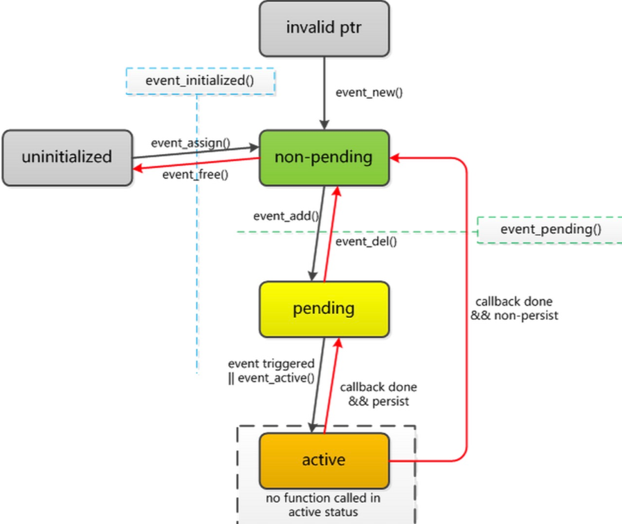

### [libevent 事件处理](#)
 **介绍**： libevent支持三种事件处理：linux信号事件、linux下文件读写事件(监控系统日志)、网络服务事件。

-----

- [x] [1. event](#1-event)
- [x] [2. 事件的优先级](#2-事件的优先级)
- [x] [3. 关于event的api](#3-关于event的api)
- [x] [4. 特殊事件操作](#4-特殊事件操作)
- [x] [5. 信号事件](#5-信号事件)
- [x] [6. 定时器事件](#6-定时器事件)
- [x] [7. 支持文件监听事件](#7-支持文件监听事件)


-----

### [1. event](#)
libevent 的基本操作单元是事件。每个事件代表一组条件的集合,这些条件包括:
* 文件描述符已经就绪,可以读取或者写入
* 文件描述符变为就绪状态,可以读取或者写入(仅对于边沿触发 IO)
* 超时事件
* 发生某信号,linux系统中断、挂起...
* 用户触发事件

#### [1.1 event生命周期](#)
所有事件具有相似的生命周期,如下所述：



* 调用 libevent 函数设置事件并且关联到event_base 之后, 事件进入 **已初始化(initialized)** 状态。
* 此时可以将事件添加到 event_base 中,这使之进入 **未决(pending)** 状态。
* 在未决状态下,如果触发事件的条件发生(比如说,文件描述 符的状态改变,或者超时时间到达 ),则事件进入 **激活(active)** 状态,(用户提供的)事件回调函数将被执行。
* 如果配置为 **持久的(persistent)**,事件将保持为未决状态，重新加入监听， 否则, 执行完回调后,事件不再是未决的。
* event_del 删除操作可以让未决事件成为非未决(已初始化)的 
* event_add 添加操作可以让非未决事件再次成为未决的。

#### [1.2 生成新事件](#)
用event_new()函数之后, 新事件处于已初始化和非未决状态，信号事件需要使用evsignal_new()方法创建，但是它们的返回值是一致的！
还有一个 event_assign 方法，但是event_new在堆上面创建对象, 然后调用了event_assign方法，对event初始化。
```cpp
//创建普通事件
struct event *event_new(
    struct event_base * base , 
    evutil_socket_t fd, 
    short e_event, 
    event_callback_fn callback, 
    void * callback_arg
);

//e_event 事件处理方式参数：
#define EV_TIMEOUT 0x01 // 超时事件
#define EV_READ 0x02    // 读事件
#define EV_WRITE 0x04   // 写事件
#define EV_SIGNAL 0x08  // 信号事件
#define EV_PERSIST 0x10 // 周期性触发
#define EV_ET 0x20 // 边沿模式

//创建信号事件
struct event *signal_event = evsignal_new(base, SIGINT, signal_cb, (void *)base);
```

#### [1.3 event_assign](#)
该方法与 **event_new** 不同，它本身不分配内存，它要求您已经分配了一个struct事件，可能是在堆上也可能在栈上面。
该函数主要是给event结构体初始化赋值，绑定event_base、回调函数和回调函数参数、文件描述符以及标志位，中间判断持续化事件。

```cpp
int event_assign(
    struct event * ev, 
    struct event_base * base, 
    evutil_socket_t fd, 
    short e_event, 
    event_callback_fn callback, 
    void * callback_arg
);
//event_assign的作用就是把给定的event类型对象的每一个成员赋予一个指定的值。
```

#### [1.4 event_add](#)
将事件添加到监听树上面，相当于 epoll_ctl ADD 操作， 事件状态会设置为未决事件

```cpp
int event_add(struct event *ev, const struct timeval *timeout);
//函数返回0,失败时返回-1
/*
timeout
 NULL 持续等待
 非空 等待一个时间
timeval 以秒和微秒指定超时值 
*/
```

#### [1.5 event_del](#) 
对已经初始化的事件调用 event_del()将使其成为非未决和非激活的。如果事件不是未决的或者激活的,调用将没有效果。成功时函数返回 0,失败时返回-1。

```cpp
int event_del(struct event *);
//returh 0 if successful, or -1 if an error occurred
```
如果在事件激活后,其回调被执行前删除事件,回调将不会执行。

#### [1.6 event_free](#) 
释放事件, 让事件消亡！

```cpp
void event_free(struct event *);

//使用例子
struct event * read_event = event_new(base, cfd, EV_READ | EV_PERSIST, read_callback , args);
event_add(read_event, nullptr);
```

### [2. 事件的优先级](#) 
多个事件同时触发时,libevent 没有定义各个回调的执行次序。可以使用优先级来定义某些事件比其他事件更重要。

每个 event_base 有与之相关的一个或者多个优先级。在初始化事件之后, 但是在添加到 event_base 之前,可以为其设置优先级。

```cpp
int event_priority_set(struct event *event, int priority);
```

#### [2.1 使用例子](#)
先要调 event_base_priority_init 方法设置优先级，再调event_priority_set 设置事件的优先级。

```cpp
auto base = event_base_new();
/*
 ...
*/
event_base_priority_init(base, 128);

struct event * read_event = event_new(base, cfd, EV_READ | EV_PERSIST, read_callback , args);

event_priority_set(read_event, 10);
```
多个不同优先级的事件同时成为激活的时候 ,低优先级的事件不会运行 。libevent会执行高优先级的事件,然后重新检查各个事件。
只有在没有高优先级的事件是激活的时候 ,低优先级的事件才会运行。

### [3. 关于event的api](#) 
关于event的API有很多，可以帮你很快的获取到其相关的各种信息！

#### [3.1 event_pending](#)
event_pending()函数确定给定的事件是否是未决的或者激活的, 如果是返回事件标志，否则返回0；

```cpp
int event_pending(const struct event *ev, short what, struct timeval *tv_out);
// tv_out 是传入参数
```
如果是,而且 what参数设置了 EV_READ、EV_WRITE、EV_SIGNAL 或者 EV_TIMEOUT 等标志,则函数会返回事件当前为之未决或者激活的所有标志

如果提供了 tv_out 参数,并且what 参数中设置了 EV_TIMEOUT 标志,而事件当前正因超时事件而未决或者激活,则 tv_out 会返回事件的超时值。

#### [3.2 event_get_fd、event_get_signal](#)
event_get_fd()和 event_get_signal()返回为事件配置的文件描述符或者信号值。

```cpp
evutil_socket_t event_get_fd(const struct event *ev);
```

#### [3.3 event_get_base](#)
返回为事件配置的 event_base, 

```cpp
struct event_base *event_get_base(const struct event *ev);
```

#### [3.4 event_get_events](#)
返回事件的标志(EV_READ、EV_WRITE 等)

```cpp
short event_get_events(const struct event *ev);
```

#### [3.5 event_get_callback、event_get_callback_arg](#)
event_get_callback()和 event_get_callback_arg() 返回事件的回调函数及其参数指针。

```cpp
event_callback_fn event_get_callback(const struct event *ev);
void *event_get_callback_arg(const struct event *ev);
```
#### [3.6 event_get_priority](#)
返回事件的优先级！

```cpp
int event_get_priority(const struct event *ev);
```

#### [3.7 event_get_assignment](#)
获取event的属性：包括事件堆event_base, IO事件的fd, 信号事件的信息，回调函数等。

```cpp
void event_get_assignment(const struct event *event,
struct event_base **base_out,
evutil_socket_t *fd_out,
short *events_out,
event_callback_fn *callback_out,
void **arg_out);
```

### [4. 特殊事件操作](#)
一次性事件和手动激活事件！

#### [4.1 一次触发事件](#)
如果不需要多次添加一个事件,或者要在添加后立即删除事件,而事件又不需要是持久的 , 则可以使用 event_base_once()。

```cpp
int event_base_once(
    struct event_base *, 
    evutil_socket_t, 
    short,
    void (*)(evutil_socket_t, short, void *), 
    void *, 
    const struct timeval *
);
```
除了不支持 EV_SIGNAL 或者 EV_PERSIST 之外,这个函数的接口与 event_new()相同。

安排的事件将以默认的优先级加入到 event_base并执行。**回调被执行后,libevent内部将会释放 event 结构**。成功时函数返回0,失败时返回-1。

不能删除或者手动激活使用 event_base_once ()插入的事件, 如果希望能够取消事件, 应该使用 event_new()或者 event_assign()。

#### [4.2 手动激活事件](#)
极少数情况下,需要在事件的条件没有触发的时候让事件成为激活的。

```cpp
void event_active(struct event *ev, int what, short ncalls);
//ncalls: an obsolete argument: this is ignored.
```

这个函数让事件 ev 带有标志 what(EV_READ、EV_WRITE 和 EV_TIMEOUT 的组合)成 为激活的。事件不需要已经处于未决状态,激活事件也不会让它成为未决的。

### [5. 信号事件](#) 
libevent可以检测POSIX风格的信号，需要先建立信号处理器。

```cpp
#define evsignal_new(base, signum, cb, arg) event_new(base, signum, EV_SIGNAL|EV_PERSIST, cb, arg)
```

使用例子：carl
```cpp
struct event *hup_event;
struct event_base *base = event_base_new();

hup_event = evsignal_new(base, SIGHUP, sighup_function, NULL);
```

### [6. 定时器事件](#)
该事件可以用来注册定时事件和周期性事件,Libevent 根据所有定时器事件的最小超时时间来设置系统 I/O 的 timeout 值，当系统I/O 返回时，再激活就绪的定时器事件，如此 Timer 事件便可融合在系统 I/O 机制中。

定时器事件的实现基于一种经典的 **数据结构-小根堆**，相关的数据结构定义和操作在 **minheap-internal.h** 中。

不同之处在于定时器事件 **不依赖于文件描述符**，在初始化该类型事件时，文件描述符处的参数为-1，在注册定时器事件是，后面的时间参数不为 NULL。

#### [6.1 相关接口](#)
定时器相关的接口本质上就是event的接口，只是参数不一致。

```cpp
#define evtimer_assign(ev, b, cb, arg) \
	event_assign((ev), (b), -1, 0, (cb), (arg))
#define evtimer_new(b, cb, arg)		event_new((b), -1, 0, (cb), (arg)) //默认定时器是非持久的
#define evtimer_add(ev, tv)		event_add((ev), (tv))   //设置超时时间
#define evtimer_del(ev)			event_del(ev)
#define evtimer_pending(ev, tv)		event_pending((ev), EV_TIMEOUT, (tv))
#define evtimer_initialized(ev)		event_initialized(ev)
```

获得当前事件的指针。
```cpp
void *event_self_cbarg(void);
```

使用例子：
```cpp
void timer_callback(evutil_socket_t fd, short what, void *arg){
    auto ev = (struct event *)arg;
    std::cout << "it time out !" << std::endl;
    if (ev == nullptr){
        std::cout << "??" << std::endl;
    }
    struct timeval tv_in = { 3, 0 };
    if ( !evtimer_pending(ev, &tv_in)){
        evtimer_del(ev);
        evtimer_add(ev, &tv_in);
    }
}

struct event *t_ev = evtimer_new(base,timer_callback, event_self_cbarg());

struct timeval tv_in = { 3, 0 };

evtimer_add(t_ev, &tv_in);
```

#### [6.2 跟踪未决事件的方式](#)
Libevent 有两种方式跟踪未决事件的超时值：
* 默认使用二叉堆（binary heap），添加和删除的时间复杂度为 O(logN) 。可使用完全二叉树实现，分大根堆和小根堆。Libevent 使用小根堆，最近的超时时间在堆顶。
* 双链队列，添加和删除的时间复杂度为 O(1) 。适用于具有大量相同超时值的情况，可以调用函数 `event_base_init_common_timeout` 设置。

```cpp
// 优化到双向队列，插入删除复杂度 O(1)
struct timeval tv_in = { 3, 0 };
const timeval *tv3 = event_base_init_common_timeout(base, &tv_in);
event *ev3 = event_new(base, -1, EV_PERSIST, timer3_cb, NULL);
evtimer_add(ev3, tv3);      // 插入性能 O(1)
```

### [7. 支持文件监听事件](#)
支持文件监听需要libevent支持对 event_base 进行配置，并且提供了许多的了接口！

```cpp
void read_callback(evutil_socket_t fd, short what, void *arg){
    char buf[1024] = {0};
    int len = read(fd, buf, sizeof(buf) - 1 );
    if (len > 0){
        std::cout << buf << std::endl;
    }else{
        std::this_thread::sleep_for(std::chrono::milliseconds(500));
    }
}
```

监听日志文件：
```cpp
#include <sys/types.h>
#include <sys/stat.h>
#include <fcntl.h>
#include <unistd.h>
#include <chrono>

//只读非阻塞
int sock = open("/var/log/auth.log", O_RDONLY|O_NONBLOCK);
if (sock <= 0){
    std::cout<< "open file failed!" << std::endl;
    return -1;
}

lseek(sock,0, SEEK_END); //文件指针移动到结尾处
event_base_priority_init(base, 128);

//监听文件数据
struct event* f_event = event_new(base, sock, EV_READ|EV_PERSIST,read_callback, nullptr);
event_add(f_event, nullptr);
```