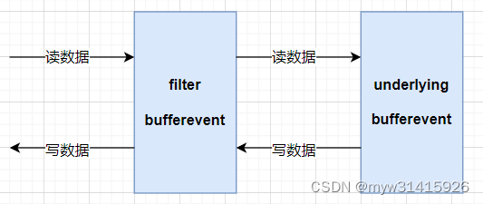

### [Bufferevent：高级话题](#)
 **介绍**： 包括过滤bufferevent、成对的bufferevent、bufferevent 和速率限制、bufferevent 和 SSL。

-----
- [x] [1. bufferevent 过滤器](#1-bufferevent-过滤器)
- [x] [2. evbuffer](#2-evbuffer)
- [x] [3. 例子](#3-例子)
- [x] [4. ](#4-)
- [x] [5. ](#5-)
-----

### [1. bufferevent 过滤器](#)
bufferevent filter 过滤器可以在读取前和写入后对数据进行一系列的预处理操作，比如压缩和加密， 对用户来讲，过滤器就像一个黑盒子，用户仍然只需要完成读取和写入，而不必知晓过滤器中的操作。

 

**underlying bufferevent** 表示潜在的、根本的 bufferevent，即用户处理读写操作的 bufferevent

* **读取（接收）** 的数据先进入过滤器中，在过滤器处理完成后再传递给用户进行读取，即 过滤在读取之前 ，例如压缩数据要先在 filter 中解压，然后在 underlying 读取解压/解密后的原始；
* **写入（发送）** 的数据由用户发起，再传给过滤器，过滤器处理完后再发送出去，即 过滤在写入之后 ，例如在 underlying 中发送的原始数据，会在 filter 中进行压缩/加密后再发送。


#### [1.1 bufferevent_filter_new](#) 
要使用过滤器，需要先明白 bufferevent_filter_new 函数和结构体 evbuffer 。

options 参数支持所有通常的选项，设置了 BEV_OPT_CLOSE_ON_FREE ， 那么释放过滤 bufferevent 也会同时释放底层bufferevent。
```cpp
struct bufferevent * bufferevent_filter_new(
    struct bufferevent *underlying,
    bufferevent_filter_cb input_filter,
    bufferevent_filter_cb output_filter,
    int options, //BEV_OPT_CLOSE_ON_FREE
    void (*free_context)(void *), //free_context：释放上下文的函数指针。
    void *ctx //ctx：过滤器的上下文信息。
);

/**
 * @brief: 回调函数，用于实现 bufferevent 的过滤器
 *
 * @param src: 源事件缓存
 * @param dst: 目的事件缓存
 * @param dst_limit: 写入 dst 的字节上限，-1表示无限制
 * @param mode: 数据刷新模式
 * @param ctx: 用户传递的参数
 *
 * @return: 返回过滤器的处理结果，详见后面说明
 */
typedef enum bufferevent_filter_result (*bufferevent_filter_cb)(
    struct evbuffer *src, 
    struct evbuffer *dst, 
    ev_ssize_t dst_limit,
    enum bufferevent_flush_mode mode, 
    void *ctx
);

enum bufferevent_flush_mode {
	/** usually set when processing data */
	BEV_NORMAL = 0,
	/** want to checkpoint all data sent. */
	BEV_FLUSH = 1,
	/** encountered EOF on read or done sending data */
	BEV_FINISHED = 2
};

// filter 回调函数返回值
enum bufferevent_filter_result {
	// 正常
	BEV_OK = 0,
	// 还需要更多的数据才能输出
	BEV_NEED_MORE = 1,
	// filter 发生错误，无法进一步处理数据
	BEV_ERROR = 2
};

// filter 数据刷新模式
enum bufferevent_flush_mode {
	// 正常处理数据
	BEV_NORMAL = 0,
	// 检查发送的所有数据
	BEV_FLUSH = 1,
	// 读完或写完数据后，会有 EOF 标志
	BEV_FINISHED = 2
};
```
evbuffer 是一个不透明的结构体，即只有声明，定义不对外公开，用于在 bufferevent 上发送或接收的数据，其实这个结构体就是在 filter bufferevent 和 underlying bufferevent 之间传递数据用的。

buffervent同样需要调用 **bufferevent_setcb** 设置回调函数, 但却不是设置到underlying bufferevent上面，而是bufferevent_filter 上面！

```cpp
short bev_options =  BEV_OPT_CLOSE_ON_FREE | BEV_OPT_THREADSAFE;
bufferevent *bev = bufferevent_socket_new(base, sockFd, bev_options);

//过滤器
bufferevent *bev_filter =
bufferevent_filter_new(
	bev, filter_in, filter_out,
	BEV_OPT_CLOSE_ON_FREE,
	nullptr,
	base
);

const struct timeval timeout {4,0};//超时时间

bufferevent_set_timeouts(bev_filter, &timeout, nullptr);
bufferevent_priority_set(bev_filter, 32);

//回调函数
bufferevent_setcb(
	bev_filter, //过滤器
	bev_read_callback, bev_write_callback, bev_event_callback,
	client_address
);

short bev_events = EV_WRITE | EV_READ | EV_CLOSED | BEV_EVENT_ERROR;

// //过滤器
bufferevent_enable(bev_filter, bev_events);
```

#### [1.2 buffervent 和 evbuffer](#)
buffervent 和 evbuffer 经常一起使用，但也有区别

bufferevent 是一个事件缓冲 I/O，内部实现了基本 socket recv/send 操作；
evbuffer 只是一个数据缓冲区，使用链表实现，不带任何 I/O 操作。

### [2 evbuffer](#)
evbuffer的高级用法，如何减少复制！

#### [2.1 检测数据而不复制](#)
有时候需要读取 evbuffer 中的数据而不进行复制（像 evbuffer_copyout()那样），也不重新
排列内部内存布局（像 evbuffer_pullup()那样）。有时候可能需要查看 evbuffer 中间的数据。

调用 evbuffer_peek()的时候，通过 vec_out 给定一个 evbuffer_iovec 数组，数组的长度是n_vec。函数会让每个结构体包含指向 evbuffer 内部内存块的指针（iov_base)和块中数据长度。
```cpp
struct evbuffer_iovec 
{
	void* iov_base;
	size_t iov_len;
};

int evbuffer_peek(
    struct evbuffer *buffer, 
    ev_ssize_t len,
    struct evbuffer_ptr *start_at,
    struct evbuffer_iovec *vec_out, int n_vec
);
```
**返回值**：所需的扩展数据块数。如果我们不需要所有的evbuffer_iovec，这可能小于n_vec，或者如果我们需要更多的数据来返回所有请求的数据，这可能大于n_vec。
* **buffer**：要检查的的evbuffer。
* **len**： 尝试检查的字节数, 如果 len 小于0，evbuffer_peek()会试图填充所有 evbuffer_iovec 结构体。
* **start_at**： 一个evbuffer_ptr，指示我们应该开始查找数据的点, 空指针表示“在缓冲区的开头。
* **vec_out**：evbuffer_iovec的数组。
* **n_vec**：vec_out的长度。如果为0，则只计算需要多少扩展数据块才能指向请求的数据量。

```cpp
struct evbuffer *buffer = evbuffer_new();

evbuffer_enable_locking(buffer, nullptr);

const char *block_01 = {"123456789\r\n"};
const char *block_02 = {"123456789\r\n"};

evbuffer_add(buffer,block_01, sizeof(char)* strlen(block_01));
evbuffer_add(buffer,block_02, sizeof(char)* strlen(block_01));

struct evbuffer_iovec vec_outs[2]{{nullptr,0},{nullptr,0}};

auto block_chain_len = evbuffer_peek(buffer, -1, nullptr, vec_outs, 2);

for (int i = 0; i < 2; ++i) {
    std::cout << "vec_outs["<<i<<"]:" << vec_outs[i].iov_base <<" "<< vec_outs[i].iov_len<< std::endl;
}
std::cout <<  "buffer len: " << evbuffer_get_length(buffer) <<std::endl;
std::cout <<  "evbuffer_peek return: " << block_chain_len <<std::endl; //1

std::cout << (char *)vec_outs[0].iov_base << std::endl;
/*
vec_outs[0]:0x558c18384f70 22
vec_outs[1]:0 0
buffer len: 22
evbuffer_peek return: 1
123456789
123456789

*/

evbuffer_free(buffer);
```
#### [2.2 直接向 evbuffer 添加数据](#)
有时候需要能够直接向 evbuffer 添加数据，而不用先将数据写入到字符数组中，然后再使用 evbuffer_add()进行复制。有一对高级函数可以完成这种功能：
evbuffer_reserve_space()和 evbuffer_commit_space()。跟 evbuffer_peek()一样，这两个函数使用 evbuffer_iovec 结构体来提供对 evbuffer 内部内存的直接访问。

```cpp
//描述evbuffer中的单个内存范围。
#define evbuffer_iovec iovec
/* Structure for scatter/gather I/O.  */
struct iovec
  {
    void *iov_base;	/* Pointer to data.  */
    size_t iov_len;	/* Length of data.  */
  };


int evbuffer_reserve_space(
    struct evbuffer *buf, ev_ssize_t size,
    struct evbuffer_iovec *vec,  
    int n_vec 
    //The length of the vec array. Must be at least 1; 2 is more efficient.
);

int evbuffer_commit_space(
    struct evbuffer *buf, struct evbuffer_iovec *vec,  int n_vecs
);
```

* 当前的实现中，evbuffer_reserve_space不会使用多余两个的vector，而不管用户提供了多少，或许会在未来版本中有所改变。
* 调用多次evbuffer_reserve_space是安全的。
* 如果evbuffer在多线程中使用，则在调用evbuffer_reserve_space函数之前应该使用evbuffer_lock函数进行加锁，并且一旦commit会后就解锁。

使用例子：
```cpp
struct evbuffer *buffer = evbuffer_new();
evbuffer_enable_locking(buffer, nullptr);

ev_ssize_t add_space = 128; //追加 128 字节
struct evbuffer_iovec vc[2]{ {nullptr,0},{nullptr,0} };

auto n = evbuffer_reserve_space(buffer, add_space, vc, 2);
if (n <= 0) throw std::runtime_error("cant give the spaces!");

for (int i = 0; i < n; ++i) {
    std::cout << "len: " << vc[i].iov_len << std::endl; //976
    size_t len = vc[i].iov_len;
    if (len > add_space) len = add_space;
    //对第一个块写入数据
    for (int j = 0; j < len - 1; ++j) {
        *((char *)vc[i].iov_base + j)  = '1';
    }
    //最后一位 给个字符串 \0
    *((char *)vc[i].iov_base + len - 1) = '\0';
}

evbuffer_commit_space(buffer, vc,n);

struct evbuffer_iovec vec_outs[2]{ {nullptr,0},{nullptr,0} };
auto block_chain_len = evbuffer_peek(buffer, -1, nullptr, vec_outs, 2);

for (int i = 0; i < 2; ++i) {
    std::cout << "vec_outs["<<i<<"]:" << vec_outs[i].iov_base <<" "<< vec_outs[i].iov_len<< std::endl;
}
std::cout <<  "buffer len: " << evbuffer_get_length(buffer) <<std::endl;

std::cout << "data:" << (char *)vec_outs[0].iov_base << std::endl;

evbuffer_free(buffer);

/*
len: 976
vec_outs[0]:0x5615c31a9f70 976
vec_outs[1]:0 0
buffer len: 976
data:111111111111111111111111111111111111111111111111111111111
11111111111111111111111111111111111111111111111111111111111111
11111111
*/

```

### [3. 例子](#) 
在输入过滤器中将客户端发送的数据转为大写，在输出过滤器中将发送给客户端的数据打上头尾标签。代码如下:

```cpp
#include <event2/event.h>
#include <event2/listener.h>
#include <event2/bufferevent.h>
#include <event2/buffer.h>
#include <string.h>
#include <iostream>
#ifndef _WIN32
#include <signal.h>
#else
#endif
#include <string>
using namespace std;

bufferevent_filter_result filter_in(evbuffer *s,evbuffer *d,ev_ssize_t limit,
	bufferevent_flush_mode mode,void *arg)
{
	cout<<"filter_in"<<endl;
	
	char data[1024] = {0};
	//读取并清理原数据
	int len = evbuffer_remove(s, data, sizeof(data)-1);

	//所有字母转成大写
	for (int i = 0; i < len; ++i)
	{
		data[i] = toupper(data[i]);
	}

	evbuffer_add(d, data, len);

	return BEV_OK;
}

bufferevent_filter_result filter_out(evbuffer *s,evbuffer *d,ev_ssize_t limit,
	bufferevent_flush_mode mode,void *arg)
{
	cout<<"filter_out"<<endl;
	char data[1024] = {0};
	//读取并清理原数据
	int len = evbuffer_remove(s,data,sizeof(data)-1);

	string str = "";
	str += "================\n";
	str += data;
	str += "================\n";
	
	evbuffer_add(d,str.c_str(),str.size());
	return BEV_OK;
}

void read_cb(bufferevent*bev,void *arg)
{
	cout<<"read_cb"<<endl;
	char data[1024] = {0};
	int len = bufferevent_read(bev,data,sizeof(data)-1);
	cout<<data<<endl;

	//回复客户消息，经过输出过滤
	bufferevent_write(bev,data,len);

}
void write_cb(bufferevent*bev,void *arg)
{
	cout<<"write_cb"<<endl;
}

void event_cb(bufferevent*bev,short events,void *arg)
{
	cout<<"event_cb"<<endl;
}

void listen_cb(evconnlistener *ev,evutil_socket_t s,sockaddr*sin,int slen,void *arg)
{
	event_base *base = (event_base*)arg;
	cout << "listen_cb" << endl;
	//创建bufferevent 
	bufferevent *bev = bufferevent_socket_new(base,s,BEV_OPT_CLOSE_ON_FREE);

	//绑定bufferevent filter
	bufferevent * bev_filter = bufferevent_filter_new(
		bev,	//指向要被包装的底层Bufferevent
		filter_in,//输入过滤函数
		filter_out,//输出过滤函数
		BEV_OPT_CLOSE_ON_FREE, //关闭filter是同时关闭bufferevent
		0,		//清理的回调函数
		0		//传递给回调的参数
	);


	//设置bufferevent的回调 
	bufferevent_setcb(bev_filter,read_cb,write_cb,event_cb,
		NULL);//回调函数的参数

	bufferevent_enable(bev_filter,EV_READ|EV_WRITE);
}

int main(int argc,char *argv[])
{
    
#ifdef _WIN32 
	//初始化socket库
	WSADATA wsa;
	WSAStartup(MAKEWORD(2,2),&wsa);
#else
	//忽略管道信号，发送数据给已关闭的socket
	if (signal(SIGPIPE, SIG_IGN) == SIG_ERR)
		return 1;
#endif

	std::cout << "test server!\n"; 
	//创建libevent的上下文
	event_base * base = event_base_new();
	if (base)
	{
		cout << "event_base_new success!" << endl;
	}
	//监听端口
	//socket ，bind，listen 绑定事件
	sockaddr_in sin;
	memset(&sin, 0, sizeof(sin));
	sin.sin_family = AF_INET;
	sin.sin_port = htons(5001);

	evconnlistener *ev = evconnlistener_new_bind(base,	// libevent的上下文
		listen_cb,					//接收到连接的回调函数
		base,						//回调函数获取的参数 arg
		LEV_OPT_REUSEABLE|LEV_OPT_CLOSE_ON_FREE,//地址重用，evconnlistener关闭同时关闭socket
		10,							//连接队列大小，对应listen函数
		(sockaddr*)&sin,							//绑定的地址和端口
		sizeof(sin)
		);

	//事件分发处理
	if(base)
		event_base_dispatch(base);
	if(ev)
		evconnlistener_free(ev);
	if(base)
		event_base_free(base);
	
	return 0;
}

```

#### [3.1 bufferevent server](#)

```cpp
#include <csignal>
#include <ctime>

#include <iostream>
#include "net/wrap.hpp"
#include <event2/event.h>
#include <event2/listener.h>
#include <event2/buffer.h>
#include <event2/thread.h>
#include <event2/event-config.h>
#include <event2/thread.h>
#include <event.h>

#include <codecvt>
#include <string>
#include <locale>

#include <sys/types.h>
#include <sys/stat.h>
#include <fcntl.h>
#include <unistd.h>
#include <chrono>

struct event_base* ConfigBase(){
    struct event_base * base = nullptr;
    struct event_config * config = event_config_new();

    //features、 flag
    event_config_require_features(config, EV_FEATURE_ET);
    event_config_set_flag(config,  EVENT_BASE_FLAG_NOLOCK);

    //创建 event_base
    base = event_base_new_with_config(config);

    //优先级
    event_base_priority_init(base, 128);

    //释放配置对象
    event_config_free(config);
    return base;
}

void bev_read_callback(struct bufferevent *bev, void *ctx);
void bev_write_callback(struct bufferevent *bev, void *ctx);
void bev_event_callback(struct bufferevent *bev, short what, void *ctx);

bufferevent_filter_result filter_in
(evbuffer *s,evbuffer *d,ev_ssize_t limit,bufferevent_flush_mode mode,void *arg);

bufferevent_filter_result filter_out
(evbuffer *s,evbuffer *d,ev_ssize_t limit,bufferevent_flush_mode mode,void *arg);

void listener_callback(struct evconnlistener *listener, 
evutil_socket_t sockFd, struct sockaddr *clientAddr, int len, void *ptr){
    auto addr = (struct sockaddr_in *)clientAddr;

    auto client_address = new struct sockaddr_in();
    *client_address = *(addr);

    char *addrIP = inet_ntoa(addr->sin_addr);
    std::cout << "new connection: " << sockFd << " from ip: "<< 
	addrIP <<" port: " << ntohs(addr->sin_port) ;

    struct event_base *base = evconnlistener_get_base(listener);

    short bev_options =  BEV_OPT_CLOSE_ON_FREE | BEV_OPT_THREADSAFE;

    bufferevent *bev = bufferevent_socket_new(base, sockFd, bev_options);

    //过滤器
    bufferevent *bev_filter =
    bufferevent_filter_new(
        bev,
        filter_in,
        filter_out,
        BEV_OPT_CLOSE_ON_FREE,
        nullptr,
        base
    );

    const struct timeval timeout {4,0};//超时时间

    bufferevent_set_timeouts(bev_filter, &timeout, nullptr);
    bufferevent_priority_set(bev_filter, 32);

    //回调函数
    bufferevent_setcb(
        bev_filter,
        bev_read_callback,
        bev_write_callback,
        bev_event_callback,
        client_address
    );

    short bev_events = EV_WRITE | EV_READ | EV_CLOSED | BEV_EVENT_ERROR;

    bufferevent_enable(bev_filter, bev_events);

}

void initServer(){
    struct event_base* base = ConfigBase();
    struct evconnlistener *listener = nullptr;
    evthread_use_pthreads();
    /* 端口 */
    unsigned short port = 15000;

    /* 服务器地址 */
    sockaddr_in serverAddress{
            AF_INET,
            htons(port),
            htonl(INADDR_ANY)
    };
    std::cout << "start server at 127.0.0.1 running in "<< std::to_string(port) <<":" << "\n";
    /* 端口 sizeof */
    auto socket_len = sizeof(serverAddress);

    short listener_flags = LEV_OPT_REUSEABLE | LEV_OPT_LEAVE_SOCKETS_BLOCKING |
                           LEV_OPT_CLOSE_ON_FREE | LEV_OPT_DEFERRED_ACCEPT;

    listener = evconnlistener_new_bind(
        base,
        listener_callback,
        nullptr,
        listener_flags,
        64,
        (const struct sockaddr *)&serverAddress,
        socket_len
    );

    event_base_dispatch(base);

    evconnlistener_free(listener);
    event_base_free(base);

}

int main(int argc, char *argv[]) {
    initServer();
    return 0;
}


void bev_read_callback(struct bufferevent *bev, void *ctx){
    auto client_address = (struct sockaddr_in *)ctx;
    char store_buffer[1024] = {0};
    struct evbuffer * input = bufferevent_get_input(bev);
    auto len = evbuffer_remove(input, store_buffer, 1023);
    if (len > 0){
        char *addrIP = inet_ntoa(client_address->sin_addr);
        std::cout << addrIP <<" - " << ntohs(client_address->sin_port)
		<< ": " << store_buffer << std::endl << std::flush;

        std::string message = "get information: " + std::to_string(len) + " bytes!";
        bufferevent_write(bev,message.c_str(), sizeof(char) * message.size());
    }
}

void bev_write_callback(struct bufferevent *bev, void *ctx){
    struct evbuffer * output = bufferevent_get_output(bev);
    if (evbuffer_get_length(output) == 0){
        std::cout << "write event buffer is empty!" << std::endl;
    }
}

void bev_event_callback(struct bufferevent *bev, short events, void *ctx){
    if (events & EV_TIMEOUT){
        std::cout << "timeout Connection closed.\n";
        bufferevent_free(bev);
    }else if (events & EV_CLOSED) {
        std::cout << "Connection closed.\n";
        bufferevent_free(bev);
    } else if (events & BEV_EVENT_ERROR) {
        std::cout <<"Got an error on the connection: " << 
		bufferevent_getfd(bev) << " errno: " << errno << std::endl;
        bufferevent_free(bev);
    }else if (events & BEV_EVENT_CONNECTED){
        std::cout << "Connect to server successfully.\n";
    }
}

bufferevent_filter_result filter_in(evbuffer *s,evbuffer *d,
ev_ssize_t limit,bufferevent_flush_mode mode,void *arg){
    std::cout<<"filter_in"<<std::endl;

    char data[1024] = {0};
    //读取并清理原数据
    int len = evbuffer_remove(s, data, sizeof(data)-1);

    //所有字母转成大写
    for (int i = 0; i < len; ++i)
    {
        data[i] = toupper(data[i]);
    }

    evbuffer_add(d, data, len);
    return BEV_OK;
}

bufferevent_filter_result filter_out(evbuffer *s,evbuffer *d, 
	ev_ssize_t limit,bufferevent_flush_mode mode,void *arg){
    std::cout<<"filter_out"<<std::endl;
    char data[1024] = {0};
    //读取并清理原数据
    int len = evbuffer_remove(s,data,sizeof(data)-1);

    std::string str;
    str += "|--- HEAD ---|";
    str += data;
    str += "|--- END ---|\n";

    evbuffer_add(d,str.c_str(),str.size());
    return BEV_OK;
}
```

#### [3.2 bufferevent client](#) 

```cpp
//
// Created by remix on 23-5-11.
//
#include <iostream>
#include "net/wrap.hpp"
#include <event.h>
#include <event2/event.h>
#include <event2/listener.h>
#include <event2/buffer.h>
#include <zlib.h>

bufferevent_filter_result filter_in(evbuffer *s,evbuffer *d, 
        ev_ssize_t limit,bufferevent_flush_mode mode,void *arg){
    //源数据再 s:
    auto byte_sizes= evbuffer_get_length(s);
    std::cout << "byte sizes: " << byte_sizes << std::endl;

    evbuffer_add_buffer(d, s);
    return BEV_OK;
}

bufferevent_filter_result filter_out(evbuffer *s,evbuffer *d,
        ev_ssize_t limit,bufferevent_flush_mode mode,void *arg){
    evbuffer_add_buffer(d, s);
    return BEV_OK;
}

void read_callback(struct bufferevent *bev, void *user_data){
    char msg[1024];
    auto len = bufferevent_read(bev, msg, 1023);
    if (len < 1023){
        msg[len] = '\0';
    }
    std::cout <<"from server: " << msg << std::endl;
    bufferevent_free(bev);
};

void write_callback(struct bufferevent *bev, void *user_data){
    struct evbuffer *output = bufferevent_get_output(bev);
    if (evbuffer_get_length(output) == 0) {

    }
}

//其他事件
void event_callback(struct bufferevent *bev, short events, void *ctx){
    if (events & BEV_EVENT_EOF) {
        std::cout << "eof closed.\n";
        bufferevent_free(bev);
    } else if (events & BEV_EVENT_ERROR) {

        std::cout <<"Got an error on the connection: " <<
           bufferevent_getfd(bev) << " errno: " << errno << std::endl;

        bufferevent_free(bev);
    }else if (events & EV_CLOSED){
        std::cout << "Connection closed.\n";
        bufferevent_free(bev);
    }else{
        bufferevent_free(bev);
    }
}

//其他事件
void event_callback_cont(struct bufferevent *bev, short events, void *ctx){
    if (events & BEV_EVENT_CONNECTED){
        std::cout << "Connect to server successfully.\n";
        auto bev_filter = bufferevent_filter_new(bev,
                                                 filter_in, filter_out,
                                                 BEV_OPT_CLOSE_ON_FREE,
                                                 nullptr,nullptr);

        bufferevent_setcb(bev_filter,read_callback, write_callback, event_callback, nullptr);
        bufferevent_enable(bev_filter, EV_READ|EV_WRITE|EV_CLOSED);

        bufferevent_write(bev_filter, "temp.data", 10);
    }else{
        std::cout << "time out.\n";
        bufferevent_free(bev);
    }
}


int main(int argc, char *argv[]) {
    struct event_base *base = event_base_new();

    auto bev = bufferevent_socket_new(base, -1, BEV_OPT_CLOSE_ON_FREE);

    sockaddr_in serverAddress{
            AF_INET,
            htons(15000)
    };

    inet_aton("127.0.0.1",&serverAddress.sin_addr);

    bufferevent_socket_connect(bev, (const struct sockaddr*)&serverAddress, sizeof(serverAddress));

    bufferevent_setcb(bev, nullptr, nullptr,event_callback_cont, nullptr);
    bufferevent_enable(bev, BEV_EVENT_CONNECTED);
    struct timeval timeout {4,0};
    bufferevent_set_timeouts(bev,&timeout , nullptr);

    event_base_dispatch(base);

    event_base_free(base);
    return 0;
}
```

### [4. 套接字设置](#)

#### [4.1 ](#)


### [5.](#) 

-----
时间: [] 