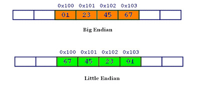
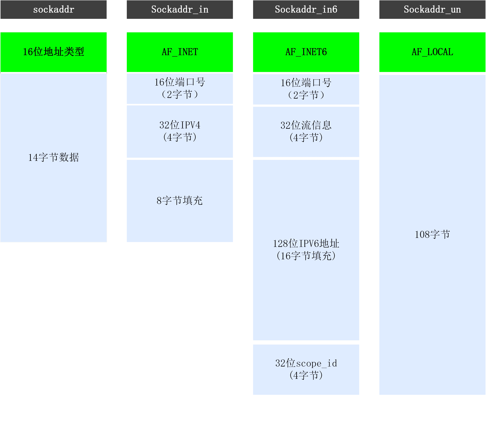

### [C++ Socket 编程入门](#)
 **介绍**： Socket编程也称为套接字编程，可以理解为IP地址与端口号的组合。socket提供了基于TCP的流（stream）和基于UDP的数据报（datagram）两种通信机制。

-----
- [x] [1. Socket概述](#1-socket概述)
- [x] [2. 阻塞和非阻塞注意事项](#2-阻塞和非阻塞注意事项)
- [x] [3. 非教科书的网络基本问题](#3-非教科书的网络基本问题)
- [x] [4. 头文件说明](#4-头文件说明)
- [x] [5. IP地址处理](#5-ip地址处理)
-----

### [1. Socket概述](#)
Socket本意是（电源）插座，在计算机通信领域中被翻译为套接字，是对网络中不同主机上的应用进程之间进行双向通信的端点的抽象。通过Socket，**两台计算机可以通过网络进行信息的传递**。

Socket提供了流（`stream`）和数据报（`datagram`）、原始套接字三种通信机制，即流 `socket(SOCK_STREAM)` 和数据报 `socket(SOCK_DGRAM)`、原始套接字`（SOCK_RAW）`。

* 流socket基于 **TCP** 协议，是一个有序、可靠、双向字节流的通道，传输数据不会丢失、不会重复、顺序也不会错乱。
* 数据报socket基于 **UDP** 协议，不需要建立和维持连接，可能会丢失或错乱。UDP不是一个可靠的协议，对数据的长度有限制，但是它的速度比较高。
* 原始套接字（SOCK_RAW）原始套接字可以读写内核没有处理的IP数据包，而流套接字只能读取TCP协议的数据，数据报套接字只能读取UDP协议的数据,因此，如果要访问其他协议发送的数据必须使用原始套接。

[问题：socket没有一个统一的标准，在linux和win系统上面具有不一样的接口！](#)

#### [1.1 流socket网络通信的过程](#)
在TCP/IP网络应用中，两个程序之间通信模式是客户/服务端模式（`client/server`），客户/服务端也叫作客户/服务器。
对于程序员来说，只要用好socket相关的函数，就可以完成网络通信。


套接字是有缓存区的！
#### [1.2 套接字的特性](#)
套接字的特性有三个属性确定，它们是：域（domain），类型（type），和协议（protocol）。

```cpp
#include <sys/types.h>
#include <sys/socket.h>
#include <netinet/in.h>

int socket(int domain, int type, int protocol);
```

**域（domain）** 域指定套接字通信中使用的网络介质, 最常见的套接字域是 
* AF_INET（IPv4）
* AF_INET6(IPV6)

**类型（type）**
* 流套接字（SOCK_STREAM）
* 数据报套接字（SOCK_DGRAM）
* 原始套接字（SOCK_RAW）：

**协议（protocol）**
* 0  使用默认协议；
* IPPROTO_TCP 使用TCP协议；
* IPPROTO_UDP 使用UDP协议；

#### [1.3 socket缓冲区以及阻塞模式](#)
每个 TCP socket 被创建后，都会分配两个缓冲区，**输入缓冲区**和**输出缓冲区**，可以用`SO_SNDBUF`套接口选项来改变这个缓冲区的大小,缓存区存在于内核空间！


```cpp
int setsockopt(int sockfd, int level, int optname, const void *optval, socklen_t optlen);
```

* sockfd：待设置参数的 socket 文件描述符。
* level：参数选项的定义层次。常用的层次有 SOL_SOCKET 表示基本的套接字选项，IPPROTO_TCP 表示 TCP 协议选项，IPPROTO_IP 表示 IP 协议选项，IPPROTO_IPV6 表示 IPv6 协议选项等。
* optname：选项名。不同的 level 和选项，支持的选项名也不同。常用的选项包括：
   * SO_REUSEADDR：设置地址重用，用于解决 bind() 失败的问题。
   * SO_REUSEPORT：设置端口重用，用于解决多进程同时监听同一端口的问题。
   * SO_LINGER：设置 socket 关闭后的行为。
   * SO_SNDBUF 和 SO_RCVBUF：发送和接收缓冲区大小。
   * SO_KEEPALIVE：开启 TCP 的心跳检测。
   * TCP_NODELAY：禁用 Nagle 算法，提高 TCP 连接的实时性。
* optval：指向要设置的选项值的指针，一般是一个特定类型的变量的指针。
* optlen：指定要设置的选项值的大小。

```cpp
SOCKET socket = ...
int nRcvBufferLen = 64*1024;
int nSndBufferLen = 4*1024*1024;
int nLen          = sizeof(int);
 
setsockopt(socket, SOL_SOCKET, SO_SNDBUF, (char*)&nSndBufferLen, nLen);
setsockopt(socket, SOL_SOCKET, SO_RCVBUF, (char*)&nRcvBufferLen, nLen);
```


write()/send() 并不立即向网络中传输数据，而是先将数据写入缓冲区中，再由TCP协议将数据从缓冲区发送到目标机器。一旦将数据写入到缓冲区，函数就可以成功返回，不管它们有没有到达目标机器，也不管它们何时被发送到网络，这些都是TCP协议负责的事情。

* I/O缓冲区在每个TCP套接字中单独存在；
* I/O缓冲区在创建套接字时自动生成；
* 即使关闭套接字也会继续传送输出缓冲区中遗留的数据；
* 关闭套接字将丢失输入缓冲区中的数据。

所谓**阻塞**，就是上一步动作没有完成，下一步动作将暂停，直到上一步动作完成后才能继续，以保持同步性。

#### [1.4 发送数据 - 阻塞模式 - TCP](#)
主要分为如下几个场景：
1. **缓存区没有足够的空间**  
首先会检查缓冲区，如果缓冲区的可用空间长度小于要发送的数据，那么 write()/send() 会被**阻塞**（暂停执行），直到缓冲区中的数据被发送到目标机器，腾出足够的空间，才唤醒 write()/send() 函数继续写入数据；

2. **正在工作则阻塞**  
如果TCP协议正在向网络发送数据，那么输出缓冲区会被锁定，不允许写入，write()/send() 也会被阻塞，直到数据发送完毕缓冲区解锁，write()/send() 才会被唤醒。如果TCP协议正在向网络发送数据，那么输出缓冲区会被锁定，不允许写入，write()/send() 也会被阻塞，直到数据发送完毕缓冲区解锁，write()/send() 才会被唤醒；

3. **总空间不够，则分批**  
如果要写入的数据大于缓冲区的最大长度，那么将分批写入。如果要写入的数据大于缓冲区的最大长度，那么将 **分批写入** ；直到所有数据被写入缓冲区 write()/send() 才能返回。直到所有数据被写入缓冲区 write()/send() 才能返回。

4. **Nagle算法**  
send()函数默认情况下会使用Nagle算法。Nagle算法通过将未确认的数据存入缓冲区直到积攒到一定数量一起发送的方法，来降低主机发送零碎小数据包的数目。所以假设send()函数发送数据过快的话，该算法会将一些数据打包后统一发出去,
通过setsockopt()的TCP_NODELAY选项来禁用Nagle算法。

#### [1.5 读取数据 - 阻塞模式 - TCP](#)
首先会检查缓冲区，如果缓冲区中有数据，那么就读取，否则函数会被阻塞，直到网络上有数据到来；

**如果要读取的数据长度小于缓冲区中的数据长度**，那么就不能一次性将缓冲区中的所有数据读出，剩余数据将不断积压，直到读取到数据后 read()/recv() 函数才会返回，否则就一直被阻塞。


#### [1.6 发送数据 - 非阻塞模式 - TCP](#)
这个过程非常简单：发送的时候仅仅是将数据拷贝到协议栈的缓冲区而已，如果缓冲区可用空间不够，则尽可能拷贝，返回成功拷贝的大小；如果缓存区可用空间为0，则返回-1，同时设置errno为EAGAIN。

#### [1.7 读取数据 - 非阻塞模式 - TCP](#)
接收数据时perror时常遇到“Resource temporarilyunavailable”的提示，errno代码为11(EAGAIN)。
这表明你在非阻塞模式下调用了阻塞操作，在该操作没有完成就返回这个错误，这个错误不会破坏socket的同步，继续循环接着recv就可以。

#### [1.8 TCP发送数据的过程](#)
TCP发送数据的大体过程：首先，TCP是有链接的可靠传输协议，所谓可靠也就是说保证客户端发送的数据服务端都能够收到，并且是按序收到。那么对于上面的问题就不可能存在数据的丢弃。那么客户端一直发送数据越来越多怎么办？下面我们分析一下TCP的传输过程。

数据首先由应用程序缓冲区复制到发送端的输出缓冲区（位于内核），注意这个过程是用类似write功能的函数完成的。有的人通常看到write成功就以为数据发送到了对端主机，其实这是错误的，write成功仅仅表示数据成功的由应用进程缓冲区复制到了输出缓冲区。

然后内核协议栈将输出缓冲区中的数据发送到对端主机，注意这个过程不受应用程序控制，而是发送端内核协议栈完成，其中包括使用滑动窗口、拥塞控制等功能。

数据到达接收端主机的输入缓冲区，注意这个接收过程也不受应用程序控制，而是由接收端内核协议栈完成，其中包括发送ack确认等。

数据由套接字接收缓冲区复制到接收端应用程序缓冲区，注意这个过程是由类似read等函数来完成。

#### [1.9 UDP缓存区](#)
**UDP只有接收缓冲区**，每个UDP Socket都有一个接收缓冲区，没有发送缓冲区。
有数据就直接发送，不管对方是否能够正确接收，也不管对端接收缓冲区是否已经满了。

**问题**： **UDP是没有流量控制的**；**快的发送者可以很容易地就淹没慢的接收者**，**导致接收方的UDP丢弃数据报**！

### [2. 阻塞和非阻塞注意事项](#) 

#### [2.1 阻塞情况 - TCP](#) 
阻塞方式下，如果服务端一直sleep不接收数据，而客户端一直write，也就是只能执行上述过程中的前三步，这样最终结果肯定是接收端的输入缓冲区和发送端
的输出缓冲区都被填满，这样write就无法继续将数据从应用程序复制到发送端的输出缓冲区了，从而使进程进入睡眠。

#### [2.2 非阻塞情况 - TCP](#) 
非阻塞情况下，服务端一直sleep，客户端一直write数据的结果：开始客户端write成功，随着客户端write，接收端的输入缓冲区和发送端的输出缓冲区会被填满。
当发送端的输出缓冲区的可用空间小于write请求写的字节数时，write立即返回-1，并将errno置为EWOULDBLOCK。

### [3. 非教科书的网络基本问题](#)
这些常识很基础，需要记忆！

#### [3.1 网络字节序列](#)
**TCP/IP协议规定：网络字节流采用大端字节序** 数值例如0x2266使用两个字节储存：高位字节是0x22，低位字节是0x66。

* **大端字节序(网络字节序)**：高位字节在前，低位字节在后，这是人类读写数值的方法。
* **小端字节序(主机字节序)**：低位字节在前，高位字节在后，即以0x6622形式储存。 `intel 设计的`

 

计算机电路先处理低位字节，效率比较高，因为计算都是从低位开始的。所以，计算机的内部处理都是小端字节序。但是，人类还是习惯读写大端字节序。所以，除了计算机的内部处理，其他的场合几乎都是大端字节序，比如网络传输和文件储存。

**结论：网络字节序列传输采用大端序。**

为了进行转换 `bsd socket`提供了转换的函数: `h:host` `n：network` `s:short` `l:long`
```cpp
#include <arpa/inet.h>
uint16_t ntohs (uint16_t __netshort)  //unsigned short类型从网络序转换到主机序  给端口用
uint16_t htons (uint16_t __hostshort) //unsigned short类型从主机序转换到网络序  给端口用
uint32_t htonl (uint32_t __hostlong)  //unsigned long类型从主机序转换到网络序   给IP用 
uint32_t ntohl (uint32_t __netlong)   //把unsigned long类型从网络序转换到主机序 给IP用
```

### [4. 头文件说明](#) 
注意由于标准尚未统一，所以在不同OS中头文件不一样！

#### [4.1 linx socket编程中需要用到的头文件](#)

* **sys/types.h**：数据类型定义
* **sys/socket.h**：提供socket函数及数据结构
* **netinet/in.h**：定义数据结构sockaddr_in
* **arpa/inet.h**：提供IP地址转换函数
* **netdb.h**：提供设置及获取域名的函数
* **sys/ioctl.h**：提供对I/O控制的函数
* **sys/poll.h**：提供socket等待测试机制的函数

### [5. IP地址处理](#) 
IP如何表示，IP的转换,socket库提供了IP地址转换的接口函数！

#### [5.1 IP地址数据类型](#)
有好多种数据类型，有些数据类型已经淘汰了

|数据类型|说明|
|:---|:---|
|in_addr|网络字节序IPv4地址|
|in6_addr|网络字节序IPv6地址|
|sockaddr|古老的数据类型，古老的接口都用这种数据类型！|
|sockaddr_in|socket 地址，主要用于不同主机之间的socket编程|
|sockaddr_un|socket 地址，主要用于同一个主机中的本地Local socket|
|sockaddr_in6|socket 地址，主要用于不同主机之间的socket编程,使用在ipv6|



**sockaddr** : 16位地址类型，14字节地址数据! `socket address`
```cpp
struct sockaddr {
    unsigned short    sa_family;
    char              sa_data[14];
};
```

**in_addr** : 网络字节序IPV4地址 `internet address`
```cpp
typedef unsigned int __uint32_t;
typedef __uint32_t uint32_t;
typedef uint32_t in_addr_t;
struct in_addr
  {
    in_addr_t s_addr;
  };
```

**in6_addr** : 网络字节序IPV6地址 `internet ipv6 address`
```cpp
struct in6_addr
{
    union
    {
        uint8_t __u6_addr8[16];   // 128 bit
        #if defined __USE_MISC || defined __USE_GNU
        uint16_t __u6_addr16[8];  // 64 bit
        uint32_t __u6_addr32[4];  // 32 bit
        #endif
    } __in6_u;
    #define s6_addr         __in6_u.__u6_addr8
    #if defined __USE_MISC || defined __USE_GNU
    # define s6_addr16      __in6_u.__u6_addr16
    # define s6_addr32      __in6_u.__u6_addr32
    #endif
};
```

**sockaddr_in** : 大小和sockaddr一样，但是数据类型更加细化 ‵socket address internet`  
```cpp
typedef  struct sockaddr_in SOCKADDR_IN, *PSOCKADDR_IN;

struct sockaddr_in {
    short           sin_family; //地址类型 AF_INET/AF_INET6
    unsigned short  sin_port;   //16位端口号
    struct in_addr  sin_addr;   //32位IP地址 网络字节序列
    char            sin_zero[8];//八字节填充
};
```

**sockaddr_un** : 主要用于同一个主机中的本地Local socket

进程间通信的一种方式是使用UNIX套接字，人们在使用这种方式时往往用的不是网络套接字，而是一种称为本地套接字的方式。这样做可以避免为黑客留下后门。
```cpp
struct sockaddr_un {
    sa_family_t  sun_family;     // PF_UNIX或AF_UNIX 
    char  sun_path[UNIX_PATH_MAX];  //108字节路径名 
};
```

**sockaddr_in6** : 
```cpp
struct sockaddr_in6
{
       sa_family_t sin6_family;   /* 地址协议簇： AF_INET6 */
       u_int16_t sin6_port;         /* 端口号， 要用网络字节序表示 */
       u_int32_t sin6_flowinfo     /* 流信息， 应设置为0 */
       struct in6_addr sin6_addr; /* ipv6 地址 结构体， 见下面 */
       u_int32_t sin6_socpe_id;   /* scope ID， 尚处于实验阶段 */
};
```

#### [5.2 数据类型不符合的问题](#)
我们查看bind函数会发现 `int bind(int sockfd, const struct sockaddr *addr,socklen_t addrlen);` 其使用的地址表示法是`sockaddr` 而不是更好用的sockaddr_in。
这样怎么传递参数呢？ 方法如下，需要类型转换！ 将sockaddr_in转换为sockaddr！

```cpp
    sockaddr_in addr{} ;
    addr.sin_family = AF_INET;
    addr.sin_port = htons(15000);
    inet_pton(AF_INET, "114.0.0.0",&addr.sin_addr);

    auto fd = socket(AF_INET, SOCK_STREAM, IPPROTO_TCP);
    if (fd != -1){
        //类型转换
        auto result = bind(fd, (const struct sockaddr*)&addr, sizeof(addr));
    }
```

#### [5.3 IP地址转换函数](#)
支持IPV4/6的地址转换！

|函数|说明|
|:---|:---|
|inet_pton|将点分十进制字符串转换为网络字节序地址，支持IPV4/6|
|inet_ntop|将点分网络字节序地址转换为十进制字符串，支持IPV4/6|
|inet_aton|主机地址从IPv4数字和点符号转换为二进制形式（按网络字节顺序）|
|inet_ntoa|主机地址（按网络字节顺序）转换为IPv4点十进制表示法的字符串|

**int inet_pton(int af, const char \*src, void \*dst)** IP地址字节序将变成网络字节序！
* 返回值： 1 成功，0 src无效IP地址，-1 则是字符不规范！
* 参数：
    * af:AF_INET/AF_INET6
    * src:IP地址字符串
    * dst：结构体sockaddr_in的指针
* [本地字节序IP string ----> 网络字节序列](#)  

```cpp
struct sockaddr_in address;
int ret = inet_pton(AF_INET, "114.0.0.0",&address.sin_addr);
if(ret == 0)
{
    perror("enter IP error！\n");
    exit(-1);
}
else if(ret == -1)
{
    perror("inet_pton error!\n");
    exit(-1);
}
uint32_t *ptr = (uint32_t *)(&address.sin_addr);	
```

**const char \*inet_ntop(int af, const void \*src,char \*dst, socklen_t size)** 
* 返回值： 指向dst的非空指针 成功，NULL 失败，并设置errno以指示错误
* 参数：
    * af: AF_INET/AF_INET6
    * src: 网络字节序IP地址
    * size: 缓冲区大小，即dst的大小！ 
* [网络字节序列  ----> 本地字节序 IP string](#)  

```cpp
std::cout << *ptr << std::endl; //114
socklen_t len = sizeof(struct sockaddr_in);
char buf[1024] = {0};
const char *ptr_result = inet_ntop(AF_INET, &address.sin_addr, buf, len);
printf("addr:%s\n", ptr_result);
//addr:114.0.0.0
printf("%p\n", ptr_result);  //0x7fff9fcd5120
printf("%p\n", buf);         //0x7fff9fcd5120
```

**int inet_aton(const char \*cp, struct in_addr \*inp);** 将Internet主机地址cp从IPv4数字和点符号转换为二进制形式（按网络字节顺序），并将其存储在inp指向的结构中。
* 返回值：如果地址有效，inet_aton返回非零值，如果地址无效，则返回零。
* 参数：
    * cp: IP字符串
    * inp: 结构体 in_addr 的指针！
```cpp
in_addr inp;
if(1 == inet_aton("114.0.0.0",&inp))
    std::cout << inp.s_addr << "\n"; //114
```

**char \*inet_ntoa(struct in_addr in);** `inet_ntoa（）` 函数将中的Internet主机地址（按网络字节顺序）转换为IPv4点十进制表示法的字符串。
* 注意： **字符串返回到静态分配的缓冲区中. 无序释放！**

```cpp
in_addr address = {144}; //144

printf("address:%s\n", inet_ntoa(address));
//addr:144.0.0.0
```


-----
时间: [2023年4月16日16:32:19] 