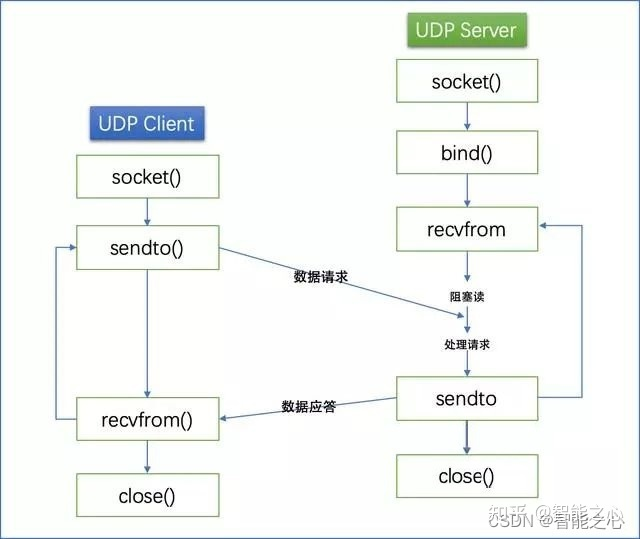

### [C++ UDP Socket](#)
 **介绍**： 由于UDP不面向连接，进最大能力交付，使得使用Socket设计UDP服务器和TCP服务器之间有许多的不同之处！

-----

- [x] [1. UDP 通信](#1-upd-通信)
- [x] [2. UDP Server实现](#2-udp-server实现)

-----

### [1. UDP 通信](#)
UDP，用户数据报协议（UDP，User Datagram Protocol），UDP是面向**无连接**协议，面向无连接的意思是只有“传送数据”的过程，提供面向事务的简单不可靠信息传送服务。
即使是在网络拥堵的过程中，UDP也**无法进行流量控制**等避免网络拥塞，传输过程种丢包,UDP也 **不负责重发**，甚至**出现包的到达顺序乱掉的情况**也无法纠正。

**优点:**  传输速度快，传输效率高，系统开销小(不需要维护连接), 没有syn泛洪攻击威胁！ 适用于对**实效性要求较高**的场景 (游戏、视频会议、online电话)！
[可以再应用层增加数据校验协议来弥补UDP协议的不足去实现UDP的可靠传输！](#)

#### [1.1 UDP Socket 模型](#)
UDP Socket网络编程的API不多，socket()用于创建套接字，bind()用于服务端绑定端口，sendto()用于发送数据，recvfrom()用于接收数据， close()用于关闭套接字，基本流程图如下所示：



#### [1.2 sendto](#)
将数据发送给socket，也就是对端服务器！
```cpp
#include <sys/types.h>
#include <sys/socket.h>

ssize_t sendto(int sockfd, const void *buf, size_t len, int flags,
                const struct sockaddr *dest_addr, socklen_t addrlen);

```
成功返回成功发送的数据长度， 失败就返回 `-1`  
参数：
* sockfd: 正在监听端口的套接口实例;
* buf：要发送的数组;
* len: 要发送的数组的字节大小; **由于以太网帧1500 - IP头部20 - UDP首部8 = 1472， 所以len不能超过1472,推荐1400**。
* flags: 填0即可;
* dest_addr: 指定数据要发送到哪个主机，哪个端口;
* addrlen: 表示 dest_addr 的长度;


#### [1.3 recvfrom](#)
接受从其他地方受到的信息，一次 recvform 只收一个报文。 如果用户传过来三个报文，recvform就需要调用三次。**谨记！**

```cpp
#include <sys/types.h>
#include <sys/socket.h>
ssize_t recvfrom(int sockfd, void *buf, size_t len, int flags,
                struct sockaddr *src_addr, socklen_t *addrlen);
```
成功返回成功接受的数据长度， 失败就返回 `-1`  
参数：
* sockfd: 正在监听端口的套接口实例;
* buf: 要接收的数组;
* len: 要接收的数组的字节大小;  **由于以太网帧1500 - IP头部20 - UDP首部8 = 1472， 所以len不能超过1472,推荐1400**。
* flags: 填0即可;   
    * MSG_DONTWAIT 启用非阻塞操作；如果操作将被阻止，则调用将失败，并返回错误EAGAIN或EWOULDBLOCK。
* src_addr: 获取接收的数据是从哪个主机地址发来的;
* addrlen: 表示 src_addr 所指向内容的长度;

### [2. UDP Server实现](#) 
使用UDP实现一个 echo 服务器！ 可以使用 `nc -ul 127.0.0.1 15000` 进行测试！

#### [2.1 服务端](#)
```cpp
#include <iostream>
#include <thread>
#include <sys/socket.h>
#include <netinet/in.h>
#include <arpa/inet.h>
#include <unistd.h>
#include "application.hpp"

void createUDPServer(){
    std::cout << "UDP echo server at 127.0.0.1 running in 15000:" << "\n";
    auto udp_socket_fd = socket(AF_INET, SOCK_DGRAM, 0);
    sockaddr_in server_address{
            AF_INET,
            htons(15000),
            htonl(INADDR_ANY)
    };
    //绑定端口号 和 IP
    Bind(udp_socket_fd, (const struct sockaddr*)&server_address, sizeof(server_address));

    while (true){
        const unsigned int buffer_size = 4096;
        char recvBuf[buffer_size] = { '\0' };
        sockaddr_in link_addr{};
        socklen_t len = sizeof(link_addr);

        int recvLen = recvfrom(udp_socket_fd, recvBuf, buffer_size, 0 ,
                               (struct sockaddr*)&link_addr, &len);
        char* addr_ip = inet_ntoa(link_addr.sin_addr);
        std::cout << "connect from " << addr_ip  << " - "
         << std::to_string(link_addr.sin_port) << std::endl;
        if (recvLen == -1){
            continue;
        }
        recvBuf[recvLen] = '\0';
        std::string single(recvBuf);
        //停止服务器
        if (single.starts_with("end")){
            break;
        }
        std::cout << "message: " << recvBuf << std::flush;
        std::string  message = "Get Message:" + std::to_string(recvLen) + 
            " from "+ addr_ip + " - " + std::to_string(link_addr.sin_port) + "\n";
        auto write_count = sendto(udp_socket_fd, message.c_str() , sizeof(char)*message.size(),
                                  0, (struct sockaddr*)&link_addr, len);
        if(write_count <= 0)
        {
            std::cout << "write error" << std::endl;
            break;
        }
    }
    std::cout << "server end!\n" << std::flush;
    close(udp_socket_fd);
}

int main() {
    createUDPServer();
    return 0;
}
```

#### [2.2 客户端](#)

```cpp
//
// Created by remix on 23-4-17.
//
#include <iostream>
#include <thread>
#include <sys/types.h>
#include <sys/socket.h>
#include <netinet/in.h>
#include <arpa/inet.h>
#include <exception>
#include <ctype.h>
#include <stdio.h>
#include <unistd.h>
#include <cstring>
#include <string>
#include <chrono>

int main(int argc, char *argv[]){
    std::cout << "start client:" << "\n";
    auto client_fd = socket(AF_INET, SOCK_DGRAM, 0);
    if (client_fd == -1) throw std::runtime_error("create the socket failed!");

    //服务器端口 + IP
    sockaddr_in server_address{
            AF_INET,
            htons(15000),
    };
    if (inet_aton("127.0.0.1",&server_address.sin_addr) == 0){
        throw std::runtime_error("ip address is not right!");
    };

    socklen_t len = sizeof(server_address);
    auto count = 10;
    while (count-- > 0){
        std::string message = "count: " + std::to_string(count * 100) + "\n";
        auto result = sendto(client_fd, message.c_str(), sizeof(char) * message.size(),
             0 , (struct sockaddr*)&server_address, sizeof(server_address));
        if (result == -1){
            throw std::runtime_error("sendto error!");
        }
        std::this_thread::sleep_for(std::chrono::seconds(1));

        char buffer[4096];
        auto read_count = recvfrom(client_fd, buffer, 4096, 0, (struct sockaddr*)&server_address, &len);
        if (read_count < 0) {
            std::cout << "the connect has been end!" << std::endl;
        }
        for (int i = 0; i < read_count; ++i) {
            if (buffer[i] == '\0') break;
            printf("%c", buffer[i]);
        }
    }
    close(client_fd);
    return 0;
}
```

