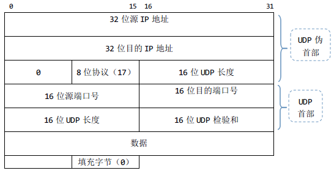
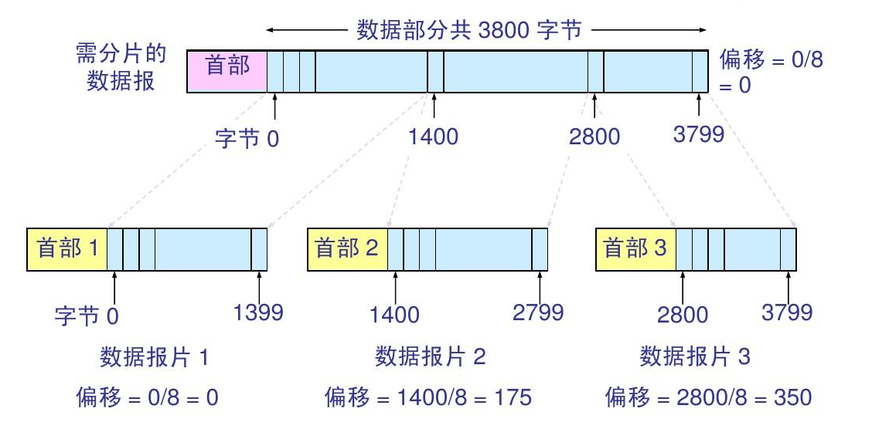

### [C++ Socket Server 基础](#)
 **介绍**：在一些特殊场景下例如游戏、online视频聊天、电话、多播、广播都是基于UDP实现的，应用同样非常广泛，所以掌握UDP Server是非常必要的！

-----
- [x] [1. UDP Server基础知识](#1-udp-server基础知识)
- [x] [2. ](#2-)
- [x] [3. ](#3-)
- [x] [4. ](#4-)
- [x] [5. ](#5-)
-----

### [1. UDP Server基础知识](#)
向上提供无连接不可靠服务,适用于实时性要求高（IP电话、视频会议等）,能够容忍少量数据包的丢弃的应用。
支持一对一，一对多，多对一和多对多交互通信， 而**TCP只能一对一通信**， **同时UDP的首部开销小**，只需要八个字节， 而TCP：最小20字节，最大60字节。

**UDP报文结构：**



UDP协议设计的长度最大值为65535,但实际上由于IP不可靠，如果数据长度大于1472,就会发生IP分片，当IP层组包发生错误，那么包就会被丢弃，导致丢弃整个IP数据报分片，而UDP不可靠不重传，
导致一个大的报文直接无法重组还原，还由一堆垃圾数据在缓存区。

#### [1.1 UDP和IO复用](#)
UDP 编程一般不需要用到系统的 epoll 函数，不朽的经典《Unix网络编程卷一》中注明：**“大多数情况下，TCP服务器是并发的，UDP的服务器是迭代的”** 。 

##### [1.2 UDP报文传输](#)
一定要记住： **UDP是报文传输**, **TCP是流式传输** , 对于TCP而言，如果客户端发送4096字节的数据，那么客户端可以 recv(1024) 调用多次，分次夺取数据，
因为TCP是流传输，是支持这样做的，但是UDP，不性，你必须一次性全部读取出来 recvfrom(4096)。

TCP 通信读取方式是支持下面的操作，而UDP不支持。
```cpp
//客户端
send(4096)
send(512)

//服务端
recv(1024)
recv(512)
recv(512)
recv(1024)
recv(512)
recv(1024)
```
UDP的正确读取方式,必须一一对应！ [**UDP必须一次性读取完整个报文。**](#)， **如果不一一对应，会有 分片重组异常**！
```cpp
//客户端
sendto(512)    //一个报文
sendto(1024)

//服务端
recvfrom(512)
recvfrom(1024)
```

对于UDP报文，一定是一个报文一个报文的发送，一个报文一个报文的接受！


#### [1.3 UDP和MTU](#)

一个以太帧最大为1518字节 （14字节以太首部，20字节IP首部，UDP8/TCP20，因此IP包每次最大为1500==MTU。去掉协议头UDP有效数据1472字节，TCP为1460字节。还有最后的4字节CRC）

以太网(Ethernet)数据帧的长度必须在**46-1500**字节之间,这是由以太网的物理特性决定的。这个1500字节被称为链路层的MTU(最大传输单元)， **由于以太网帧的限制，长度不能超过1472字节**：

* 因为IP数据报的首部为20字节,所以IP数据报的数据区长度最大为1480字节.
* 因为UDP数据报的首部8字节,所以UDP数据报的数据区最大长度为1472字节.

虽然是1472,最好还是小于1472， 推荐使用1400，如果是游戏之类的 推荐 512字节, 鉴于Internet(非局域网)上的标准MTU值为576字节，所以建议在进行Internet的UDP编程时，最好将UDP的数据长度控制在548字节 (576-8-20)以内。


如果我们定义的TCP和UDP包没有超过范围，那么我们的包在IP层就不用分包了，这样传输过程中就避免了在IP层组包发生的错误；如果超过范围，既IP数据报大于1500字节，发送方IP层就需要将数据包分成若干片，而接收方IP层就需要进行数据报的重组。

更严重的是，如果使用UDP协议，当IP层组包发生错误，那么包就会被丢弃。接收方无法重组数据报，将导致丢弃整个IP数据报。UDP不保证可靠传输；但是TCP发生组包错误时，该包会被重传，保证可靠传输。


#### [1.4 IP 分片](#)

当IP数据报的长度超过帧的MTU时，它将被分片传输。分片可能发生在发送端，也可能发送在中转路由器上，而且可能在传输过程中被多次分片，但只有在最终的目标机器上，这些分片才会被内核中的IP模块重新组装。

IP的分片和重组需要的信息由头部的三个字段提供：**16位数据报标识**、**3位标志**、**13位偏移**。一个IP数据报的每个分片都具有自己的IP头部，他们具有相同的标识值，但具有不同的片偏移。并且除了最后一个分片外，其他分片都将设置MF标志。此外，每个分片的IP头部的总长度字段将被设置为该分片的长度。

- 3位标志：标识是否IP分片.第一位无用，第二位0：允许分片，1：不允许。第三位0：最后一片，1：后面还有分片
- 13位片偏移：此分片在原始数据的偏移，用于分片重组，因为13位，所以支持的最大字节为8192




### [2.](#) 

|方法|返回值|参数个数|说明|
|:---|:---|:---|:----|
|||||
|||||
|||||

### [3.](#) 

### [4. 套接字设置](#)

#### [4.1 ](#)


### [5.](#) 

-----
时间: [] 

