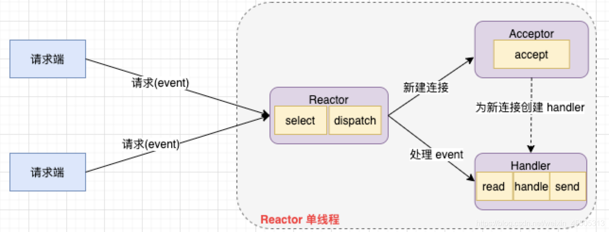
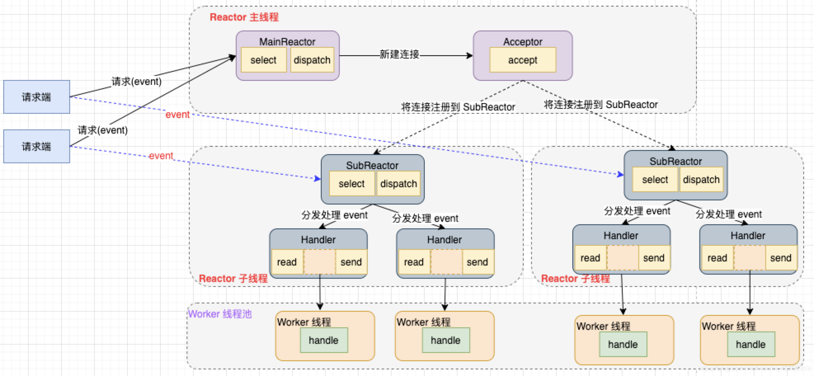

### [C++ 高性能网络模式](#)
 **介绍**： 这是在IO多路复用、阻塞非阻塞、同步、异步、多线程的基础上对网络高性能库、封装所形成的网络模式设计的思想！

-----
- [x] [1. ](#1-)
- [x] [2. ](#2-)
- [x] [3. ](#3-)
- [x] [4. ](#4-)
- [x] [5. ](#5-)
-----

### [1. IO多路复用方式](#)

* linux:  select、poll、epoll
* mac: kqueue
* windows: select IOCP!

### [2. Reactor模型](#) 
Reactor模型，**是基于事件驱动的**，基本设计思想是I/O 复用结合线程池。通过一个或多个输入同时传递给服务端处理,也叫做反应器设计模式，是一种为处理服务请求并发提交到一个或者
多个服务处理器的事件设计模式。当请求抵达后，通过服务处理器将这些请求采用多路分离的方式分发给相应的请求处理器。

Reactor 模式主要由 Reactor 和处理器 Handler 这两个核心部分组成，如下图所示，它俩负责的事情如下：

* Reactor：负责监听和分发事件，事件类型包含连接事件、读写事件；
* Handler ：负责处理事件，如 read -> 业务逻辑 （decode + compute + encode）-> send；

**事件驱动处理示意图**，可以看到大致流程为服务端程序监听处理多路请求传入的事件，并将事件分派给请求对应的处理线程完成处理。

Reactor 模式中有 2 个关键组件：

* Reactor 运行在一个单独的线程中，负责监听和分发事件，分发事件给适当的 Handler 来对 IO 请求做出反应
* Handler 将自身与事件绑定，实际执行 I/O 要完成的事件。Reactor 通过调度适当的 Handler 来响应 I/O 事件，执行非阻塞操作

####  [2.1 Reactor模型分类](#) 
Reactor 模型中的 Reactor 可以是单个也可以是多个，Handler 同样可以是单线程也可以是多线程，所以组合的模式大致有如下三种：

* 单 Reactor 单线程模型
* 单 Reactor 多线程模型
* 主从 Reactor 单线程模型
* 主从 Reactor 多线程模型

#### [2.2 单 Reactor 单线程](#)
* Reactor 通过 select/poll/epoll 监控连接上的所有事件，收到事件后通过 dispatch 将其分发
* 如果该事件是请求连接建立，则由 Acceptor 接受连接，并为其创建 Handler 处理后续事件
* 假如不是建立连接事件，Reactor 将其分发给对应的 Handler 来响应
* Handler 实际处理事件，完成 read->handle->send 的业务处理流程

单Reactor单线程模型只是进行了代码组件的区分，整体操作还是单线程，其优缺点如下：
* **优点**: 模型简单，所有处理都在一个线程中完成，没有多线程上下文切换的开销，没有进程通信及锁竞争的问题
* **缺点**: 
    1. 只有一个线程，无法完全发挥多核 CPU 的性能，造成浪费
    2. Handler 在处理某个连接上的业务时，整个进程无法处理其他连接事件，容易导致性能瓶颈
    3. 一旦 Reactor 线程意外中断或者跑飞，可能导致整个系统通信模块不可用，无法接收和处理外部消息，造成节点故障
* 适用场景" 客户端数量有限，业务处理非常快速，例如 **Redis 就是使用单 Reactor 单线程模型** 。

#### [2.2 单 Reactor 多线程](#)
1. Reactor 通过 select 监控连接上的所有事件，收到事件后通过 dispatch 将其分发
2. 如果是请求建立连接的事件，则由 Acceptor 通过 accept 处理连接请求，然后创建一个 Handler 处理该连接，完成后续的读写事件
3. 假如不是建立连接事件，Reactor 将其分发给对应的 Handler 来响应。该实现中 Handler 只负责响应事件，read 读取数据后会将其分发给 Worker 线程池进行 handle 业务处理
4. Worker 线程池调度线程完成实际的业务处理，并将响应结果返回给主线程 Handler，Handler 通过 send 将结果返回给请求端，完成请求响应的流程

单 Reactor 多线程模型 相对于单Reactor单线程模型来说，**handle 业务逻辑交由线程池来处理**，其优缺点如下：

* **优点**: 可以充分利用多核 CPU 的处理能力，使 Reactor 更专注于事件分发工作，提升整个应用的吞吐
* **缺点**: 多线程环境下数据共享和访问比较复杂，子线程完成业务处理后把结果传递给主线程 Handler 进行发送，需要考虑共享数据的互斥和保护机制
Reactor 主线程单线程运行，承担所有事件的监听和响应，高并发场景下会成为性能瓶颈

#### [2.3 主从 Reactor 多线程](#)
单 Reactor 多线程模型中 Reactor 在单线程中运行，高并发场景下容易成为性能瓶颈，针对这个缺点一个解决方案是让 Reactor 在多线程中运行，于是产生了主从 Reactor 多线程模型。相比第二种模型，它将 Reactor 分成两部分
* **MainReactor** 只用来处理网络IO连接建立的操作，并将建立的连接指定注册到 SubReactor 上
* **SubReactor** 负责处理注册其上的连接的事件，完成业务处理，通常 SubReactor 个数可与CPU个数等同

**主从 Reactor 多线程模型** 消息处理流程可以分为以下几个步骤：

* Reactor 主线程 MainReactor 通过 select 监控建立连接的事件，收到事件后通过 Acceptor 接收，处理建立连接事件
* Acceptor 建立连接后，MainReactor 将连接分配给 Reactor 子线程 SubReactor 进行处理。SubReactor 会将该连接加入连接队列进行监听，并创建一个 Handler 用于处理该连接上的读写事件
* 当有读写事件发生时，SubReactor 调用连接对应的 Handler 进行响应，Handler 读取数据后将其分发给 Worker 线程池进行 handle 业务处理
* Worker 线程池调度线程完成实际的业务处理，并将响应结果返回给 SubReactor 的 Handler，Handler 通过 send 将结果返回给请求端，完成请求响应的流程

这种 Reactor 实现模型使用非常广泛，比较著名的如 Kafka 主从多线程模型的支持，其主要优点如下：

* MainReactor 与 SubReactor 的数据交互简单，MainReactor 只需把新连接交给 SubReactor，SubReactor 无需返回数据
* MainReactor 与 SubReactor 主从职责明确，MainReactor只负责接收新连接，SubReactor 负责完成后续的业务处理

### [3. Proactor](#) 
在 Reactor 模式中，Reactor 在用户进程通过 select 轮询等待某个事件的发生，然后将这个事件分发给 Handler，由 Handler 来做实际的读写操作。
[**这个过程中读写操作依然是同步的，如果把 I/O 操作改为异步，即交给操作系统来完成，就能进一步提升性能，这就是异步网络模型 Proactor**](#) 。

**Proactor模式也是基于事件驱动模型，不过 Proactor 不关注读取就绪事件，而是关注读取完成事件，因为异步IO都是操作系统将数据读写到指定的缓冲区，应用程序直接从缓冲区取用即可。**

### [4.](#)

### [5.](#) 

-----
时间: [] 