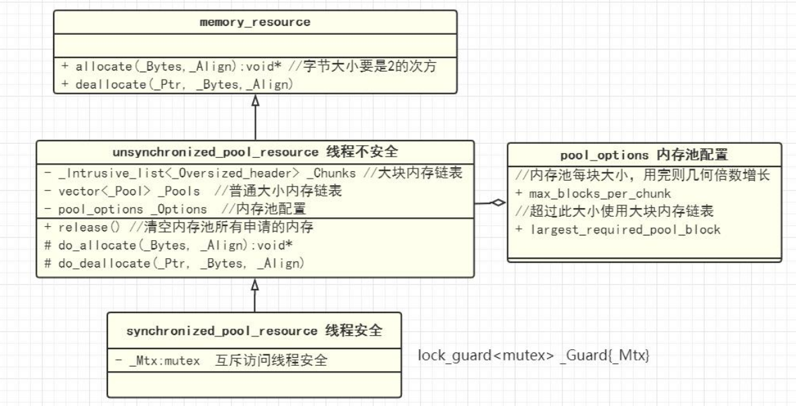

### C++ 17 标准内存池

**介绍**： C++17 引入了boost库中的内存池作为标准内存池，接口在头文件 [#include\<memory_resource\>](https://zh.cppreference.com/w/cpp/header/memory_resource) 中。

----


### [0. 内存池的组织方式](#)

内存池通常按照一定的组织方式来管理和分配内存块(chunk)和内存单元(block)。下面是一种常见的内存池组织方式：

1. **Chunk**（块）：内存池会预先申请一块较大的连续内存空间，称为块。块的大小可以根据需求进行配置，通常是以页面大小或其他固定大小的倍数为单位。
2. **Block**（内存单元）：块被划分为多个较小的内存单元，称为内存单元。每个内存单元的大小都是固定的，通常是相同的大小。
3. 空闲链表：内存池会维护一个空闲链表，用于记录空闲的内存单元。当内存单元被分配出去时，它会从空闲链表中移除；当内存单元释放时，它会被添加回空闲链表。
4. 内存分配：当需要分配内存时，内存池会从空闲链表中取出一个合适大小的内存单元，并返回给用户。如果空闲链表中没有足够大小的内存单元，内存池可以选择多种策略，如重新申请一个新的块来扩展内存池。
5. 内存释放：当用户释放内存时，内存池会将相应的内存单元添加回空闲链表，以便下次分配使用。

通过这种组织方式，内存池可以高效地管理内存分配和释放，减少内存碎片，提高内存的利用率。它适用于需要频繁进行小块内存分配和释放的场景，例如在嵌入式系统、游戏开发和高性能计算中经常使用的内存管理技术。


### [1. memory_resource](#)

C++17引入了**std::pmr::memory_resource**类，它是一个抽象基类，用于支持多态内存资源和内存分配器，针对封装内存资源类的无界集。 具有**默认**和**复制**构造函数、复制运算符、虚析构函数。

**memory_resource**类定义了一组虚拟成员函数，用于在派生类中实现特定的内存管理行为。

| 公开成员函数                                                 | 说明                                                         |
| ------------------------------------------------------------ | ------------------------------------------------------------ |
| [allocate](https://zh.cppreference.com/w/cpp/memory/memory_resource/allocate) | 分配指定大小的内存，并返回指向分配内存的指针。还可以指定对齐方式，默认为`alignof(std::max_align_t)` |
| [deallocate](https://zh.cppreference.com/w/cpp/memory/memory_resource/deallocate) | 释放先前分配的内存。需要传入要释放的内存指针、大小和对齐方式，默认为`alignof(std::max_align_t)`。 |
| [is_equal](https://zh.cppreference.com/w/cpp/memory/memory_resource/is_equal) | 比较两个内存资源对象是否相等。                               |


**allocate**: 字节数参数bytes必须是2的次方！

```cpp
void* allocate(std::size_t bytes, std::size_t alignment = alignof(std::max_align_t));
```

| 私有成员函数                                                 | 说明                                               |
| ------------------------------------------------------------ | -------------------------------------------------- |
| [do_allocate](https://zh.cppreference.com/w/cpp/memory/memory_resource/do_allocate)[虚] | 分配内存 (虚私有成员函数)                          |
| [do_deallocate](https://zh.cppreference.com/w/cpp/memory/memory_resource/do_deallocate)[虚] | 解分配内存 (虚私有成员函数)                        |
| [do_is_equal](https://zh.cppreference.com/w/cpp/memory/memory_resource/do_is_equal)[虚] | 与另一 `memory_resource` 比较相等 (虚私有成员函数) |





### [2. pool_options](#)

C++标准库中的**std::pmr::pool_options**是一个结构体，用于配置和控制内存池的行为。它在C++17中引入，可以用于自定义内存资源类（例如std::pmr::unsynchronized_pool_resource、std::synchronized_pool_resource）的参数，可以用于调整内存池的行为，以适应不同的应用场景。

**chunk和block在内存池中的区别 **：

chunk是内存池中的一个**大块内存**，是由若干个block组成的。block是内存池中的最小内存单位，是用来分配给程序使用的。

在内存池中，chunk是一个整体，它由若干个block组成，而block则是内存池中最小的内存单位，被用来分配给程序使用。

**简单来说，chunk是内存池中的一个大块内存，而block是内存池中的最小内存单位**。

`std::pmr::pool_options`结构体具有以下成员变量：

```cpp
struct std::pmr::pool_options {
    size_t max_blocks_per_chunk = std::pmr::default_memory_resource(); //chunk 中 block 数量的上限
    size_t largest_required_pool_block = 0; //大数据块的字节数量
}; 
```

* **max_blocks_per_chunk**: 每个chunk内部分配block的最大数量。较低的值可以防止分配大块内存，而这些内存可能大部分时间都处于未使用状态，但这意味着内存池需要更频繁地进行补充。
* **largest_required_pool_block** : 应该从池中提供的最大块大小（以字节为单位），分配大于此门槛的单个块的尝试会直接从上游 [std::pmr::memory_resource](https://zh.cppreference.com/w/cpp/memory/memory_resource) 分配，而不是从由池资源管理的池中提供。若 `largest_required_pool_block` 为零或大于实现定义的极限，则使用极限代替。

```cpp
std::pmr::pool_options option;
option.largest_required_pool_block = 1024 * 1024 * 10;  //大数据块的大小 10M 超过上限的从上层获取
option.max_blocks_per_chunk = 1024; //一个 chunk 最多1024个 block
```


### [3. unsynchronized_pool_resource](#)

线程不安全的 [std::pmr::memory_resource](https://zh.cppreference.com/w/cpp/memory/memory_resource)，**std::pmr::unsynchronized_pool_resource**是 **std::pmr::memory_resource**的一个 **派生类**，它使用对象池的方式进行内存分配，避免频繁的内存分配和释放带来的开销，从而提高性能。

一般而言，`std::pmr::unsynchronized_pool_resource`会维护一个或多个对象池，根据不同大小的内存块需求，从相应的对象池中分配内存，如果无法满足需求，会使用全局内存分配器。

**构造函数**：

```cpp
unsynchronized_pool_resource();

explicit unsynchronized_pool_resource(std::pmr::memory_resource* upstream);

explicit unsynchronized_pool_resource(const std::pmr::pool_options& opts);

unsynchronized_pool_resource(const std::pmr::pool_options& opts, std::pmr::memory_resource* upstream);

```

私有方法：实现了父类 **memory_resource** 的 do_allocate、do_deallocate、do_is_equal方法。


| 函数                                                         | 说明                                               |
| ------------------------------------------------------------ | -------------------------------------------------- |
| allocate(size)                                               | 分配内存                                           |
| deallocate(void *p, size)                                    | 将内存放回内存池                                   |
| [release()](https://zh.cppreference.com/w/cpp/memory/unsynchronized_pool_resource/release) | 释放所有分配的内存 (公开成员函数)                  |
| [std::pmr::memory_resource*  upstream_resource()](https://zh.cppreference.com/w/cpp/memory/unsynchronized_pool_resource/upstream_resource) | 返回指向上游 memory_resource 的指针 (公开成员函数) |
| [std::pmr::pool_options options() const;](https://zh.cppreference.com/w/cpp/memory/unsynchronized_pool_resource/options) | 返回控制此资源分池行为的选项                       |


```cpp
pool_options option;
option.largest_required_pool_block = 1024 * 1024 * 10; //10M
option.max_blocks_per_chunk = 5; //每一个chunk有多少个block

std::pmr::synchronized_pool_resource pool(option);


auto size_1 = 1024 * 1024 * 1 * 2;
void *  data = pool.allocate(size_1);

std::shared_ptr<char[]> ptr((char*)data, [&, size_1](char* ptr) { 
    printf("deallocate");
    pool.deallocate(ptr, size_1);
});
//和智能指针一起使用
```


### [4. synchronized_pool_resource](#)

线程安全的 std::pmr::memory_resource，用于管理具有不同块大小的池中的分配。


```cpp
std::pmr::pool_options option;
option.largest_required_pool_block = 1024 * 1024 * 10;  //10M
option.max_blocks_per_chunk = 1024 * 1024; //1M


std::pmr::synchronized_pool_resource pool(option);

void* ar[1000];
for (size_t i = 0; i < 1000; i++)
{
    try
    {
        void* data = pool.allocate(1024 * 1024);
        ar[i] = data;
        printf("+ 1M ");
        this_thread::sleep_for(15ms);
    }
    catch (const std::exception& ex)
    {
        printf("memory not enough!\n");
    }
}


for (size_t i = 0; i < 1000; i++)
{
    try
    {
        pool.deallocate(ar[i], 1024 * 1024);
        this_thread::sleep_for(15ms);
    }
    catch (const std::exception& ex)
    {
        printf("release error!\n");
    }
}


pool.release();
```


### [5. monotonic_buffer_resource](#)

它是通过继承`std::pmr::memory_resource`来实现的, 是一种单调递增的内存资源, `std::pmr::monotonic_buffer_resource`通过将内存分配请求从底层内存资源（例如堆）中获取，并按照顺序逐个进行分配，以减少内存重复分配的开销。


monotonic buffer resource是线程不安全的哦，所以分配的速度会很快。

```cpp
char buffer[32] = {};
std::fill_n(std::begin(buffer), std::size(buffer)-1, '_');

std::pmr::monotonic_buffer_resource pool{
   std::data(buffer), std::size(buffer)
};
```

pool背后实际有两个后盾，第一个后盾很明显，就是刚才创建的那个char buffer[32]数组。第二个后盾不是很明显，叫做upstream。这个upstream就是另一个memory_resource对象，当char buffer[32]不够用时，对内存的请求就会转向upstream。是的，32字节的数组，很可能不够用。
