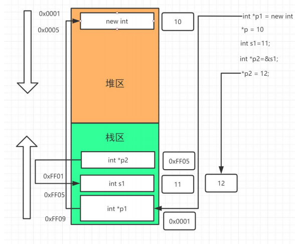

### [C/C++ 动态内存申请](#)

**介绍**: 对于C/C++ 内存申请的接口总计

----

- [1. 动态内存申请函数](1-动态内存申请函数)
- [2. 重载 new](2-重载-new)

----

### [1. 动态内存申请函数](#)

C/C++ 提供了  malloc,calloc,realloc和new,delete 等等一系列用于内存申请与释放的函数、操作符。

#### [1.1 C语言函数接口](#)

在C语言中，动态内存管理的**函数**是：[malloc](https://so.csdn.net/so/search?q=malloc&spm=1001.2101.3001.7020),calloc和realloc.使用结束后，需要我们通过free来进行手动清理。


**malloc**：按字节来开辟空间，如果开辟成功，就返回这段空间的首地址。否则，返回NULL。

```c
void* malloc(size_t size);
```


**calloc**：在malloc的基础上，还可以进行初始化开辟出来的空间。

```c
void* calloc(size_t num,size_t size);
```

num:表示分配大小为size的空间的个数。


**realloc**：扩容函数

```c
void *realloc( void *memblock, size_t size );
```

如果原来开辟的空间不够用，就可以用realloc来扩容。当原来开辟的空间不够用，但其**加上连续的闲置空间够用时**，realloc就会在原来的空间后面**紧跟着**开辟需要的空间大小，返回的仍然是原来空间的首地址；**但是如果原来的空间的连续的闲置的空间不能满足需求时**，ralloc就会在堆上的其他足够大地方重新开辟一段空间，然后返回新空间的首地址。


#### [1.2 C++ 函数接口](#)

在C++中，在C的基础上又有了新的内存管理的方式使用, 以下不是函数，是**操作符**，它们都可以被重载，可以重载全局操作符，也可以重载单个对象的内存申请操作符。

* new 
* delete
* new[]
* delete[]
* operator new
* operator delete
* operator new[]
* operator delete[]


当你new一个对象一个后，会在堆区域申请一块内存，同时也会在栈区设置一个指针变量，也就是其实占用了两块内存。



new,delete时，不仅仅会开辟和清理空间，还会**调用类的构造和析构函数**。


**严格的说，只要是由new[]来开辟空间，就一定会多开辟4个字节**。但是，有时候并不是这样，类如上面的内置类型。怎么理解呢，就是当析构函数不可以调用时，就可以不多开辟4个字节。多开辟4个自己的目的就是为了记录调用析构的次数


#### [1.3 定位 new](#)

普通 new 申请空间是从堆中分配空间，一些特殊的需求要在已分配的空间中创建对象，就可以使用放置, placement new 操作，**定位new运算符**，让你能够指定要使用的位置。可能使用这种特性来设置其内存管理规程，处理需要通过特定地址进行访问的硬件或在特定位置创建对象。需要包含头文件 #include\<new\>

* **placement new 生成对象既可以在栈上，也可以在堆上**
* **placement new 生成对象销毁要手动调用析构函数**

```cpp
#include<iostream>
#include <new>
using namespace std;

char buffer[500];

int main()
{
	int* p1, * p2;
	p1 = new int[20];
	p2 = new (buffer)int[20];
	for (int i = 0; i < 20; i++)
	{
		p1[i] = p2[i] = i;
	}
	cout << "内存地址:\n" << "p1： " << p1 << endl;
	cout << "p2地址:  " << p2 << endl;
	cout << "buffer地址: " << (void*)buffer << endl;
	delete [] p1;
    //delete [] buffer; 
	/*
	p1： 01175E38
	p2地址:  00F4D3E0
	buffer地址: 00F4D3E0
	*/
}
```


#### [1.4 malloc/free和new/delete的区别和联系](#)

* malloc/free是**函数**，而new/delete是**操作符**。
* malloc/free只是动态内存的**开辟/释放空间**，而new在开辟的同时也在**调用构造函数**，而delete在清理的同时也在**调用析构函数**。
* malloc/free在调用时需要我们 **手动计算大小** 且返回值是 **void***，而 new/delete 可以**自己计算大小**，且**返回值是对应的类型**。
* 当malloc空间开辟失败时，会返回**NULL**；而new开辟失败时则会**抛异常**。
* 所以：new/delete更为方便。
  

### [2. 重载 new](#)

我们可以重载new操作符，以改变整个程序动态内存申请的行为，还可以实现以下功能：

* 监测内存创建销毁 ，统计和监控泄漏

* 内存对齐的处理

* 特定应用：例如多进程内存共享


**new 本质**： 当我们调用 `new []` 本质是 调用 `operator new[]`然后调用  ·operator new()` 最后本质是调用 `malloc`。

**delete 本质**：`delete []` -----> `operator delete[]`  -----> `operator delete()`   ----> `free()`

#### [2.1 全局 new 和 delete](#)

重载全局 **new** 和 *delete** 的方法！

```cpp
void* operator new(size_t size){
	printf("get memory: %llu \n", size);
	void* men = malloc(size);
	if (!men)
	{
		throw std::bad_alloc();
	}
	return men;
}

using namespace std;

void* operator new [](size_t size)
{
	cout << "perator new [] : " << size << " Bytes" << endl;
	void* mem = malloc(size);
	if (!mem)
	{
		throw std::bad_alloc();
	}
	return mem;
}
void operator delete(void* ptr) {
	std::cout << "operator delete " << std::endl;
	std::free(ptr);
}
void operator delete[](void* ptr)
{
	std::cout << "operator delete []" << std::endl;
	std::free(ptr);
}
```


#### [2.2 重载类的操作符的 new 和 delete](#)

全局重载一般在DEBUG模式下进行、我们可以对单个类重载运算符。

```cpp
class TestMem
{
public:
	int x1;
	int x2;
	TestMem() { cout << "Create TestMem" << endl; }
	~TestMem() { cout << "Drop TestMem" << endl; }
	void Test()
	{
		auto b = new int;
		auto a = new char[1024];
		delete[]a;
		delete b;
	}
	void* operator new(std::size_t size)
	{
		std::cout << "Foo3 operator new:" << size << std::endl;
		//return ::new Foo3();
		//return nullptr;
		return std::malloc(size);
	}
	void* operator new[](std::size_t size)
	{
		std::cout << "Foo3[] operator new size=" << size << std::endl;
		//return ::new Foo3();
		//return nullptr;
		return std::malloc(size);
	}
	void operator delete[](void* ptr)
	{
		std::cout << "delete[] Foo3 " << std::endl;
		//return nullptr;
		std::free(ptr);
	}
	void operator delete(void* ptr)
	{
		std::cout << "delete Foo3 " << std::endl;
		//return nullptr;
		std::free(ptr);
	}
};
```


