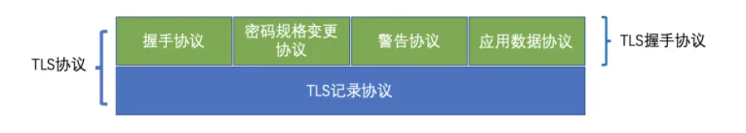
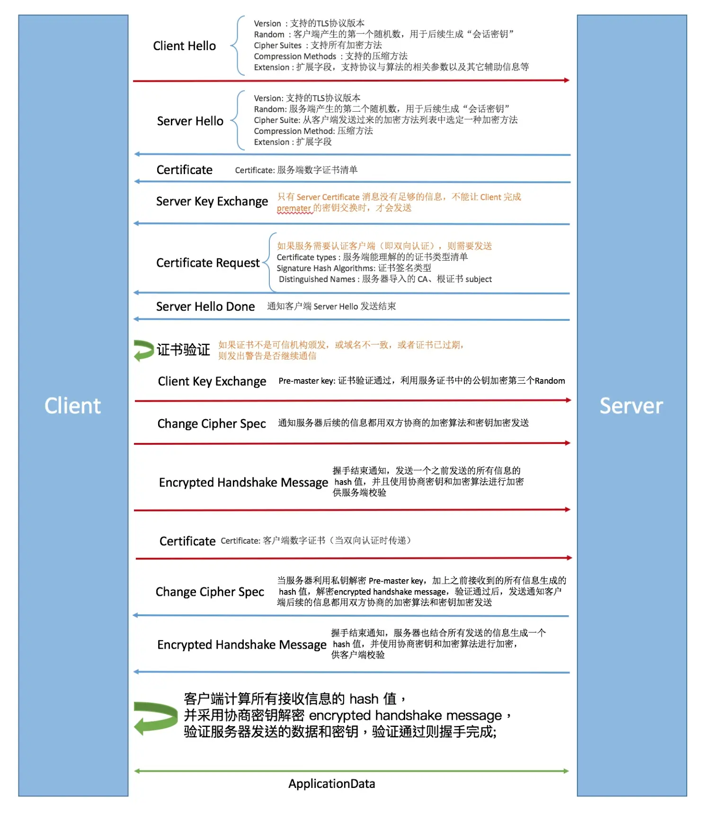

### [SSL协议](#)

SSL是一种安全套接层协议，是Web浏览器与Web服务器之间安全交换信息的协议，提供两个基本的安全服务：鉴别与保密。

SSL协议的三个特性

* 保密：在握手协议中定义了会话密钥后，所有的消息都被加密；

* 鉴别：可选的客户端认证，和强制的服务器端认证；

* 完整性：传送的消息包括消息完整性检查（使用MAC）。

**SSL介于应用层和TCP层之间，应用层数据不再直接传递给传输层，而是传递给SSL层，SSL层对从应用层收到的数据进行加密，并增加自己的SSL头**。需要注意的是，SSL 已被更现代的 TLS 协议所取代。尽管如此，为了兼容性和传统原因，"SSL" 一词仍然广泛使用于涉及 TLS 的通信和安全领域。

**TLS(Transport Layer Security 安全传输协议) 传输层安全是IETF在SSL3.0基础上设计的协议，实际上相当于SSL的后续版本、也就是SSL3.1**。

TLS主要分为两层，底层的是TLS记录协议，主要负责使用对称密码对消息进行加密。

上层的是TLS握手协议，主要分为握手协议，密码规格变更协议和应用数据协议4个部分。

- 握手协议负责在客户端和服务器端商定密码算法和共享密钥，包括证书认证，是4个协议中最最复杂的部分。
- 密码规格变更协议负责向通信对象传达变更密码方式的信号
- 警告协议负责在发生错误的时候将错误传达给对方
- 应用数据协议负责将TLS承载的应用数据传达给通信对象的协议。

#### 握手协议

[视频](https://www.bilibili.com/video/BV13P4y1o76u/)

握手协议是TLS协议中非常重要的协议，通过客户端和服务器端的交互，和共享一些必要信息，从而生成共享密钥和交互证书。

SSL握手协议是SSL/TLS协议的一部分，用于在客户端和服务器之间建立安全通信的过程。握手协议主要包括以下几个步骤：

1. 客户端发送ClientHello：客户端向服务器发送一个ClientHello消息，其中包含支持的SSL/TLS版本、加密套件列表（包括加密算法、摘要算法等）、随机数（用于后续密钥生成）等信息。
2. 服务器回应ServerHello：服务器选择一个合适的加密套件，发送一个ServerHello消息给客户端，其中包含所选择的SSL/TLS版本、加密套件、随机数等信息。
3. 服务器发送证书：服务器将其公钥证书（数字证书）发送给客户端，该证书用于对服务器身份进行认证。
4. 客户端验证证书：客户端对服务器发送的证书进行验证，检查其有效性（是否由受信任的证书颁发机构签发、是否在有效期内等）。
5. 客户端生成密钥：如果服务器的证书验证通过，客户端生成一个随机的对称密钥，并使用服务器的公钥加密该密钥，然后将其发送给服务器。
6. 服务器解密密钥：服务器使用自己的私钥解密客户端发送的密钥，获得对称密钥。
7. 握手完成：客户端和服务器都拥有了相同的对称密钥，它们使用该密钥来加密和解密后续通信的数据。握手阶段结束，SSL/TLS连接建立完成。

在握手过程中还会包括一些其他的步骤，例如密钥交换、协商密码套件、进行身份验证等。握手协议的目的是确保通信双方可以协商出一个共享的加密密钥，以保证后续通信的机密性、完整性和身份验证等安全属性。

需要注意的是，TLS（Transport Layer Security）是SSL的升级版本，更为安全可靠，并逐渐取代了旧版的SSL。握手协议在TLS中也有类似的步骤和过程。

