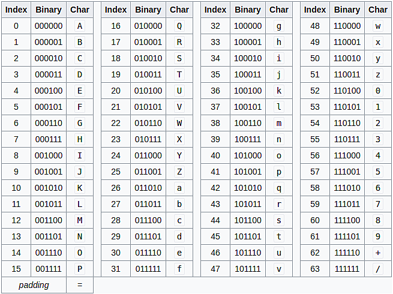

### [Base64、Base58 编码](#)

**介绍**：Base64 编码是一种将二进制数据转换为可打印字符的编码方法，它主要用于在不可靠的传输媒介中以文本形式传输和存储二进制数据，常在email中使用。

----

Base64 编码的作用有以下几个方面：

* 邮件编码(base64)
* xml、json存储二进制内容
* 网页传递数据URL
* 数据库中以文本形式存放二进制数据
* 可打印比特币钱包地址 base58Check


Base64 编码具有以下特点：

- 编码后的数据长度总是比原始数据长约 1/3。
- 编码后的数据可以包含 A-Z、a-z、0-9 和两个额外字符的任意组合。
- Base64 编码是一种可逆的编码方式，可以通过解码还原原始数据。


#### Base64 码表

**Base64** 是一种基于 64 个可打印字符来表示二进制数据的表示方法，由于 2^6=64，所以每 6 个比特为一个单元，对应某个可打印字符。




**使用 Base64 进行编码，大致可以分为 4 步**：

1. 将原始数据每三个字节作为一组，每个字节是8个bit，所以一共是 24 个 bit
2. 将 24 个 bit 分为四组，每组 6 个 bit
3. 在每组前面加补 00，将其补全成四组8个bit
   到此步，原生数据的3个字节已经变成4个字节了，增大了将近`30%`
4. 根据Base64码表得到扩展后每个字节的对应符号（见上图）


通过上面的我们知道了Base64编码过程是3个字符一组的进行，如果原文长度不是3的倍数怎么办呢，不够3个，那么只能在编码后的字符串中补`=`了。缺一个字符补一个，缺两个补两个即可，所以有时候你会看见base64字符串结尾有1个或者2个`=`。


#### Base64Encode函数

```cpp
#include <iostream>
#include <openssl/bio.h>
#include <openssl/evp.h>
#include <openssl/buffer.h>
using namespace std;
int Base64Encode(const unsigned char* in, int len, char* out_base64)
{
    if (!in || len <= 0 || !out_base64)
        return 0;
    //内存源 source
    auto mem_bio = BIO_new(BIO_s_mem());
    if (!mem_bio)return 0;

    //base64 filter
    auto b64_bio = BIO_new(BIO_f_base64());
    if (!b64_bio)
    {
        BIO_free(mem_bio);
        return 0;
    }
    //形成BIO链
    //b64-mem
    BIO_push(b64_bio, mem_bio);
    //超过64字节不添加换行（\n）,编码的数据在一行中
    // 默认结尾有换行符\n 超过64字节再添加\n
    BIO_set_flags(b64_bio, BIO_FLAGS_BASE64_NO_NL);
    
    // 写入到base64 filter 进行编码，结果会传递到链表的下一个节点
    // 到mem中读取结果(链表头部代表了整个链表)
    // BIO_write 编码 3字节=》4字节  不足3字节补充0 和 =
    // 编码数据每64字节（不确定）会加\n 换行符
    int re = BIO_write(b64_bio, in, len);
    if (re <= 0)
    {
        //情况整个链表节点
        BIO_free_all(b64_bio);
        return 0;
    }

    //刷新缓存，写入链表的mem
    BIO_flush(b64_bio);

    int outsize = 0;
    //从链表源内存读取
    BUF_MEM* p_data = 0;
    BIO_get_mem_ptr(b64_bio, &p_data);
    if (p_data)
    {
        memcpy(out_base64, p_data->data, p_data->length);
        outsize = p_data->length;
    }
    BIO_free_all(b64_bio);
    return outsize;
}
```


#### Base64Decode

```c
int Base64Decode(const char* in, int len, unsigned char* out_data)
{
    if (!in || len <= 0 || !out_data)
        return 0;
    //内存源 （密文）
    auto mem_bio = BIO_new_mem_buf(in, len);
    if (!mem_bio)return 0;
    //base64 过滤器
    auto b64_bio = BIO_new(BIO_f_base64());
    if (!b64_bio)
    {
        BIO_free(mem_bio);
        return 0;
    }
    //形成BIO链
    BIO_push(b64_bio, mem_bio);

    //默认读取换行符做结束
    //设置后编码中如果有\n会失败
    BIO_set_flags(b64_bio, BIO_FLAGS_BASE64_NO_NL);

    //读取 解码 4字节转3字节
    size_t size = 0;
    BIO_read_ex(b64_bio, out_data, len, &size);
    BIO_free_all(b64_bio);
    return size;
}
```

使用例子:

```c
int main()
{
    cout << "Test  openssl BIO base64!" << endl;
    unsigned char data[33] = { "012345678901234567890123456781" };
    int len = sizeof(data);
    char out[4096] = { 0 };
    unsigned char out2[4096] = { 0 };
    int re = Base64Encode(data, len - 1, out);
    if (re > 0)
    {
        out[re] = '\0';
        cout << "encode:[ " << out << " ]" << endl;

        re = Base64Decode(out, re, out2);
        cout << "decode:" << out2 << endl;
    }
    else {
        std::cout << "no success" << std::endl;
    }

    //BIO_new
}
```


#### Base58

**Base58**是用于[比特币](https://zh.wikipedia.org/wiki/比特幣)（Bitcoin）中使用的一种独特的编码方式，主要用于产生Bitcoin的[钱包地址](https://zh.wikipedia.org/w/index.php?title=钱包地址&action=edit&redlink=1)。相比[Base64](https://zh.wikipedia.org/wiki/Base64)，Base58不使用数字"0"，字母大写"O"，字母大写"I"，和字母小写"l"，以及"+"和"/"符号。


```cpp
#ifndef BITCOIN_BASE58_H
#define BITCOIN_BASE58_H

#include <span.h>

#include <string>
#include <vector>

/**
 * Encode a byte span as a base58-encoded string
 */
std::string EncodeBase58(Span<const unsigned char> input);

/**
 * Decode a base58-encoded string (str) into a byte vector (vchRet).
 * return true if decoding is successful.
 */
[[nodiscard]] bool DecodeBase58(const std::string& str, std::vector<unsigned char>& vchRet, int max_ret_len);

/**
 * Encode a byte span into a base58-encoded string, including checksum
 */
std::string EncodeBase58Check(Span<const unsigned char> input);

/**
 * Decode a base58-encoded string (str) that includes a checksum into a byte
 * vector (vchRet), return true if decoding is successful
 */
[[nodiscard]] bool DecodeBase58Check(const std::string& str, std::vector<unsigned char>& vchRet, int max_ret_len);

#endif // BITCOIN_BASE58_H
```


源代码 https://github.com/bitcoin/bitcoin/blob/master/src/base58.cpp