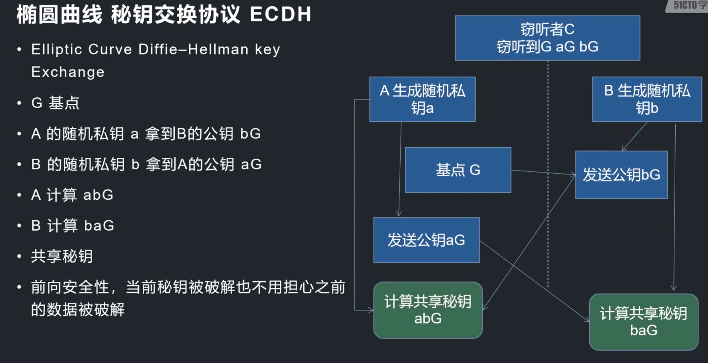

### [椭圆曲线算法（Elliptic Curve Cryptography，简称 ECC）](#)

**介绍**：椭圆曲线算法（Elliptic Curve Cryptography，简称 ECC）是一种基于椭圆曲线数学问题的公钥加密算法。它具有较短的密钥长度和高强度的安全性，因此在现代密码学中得到广泛应用。

-----

- [1. 基础数学原理简介](1-基础数学原理简介)


-----

### 1. 基础数学原理简介

椭圆曲线函数：
$$
y^2=x^3+ax+b
$$
一旦a,b确定，该方程就已经确定，由a,b确定的椭圆曲线方差机座 **E(a，b)**。当
$$
4a^3+27b^2
$$
不等于0时，称 **E(a，b)**是一条非奇异椭圆曲线，对于非奇异椭圆曲线，可以基于E（a，b）定义一个群。定义的群就是一个Abel群，具有重要的加法规则。

#### 1.1 椭圆曲线加密算法的基本原理

椭圆曲线加密算法的基本原理如下：

1. **椭圆曲线参数选择**：选择合适的椭圆曲线作为密码体制的基础，通常使用 Weierstrass 形式的曲线方程。

2. 密钥生成：通过选定的椭圆曲线生成公钥和私钥。
   - 公钥：根据曲线参数和私钥，通过点乘法操作计算出公钥点，通常表示为曲线上的一个点。
   - 私钥：随机生成一个大整数作为私钥。

3. 加密：使用对方的公钥对明文进行加密。
   - 随机生成一个临时私钥，并计算相应的临时公钥。
   - 将明文转化为曲线上的点。
   - 使用对方的公钥和临时公钥计算共享密钥。
   - 对明文进行加密，通常采用对称加密算法来保护数据的机密性。

4. 解密：使用自己的私钥对密文进行解密。
   - 使用自己的私钥和对方的临时公钥计算共享密钥。
   - 对密文进行解密，获取明文。


椭圆曲线算法相比传统的 RSA 算法具有以下优势：
- 安全性：相比较于相同安全级别下的 RSA 算法，ECC 使用更短的密钥长度，减少了存储和传输的成本，并提供了更高的安全性。
- 计算效率：ECC 的计算复杂度较低，对于相同的安全强度，它能够以更快的速度执行加密和解密操作。
- 存储空间占用：由于密钥长度较短，ECC 所需的存储空间也较小。

需要注意的是，椭圆曲线算法的实现依赖于大整数运算、点乘法等复杂的数学运算。因此，在实际应用中，通常使用密码学库（如 OpenSSL）提供的 API 来进行椭圆曲线算法的操作。


#### 1.2 椭圆曲线算法（ECC）的加解密流程如下

**参数选择**：

- 选择适当的椭圆曲线作为密码体制的基础，通常使用 Weierstrass 形式的曲线方程，并确定曲线参数。
- 选择一个生成元 G(x, y)，即曲线上的一个基点, x、y都是大数。

**密钥生成**：

- 随机选择一个 **私钥 k**，范围在 [1, n-1]，其中 n 是曲线上的阶数。
- 计算公钥 **Q** = k*G，即将基点 G 与私钥 k 进行点乘法运算得到公钥。
- 随机整数 R = r*G

**加密**：

- 首先，将待加密的明文消息 **m** 转换为曲线上的点 M，带入x 计算。
- 公钥加密： M + r\*k\*G

**解密**：

- 私钥解密 M‘ = C - k\*R

**ECC的数字签名有些不同**，它并不是把消息先用私钥加密再用公钥解密。而是将消息哈希后使用私进行运算得到一个新值，然后验证就是使用公钥和签名再次允许看能否得到 坐标(x,y)。


#### 1.3 openssl 支持的椭圆曲线

打印所有Openssl 支持的椭圆曲线、还支持 国密SM2 [81] 1172 SM2 curve over a 256 bit prime field 曲线。

```cpp
//打印所有支持的椭圆曲线
//椭圆曲线数量
int cur_len = EC_get_builtin_curves(NULL, 0);
EC_builtin_curve *curves = new EC_builtin_curve[cur_len];

EC_get_builtin_curves(curves, cur_len);

for (int i = 0; i < cur_len; i++) {
    cout << "[" << i <<"] "<< curves[i].nid << " " << curves[i].comment << std::endl;
}
```

### 2. 公钥密码

我们需要选择一条椭圆曲线来生成参数，可以使用 **EC_GROUP_new_by_curve_name** 接口

`EC_GROUP_new_by_curve_name`是 OpenSSL 中的一个函数，用于根据曲线名称创建一个新的椭圆曲线群组对象。

```cpp
#include <openssl/ec.h>

EC_GROUP *EC_GROUP_new_by_curve_name(int nid);
```
- **nid** 是表示椭圆曲线的标识符，它可以是 OpenSSL 中定义的预定义曲线的常量。
- 函数返回一个指向创建的椭圆曲线群组对象 `EC_GROUP` 的指针。如果发生错误，返回值为 NULL。

```cpp
#include <openssl/ec.h>

int main() {
    EC_GROUP *group;

    // 创建椭圆曲线群组对象
    group = EC_GROUP_new_by_curve_name(NID_secp256k1);
    if (group == NULL) {
        // 处理错误
        return -1;
    }

    // 使用椭圆曲线群组对象进行其他操作...

    // 释放椭圆曲线群组对象
    EC_GROUP_free(group);

    return 0;
}
```


#### 2.1 说明 

* 国密曲线 SM2，支持加解密
* 有的曲线如以太坊、比特币选择的NID_secp256k1 目前openssl不支持加解密，仅仅支持签名、秘钥交换。
* NID_ED25519

**secp256k1 曲线**（也称为 spec256k1 曲线）**是一个用于数字签名和密钥交换的椭圆曲线**。它在密码学应用中非常著名，**并且被广泛用于比特币和其他加密货币的密钥生成和签名过程**。

然而，secp256k1 曲线本身并不直接用于加密和解密数据。相反，它通常与其他加密算法（如对称加密算法或混合加密方案）结合使用，以提供安全的加密解决方案。

因此，在使用 secp256k1 曲线时，您通常会执行以下操作：

1. 密钥生成：使用 secp256k1 曲线生成公私钥对，其中私钥用于数字签名，公钥用于数据加密的密钥派生。
2. 数字签名：使用私钥对消息进行签名。
3. 加密：使用对称加密算法（如 AES）生成一个随机对称密钥，并使用该密钥加密要发送的消息。
4. 密钥交换：将生成的随机对称密钥通过公钥加密。
5. 解密：接收方使用私钥解密传输的对称密钥。
6. 解密消息：使用解密得到的对称密钥解密消息。

请注意，这只是一个一般性的概述。实际应用中，具体的加密和解密方案可能会有所不同，取决于您的需求和使用的密码算法。

总之，尽管 secp256k1 曲线本身不直接支持加密和解密，但它在保护私钥安全、数字签名和密钥交换等方面发挥着重要的角色。

#### 2.2 ECC 秘钥生成函数封装

选择 **NID_sm2** 曲线，支持加解密。

```cpp
//椭圆曲线的选择和秘钥生成
EVP_PKEY* EvpRCCKey() {
	 auto group = EC_GROUP_new_by_curve_name(NID_sm2); 
    // 选择国密 NID_SM2，支持加解密
	// NID_secp256k1 不支持支持加解密、仅仅签名、密钥交换
	 if (!group) {
		 ERR_print_errors_fp(stderr);
	 }
	 else {
		 //EC 秘钥存放上下文
		 auto key = EC_KEY_new();
		 //设置秘钥参数
		 EC_KEY_set_group(key, group);
		 
		 auto re = EC_KEY_generate_key(key);
		 if (re != 1) {
			 ERR_print_errors_fp(stderr);
		 }
		 else {
			 std::cout << "success" << std::endl;
			 //生成成功
			 EVP_PKEY* pkey = EVP_PKEY_new();
			 EVP_PKEY_set1_EC_KEY(pkey, key);
			 return pkey;
		 }
		 EC_KEY_free(key);
	 }
	return nullptr;
}
```

#### 2.3 NID_sm2 加解密测试

加解密测试：

```cpp
unsigned char data[1024] = { 0 };
unsigned char out[2046] = { 0 };
unsigned char out2[2046] = { 0 };

//初始化测试数据
for (int i = 0; i < sizeof(data) - 1; i++)
{
    data[i] = 'A' + i % 26;
}
int data_size = sizeof(data);

//ecc 密钥对生成
auto pkey = EvpRCCKey();

//ecc加密上下文初始化
auto ctx = EVP_PKEY_CTX_new(pkey, NULL);
if (!ctx)
{
    ERR_print_errors_fp(stderr);
}

//除了sm2 其他的一些算法会失败
int re = EVP_PKEY_encrypt_init(ctx);
if (re != 1)
{
    ERR_print_errors_fp(stderr);
}

//ecc 加密 不需要填充机制了
size_t out_len = sizeof(out);
EVP_PKEY_encrypt(ctx, out, &out_len, data, data_size);
cout << out_len << ":" << out << endl;


//ecc 解密
EVP_PKEY_decrypt_init(ctx);
size_t in_size = out_len;
out_len = sizeof(out2);
EVP_PKEY_decrypt(ctx, out2, &out_len, out, in_size);
cout << out_len << ":" << out2 << endl;

EVP_PKEY_free(pkey);
EVP_PKEY_CTX_free(ctx);
```

### 3. 数字签名

选择的曲线为 SM2

```cpp
//椭圆曲线的选择和秘钥生成
EVP_PKEY* EvpRCCKey() {
	 auto group = EC_GROUP_new_by_curve_name(NID_sm2); //选择国密 SM2，支持加解密
	//secp256k1 bu
	 if (!group) {
		 ERR_print_errors_fp(stderr);
	 }
	 else {
		 //EC 秘钥存放上下文
		 auto key = EC_KEY_new();
		 //设置秘钥参数
		 EC_KEY_set_group(key, group);
		 
		 auto re = EC_KEY_generate_key(key);
		 if (re != 1) {
			 ERR_print_errors_fp(stderr);
		 }
		 else {
			 std::cout << "success" << std::endl;
			 //生成成功
			 EVP_PKEY* pkey = EVP_PKEY_new();
			 EVP_PKEY_set1_EC_KEY(pkey, key);
			 return pkey;
		 }
		 EC_KEY_free(key);
	 }
	return nullptr;
}
```

选择的哈希算法为  **EVP_sm3**

```cpp
unsigned char data[1024] = { 0 };
unsigned char out[2046] = { 0 };
unsigned char out2[2046] = { 0 };

//初始化测试数据
for (int i = 0; i < sizeof(data) - 1; i++)
{
    data[i] = 'A' + i % 26;
}
int data_size = sizeof(data);

//ecc 密钥对生成
auto pkey = EvpRCCKey();

auto mctx = EVP_MD_CTX_new();

EVP_DigestInit(mctx, EVP_sm3());

EVP_DigestUpdate(mctx, data, data_size);

unsigned int outlen = 0;
int re = EVP_SignFinal(mctx, out, &outlen, pkey);
if (re != 1) {
    ERR_print_errors_fp(stderr);
}
cout << "re: " << re << std::endl;

//ecc 验签
EVP_DigestInit(mctx, EVP_sm3());
EVP_DigestUpdate(mctx, data, data_size);
// =1 验签成功
// s签名  kG 公钥
//s^-1hG + s^-1xkG
re = EVP_VerifyFinal(mctx, out, outlen, pkey);
cout << "EVP_VerifyFinal re = " << re << endl;
```


### 4. 秘钥交换 ECDH

**椭圆曲线密钥交换协议（Elliptic Curve Key Exchange Protocol，ECDH）是一种基于椭圆曲线密码学的密钥交换协议**。它允许两个通信方在不共享密钥的情况下通过公开的通道安全地协商出一个共享的对称密钥。

ECDH 协议的基本原理是利用椭圆曲线上的离散对数问题。它与传统的 Diffie-Hellman 密钥交换协议类似，但使用的是椭圆曲线运算而不是模幂运算。

下面是 ECDH 的基本步骤：

1. 双方选择一个相同的椭圆曲线（如 secp256k1）作为协商曲线。
2. 双方各自生成私钥和公钥。私钥是随机选择的一个整数，并保持私密。公钥是基于私钥通过椭圆曲线上的点乘运算生成的。
3. 双方交换各自的公钥。
4. 双方使用对方的公钥和自己的私钥进行椭圆曲线上的点乘运算，得到一个共享的协商结果。
5. 该协商结果可以被用作对称加密算法的密钥，用于加密和解密通信内容。

ECDH 协议的优势在于它提供了强大的安全性和较短的密钥长度。相比传统的 RSA 密钥交换，ECDH 在相同安全性水平下使用更短的密钥长度，从而提供更高的性能和效率。

需要注意的是，ECDH 协议仅提供密钥交换功能，并不涉及数据的加密和解密。为了保护通信内容的机密性，还需要使用该协商结果作为对称加密算法的密钥进行数据的加密和解密操作。

