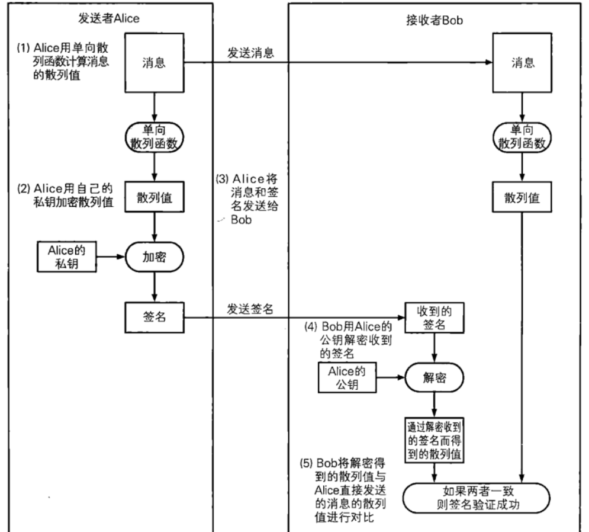

### [签名与验签](#)

**介绍**：数字签名是一种将相当于现实世界中的盖章、签字的功能在计算机世界中进行实现的技术。使用数字签名可以识别篡改和伪装，还可以防止否认。


如图是仅仅实现数字签名的流程图：




如果需要**提供安全性、发送方鉴别、报文完整性还需要更多的处理过程**。


1、防冒充(伪造)：私有密钥只有签名者自己知道，所以其他人不可能构造出正确的。 

2、鉴别身份：由于传统的手工签名一般是双方直接见面的，身份自可一清二楚。在网络环境中，接收方必须能够鉴别发送方所宣称的身份。 

3、防篡改(防破坏信息的完整性)：签名与原有文件已经形成了一个混合的整体数据，不可能被篡改，从而保证了数据的完整性。

4、防重放：采用了对签名报文添加流水号、时间戳等技术，可以防止重放攻击。

5、防抵赖。在数字签名体制中，要求接收者返回一个自己的签名表示收到的报文，给对方或者第三方或者引入第三方机制。如此操作，双方均不可抵赖。

6、机密性(保密性)。手工签字的文件(如同文本)是不具备保密性的，文件一旦丢失，其中的信息就极可能泄露。可以对数字签名的报文进行加密。


### 1. EVP 已经由好几种签名方式

* 针对hash后的数组进行签名
* 直接从明文开始签名，需要计算hash然后再加密


#### 1.1  EVP 签名

[**注意事项**](#) ：使用EVP进行前面，对于生成的签名大小有一定规定，不能够超过 非对称加密密钥的长度。

例如你的私钥长度是：512bit 64 位。也就是说加上填充机制，hash值的长度就不能够超过 64 - RSA_PKCS1_PADDING_SIZE，也就是说hash算法只能选择

* EVP_sha256()
* EVP_sha3_384()
* EVP_md5()
* EVP_sm3()


```cpp
int EvpRSAGetSignByMessage(RSA* r, const unsigned char* data, int data_size, unsigned char* sign_out, int out_size) {
	int key_size = RSA_size(r);

	EVP_PKEY* pkey = EVP_PKEY_new();
	EVP_PKEY_set1_RSA(pkey, r);


	auto mctx = EVP_MD_CTX_new();
	//指定签名算法
	EVP_SignInit(mctx, EVP_sha256());

	//消息生成hash 值
	EVP_SignUpdate(mctx, data, data_size);

	//取出hash值并用私钥加密
	unsigned int sign_size = 0;

	if (EVP_SignFinal(mctx, sign_out, &sign_size, pkey) <= 0) {
		EVP_MD_CTX_free(mctx);
		ERR_print_errors_fp(stderr);
		return -1;
	}

	std::cout << "sign_size:" << sign_size << std::endl;

	EVP_MD_CTX_free(mctx);
	EVP_PKEY_free(pkey);
	return sign_size;
}
```

使用测试:

```cpp
const unsigned char data[] = { "012345670123456701234567s984das324d98w132daasdasdasdasd4871dqasd597646489sd23a4s98dqwd46a561a2f1ghtgh4tasdasdahgh5+56584as5d18wf3a1sd89wd3w489dasd"
};

auto data_size = strlen((char*)data);

unsigned char out[1024] = { 0 }; //加密后
unsigned char out2[1024] = { 0 }; //解密后

unsigned char sign_out[1024] = { 0 }; //解密后

RSA* r = nullptr;

FILE* prif = fopen("prikey.pem", "r");
if (!prif) return -1;

if (PEM_read_RSAPrivateKey(prif, &r, NULL, NULL) == NULL) {
    RSA_free(r);
    fclose(prif);
    return -1;
}

auto sign_size = EvpRSAGetSignByMessage(r, data, data_size, sign_out, 1024);

std::cout << sign_size << std::endl;
std::cout << sign_out << std::endl;

RSA_free(r);
```


#### 1.2 EVP 验签

```cpp
// r 是 公钥
// data 是明文
// data_size 明文长度
bool EvpRSAVerifySignature(RSA* r, const unsigned char* data, int data_size, const unsigned char* sign, int sign_size) {
	int key_size = RSA_size(r);

	EVP_PKEY* pkey = EVP_PKEY_new();
	EVP_PKEY_set1_RSA(pkey, r);

	//验签 选择 hash 算法
	auto mctx = EVP_MD_CTX_new();
	EVP_VerifyInit(mctx, EVP_sha256());
	//生成单向散列
	EVP_VerifyUpdate(mctx, data, data_size);
	//验签名 对比
	int re=  EVP_VerifyFinal(mctx, 
		sign, //签名
		sign_size, //签名大小
		pkey); //公钥

	EVP_MD_CTX_free(mctx);
	EVP_PKEY_free(pkey);
	return re == 1;
}
```


#### 1.3 测试

测试代码：

```cpp
const unsigned char data[] = {    "012345670123456701234567s984das324d98w132daasdasdasdasd4871dqasd597646489sd23a4s98dqwd46a561a2f1ghtgh4tasdasdahgh5+56584as5d18wf3a1sd89wd3w489dasd"
};

auto data_size = strlen((char*)data);

unsigned char out[1024] = { 0 }; //加密后
unsigned char out2[1024] = { 0 }; //解密后

unsigned char sign_out[1024] = { 0 }; //解密后

RSA* rPub = nullptr;
RSA* rPri = nullptr;

FILE* pubf = fopen("pubkey.pem", "r");
FILE* prif = fopen("prikey.pem", "r");

if (!pubf) return -1;
if (!prif) return -1;

if (PEM_read_RSAPublicKey(pubf, &rPub, NULL, NULL) == NULL) {
    RSA_free(rPub);
    fclose(pubf);
    return -1;
}

if (PEM_read_RSAPrivateKey(prif, &rPri, NULL, NULL) == NULL) {
    RSA_free(rPri);
    fclose(prif);
    return -1;
}

auto sign_size = EvpRSAGetSignByMessage(rPri, data, data_size, sign_out, 1024);

std::cout << boolalpha << EvpRSAVerifySignature(rPub, data, data_size, sign_out, sign_size) << std::endl;

RSA_free(rPri);
RSA_free(rPub);
```

