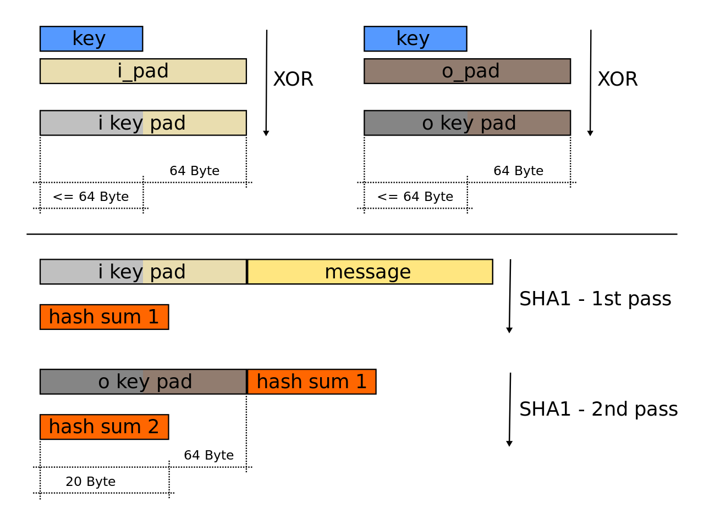

### [HMAC](#)

**介绍**：在现代的网络中，身份认证是一个经常会用到的功能，在身份认证过程中，有很多种方式可以保证用户信息的安全，而MAC(message authentication code)就是一种常用的方法，HMAC 是Keyed-Hashing for Message Authentication的缩写。


#### [1. MAC 消息鉴别码](#)

用于鉴定一个报文的完整性，通信双方需要一个共享密码s, s被称为鉴别秘钥。发生需要发送m，则实际发送 **( m ,H(m + s) )**。 接收方收到数据后，得到消息m，然后 使用s追加到m后面进行哈希运算得到 **H‘(m + s)**，HMAC 实际上通过散列函数运行数据和鉴别秘钥两次。

如何每个发送方的s不同，就可以对消息来源进行鉴别。

#### [1.1 HMAC](#)

HMAC算法的数学公式为：**HMAC(k,m)=H(k’⊕opad,H(k’⊕ipad,m))**
其中：

* **H** 为密码 Hash 函数（如MD5或SHA-2），能够对明文进行分组循环压缩。
* **k** 为密钥（secret key）。
* **m** 为要认证的消息。
* **k’** 是从原始密钥 k 导出的另一个密钥（如果 k 短于散列函数的输入块大小，则向右填充零；如果比该块大小更长，则对 k 进行散列）。
* **ipad** 内部填充（0x5C5C5C…5C5C，一段十六进制常量） 64 个0x5C。
* **opad** 外部填充（0x363636…3636，一段十六进制常量）64 个0x36。

它要求通信双方共享密钥、约定算法、对报文进行Hash运算，形成固定长度的认证码。通信双方通过认证码的校验来确定报文的合法性



HMAC是密钥相关的哈希运算消息认证码（Hash-based Message Authentication Code）的缩写。HMAC中的H代指Hash散列算法，HMAC可以使用多种单项散列式，例如使用SHA-1，则构成HMAC-1，选用SHA-256散列算法，则构成HMAC-256。

* 在密钥k后面添加0，或者对密钥k用H（Hash函数）进行处理，创建一个字长为B的字符串（B为Hash函数的明文分组长度）；
* 将上一步生成的B字长的字符串ipad做异或运算；
* 将数据流m填充至第二步的结果字符串中；
* 用H作用于第三步生成的数据流；
* 将第一步生成的B字长字符串与opad做异或运算；
* 再将第四步的结果填充进第五步的结果中；
* 用H作用于第六步生成的数据流，输出最终结果。
  

#### [1.2 HMAC算法中两次hash的目的是什么](#)

HMAC（Hash-based Message Authentication Code）是一种通过使用散列函数和密钥生成认证码的算法。在 HMAC 算法中，会将数据与密钥进行两次散列运算，目的有以下两点：

1. 加强安全性：首先，使用密钥对原始数据进行散列运算，这样可以将密钥的信息混入散列结果中。然后，将第一次散列的结果再次与密钥进行散列运算。通过进行两次散列，可以增加攻击者猜测密钥的难度，提高算法的安全性。
2. 抵抗长度扩展攻击：长度扩展攻击是一种针对散列函数的攻击方式。攻击者可以利用已知散列值和散列函数的特性，通过追加额外的数据产生新的散列值，而不需要知道实际的数据内容。为了防止这种攻击，HMAC 算法在第二次散列时将第一次散列结果与密钥再次进行散列，确保只有持有密钥的人才能正确计算出最终的认证码。

通过两次散列运算，HMAC 确保了数据完整性和身份认证的安全性。在实际应用中，HMAC 可以用于验证消息完整性、数字签名、身份认证等场景。


#### 1.3  防止重放攻击

时间戳、不重数。


#### 1.4 缺点

鉴别缺陷：由于共享秘钥，发送方可以不承认自己发送过数据，因为对端也有秘钥，发送方可以狡辩消息是对端伪造的，所以需要非对称秘钥体系。

重放攻击：共享秘钥如果不每次就更新一此，就会面临消息重放的危险，所以需要不重数、时间戳来解决。


### openssl HMAC


获得消息鉴别码:

返回数据 + hmac

```cpp
std::string GetHMAC1() {
	uint8_t data[1024] = "HMAC1";
	int data_size = strlen((char*)data);

	unsigned char mac[1024] = { 0 };
	unsigned char key[1024] = "1213456"; //秘钥

	unsigned int mac_size = 0;
	HMAC(
		EVP_sha256(),			// 哈希算法 256 也就是 32 个字节
		key,					// 秘钥
		strlen((char*)key),		// 长度
		data,					// 数据
		data_size,              // 数据长度
		mac,					// 数据
		&mac_size				// 数据mac的大小
	);	
	string message(data, data + data_size);
	message.append(mac, mac + mac_size);
	return message;
}
```

鉴别函数：

```cpp
bool CheckHMAC(std::string message) {
	unsigned char key[1024] = TEST_KEY; //秘钥

	unsigned char _mac[1024] = { 0 };
	unsigned int _mac_size = 0;
	HMAC(
		EVP_sha256(),			// 哈希算法 256 也就是 32 个字节
		key,					// 秘钥
		strlen((char*)key),									// 长度
		(unsigned char*)message.c_str(),					// 数据
		message.size() - 32,    // 数据长度
		_mac,					// 数据
		&_mac_size				// 数据mac的大小
	);
	unsigned char mac[32];
	std::memcpy(mac, message.c_str() + message.size() - 32, 32);
	for (int i = 0; i < 32; i++)
	{
		if (mac[i] != _mac[i]) return false;
	}
	return true;
}
```

测试：

```cpp
std::cout<< std::boolalpha << CheckHMAC(GetHMAC1());
```

