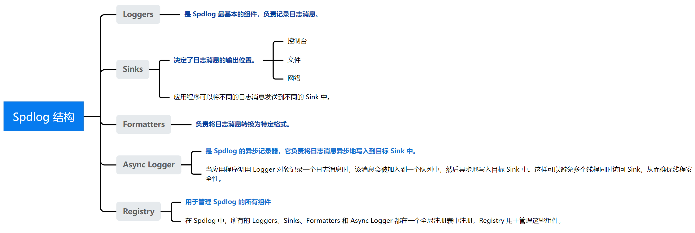

## [C++ Spdlog日志库 ](https://github.com/gabime/spdlog)
**介绍**：spdlog（Super Fast C++ Logging Library）是一个快速、异步、线程安全、高性能的C++ (header-only) 日志库，它提供了简单易用的API和丰富的功能，能够满足各种日志记录需求，它使用[fmt](https://github.com/fmtlib/fmt)库提供了类似于python的格式化API（请参阅参考资料）。

-----

#### [导图](#)

Spdlog 由五个主要组件构成：**Loggers**、**Sinks**、**Formatters**、**Async Logger** 和 **Registry**。每个组件都扮演着不同的角色，共同协作记录并输出日志消息。

#### [目录](#)

- [C++ spdlog 使用方法](./contents/001basicUse.md)

**参考:**

> https://www.zhihu.com/column/c_1622996866337132544
> 
> [https://github.com/gabime/spdlog](https://github.com/gabime/spdlog)