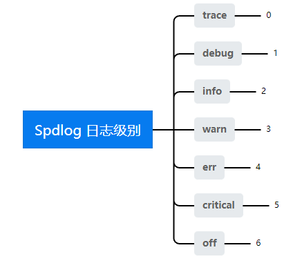
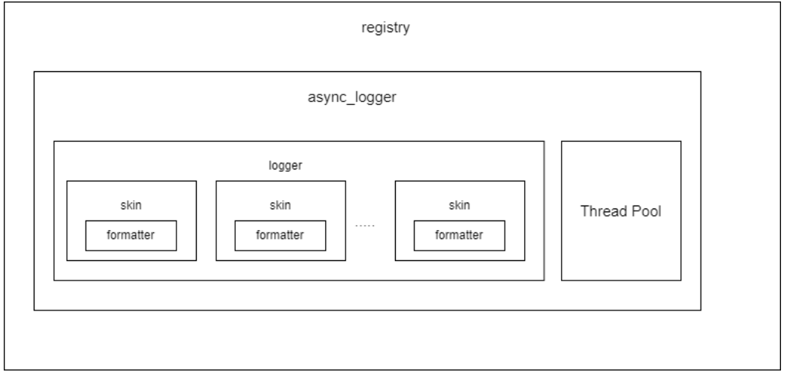

### [C++ spdlog Logger 使用方法](#)
**介绍**: spdlog是一个开源的、快速的、仅有头文件的C++日志库。它提供了向stream、标准输出、文件、系统日志、调试器等目标输出日志的能力，支持的平台包括Windows、Linux、Mac、Android。

-----
- [1. spdlog 基本常识](#1-spdlog-基本常识)
- [2. 相关术语](#2-相关术语)
- [3. 输出到终端上面](#3. 输出到终端上面)
- [4. Spdlog 记录日志的流程](#4-spdlog-记录日志的流程)


----
### [1. spdlog 基本常识](#)
spdlog中各对象都分为**多线程和单线程版本**：

* \*_st：单线程版本，不用加锁，效率更高；
* \*_mt：多线程版本，用于多线程程序下是线程安全的；

spdlog **整体结构**可分为三层，自下而上分别是:

* **sink** 执行具体的动作，如写入日志文件或者输出到命令行；
* **logger**，用户调用logger的方法，执行相关动作，logger会调用自身的所有sink进行输出；
* **registry**, 管理所有的logger，用户创建的logger会注册到registry统一管理。可以通过spdlog::get()访问已创建的logger；

spdlog 的头文件可以**按需引用**，而不是全部使用它！

例如：

* 如果您只需要旋转记录器，则需要包含头文件 **spdlog/ssink/rotating_file_sink.h**

* 如果你需要获得异步日志记录功能则只需要包含头文件 **spdlog/async.h**。

```cpp
#include <iostream>
#include "spdlog/spdlog.h"
#include "spdlog/sinks/basic_file_sink.h" // support for basic file logging
#include "spdlog/sinks/rotating_file_sink.h" // support for rotating file logging

int main(int, char* [])
{
        try 
        {
            //  创建基本的文件日志记录器
            auto my_logger = spdlog::basic_logger_mt("basic_logger", "logs/basic.txt");
            //  创建基本的旋转记录器 5MB大小 3 个旋转文件 
            auto file_logger = spdlog::rotating_logger_mt("file_logger", "myfilename", 1024 * 1024 * 5, 3);
        }
        catch (const spdlog::spdlog_ex& ex)
        {
            std::cout << "Log initialization failed: " << ex.what() << std::endl;
        }
}
```

使用工厂方法创建异步记录器：

```cpp
#include <iostream>
#include "spdlog/spdlog.h"
#include "spdlog/async.h" //support for async logging.
#include "spdlog/sinks/basic_file_sink.h"

int main(int, char* [])
{
    try
    {        
        auto async_file = spdlog::basic_logger_mt<spdlog::async_factory>("async_file_logger", "logs/async_log.txt");
        for (int i = 1; i < 101; ++i)
        {
            async_file->info("Async message #{}", i);
        }
        // Under VisualStudio, this must be called before main finishes to workaround a known VS issue
        spdlog::drop_all(); 
    }
    catch (const spdlog::spdlog_ex& ex)
    {
        std::cout << "Log initialization failed: " << ex.what() << std::endl;
    }
}
```

#### [1.1 异步日志记录](#)
默认情况下，Spdlog 是同步日志记录器，这意味着每个日志语句都会阻塞程序，直到日志记录完成。如果你的应用程序需要高效的日志记录功能，可以使用异步日志记录器。异步日志记录器可以将日志记录操作放入另一个线程中，从而避免阻塞应用程序的主线程。

```cpp
auto async_logger = spdlog::basic_logger_mt<spdlog::async_factory>("async_logger", "logs/async_log.txt");
//在上面的代码中，"async_factory" 表示使用异步工厂创建日志记录器。
```

**创建异步记录器并更改线程池设置**

```cpp
#include "spdlog/async.h" //support for async logging
#include "spdlog/sinks/daily_file_sink.h"
int main(int, char* [])
{
    try
    {                                        
        auto daily_sink = std::make_shared<spdlog::sinks::daily_file_sink_mt>("logfile", 23, 59);
        // default thread pool settings can be modified *before* creating the async logger:
        spdlog::init_thread_pool(10000, 1); // queue with 10K items and 1 backing thread.
        auto async_file = spdlog::basic_logger_mt<spdlog::async_factory>("async_file_logger", "logs/async_log.txt");       
        spdlog::drop_all(); 
    }
    catch (const spdlog::spdlog_ex& ex)
    {
        std::cout << "Log initialization failed: " << ex.what() << std::endl;
    }
}
```

#### [1.2 日志记录槽sink](#)
spdlog定义了几种sink，用于不同场景下日志输出，具体包括：

* 生成日志文件；
* 控制台日志输出（支持颜色）；
* 支持设置日志文件占用的最大空间，以及最多包含多少个；
* 支持每天生成日志文件；

#### [1.3 日志级别](#)
spdlog默认支持七种日志级别，spdlog以枚举的方式提供了七个等级, 等级按照大小进行排序，**设定等级A后，小于A的信息将不再输出**。



```cpp
//定义
namespace spdlog::level{
    enum level_enum {
        trace = SPDLOG_LEVEL_TRACE 0
        debug = SPDLOG_LEVEL_DEBUG 1
        info  = SPDLOG_LEVEL_INFO  2(默认输出等级)
        warn = SPDLOG_LEVEL_WARN 3
        err = SPDLOG_LEVEL_ERROR   4
        critical = SPDLOG_LEVEL_CRITICAL 5
        off  = SPDLOG_LEVEL_OFF 6
    }
}
```

使用：

```cpp
spdlog::set_level(spdlog::level::warn); //设置登记

spdlog::info("what we use {}", "spdlog");
spdlog::warn("what warning we use {}", "spdlog");
spdlog::error("what error we use {}", "spdlog");
```

#### [1.4 日志分割](#)
当您的应用程序需要记录大量的日志信息时，单个日志文件可能会变得非常大，这可能会影响应用程序的性能和稳定性。为了避免这个问题，Spdlog 提供了日志分割功能,您可以使用以下代码创建一个自动滚动的日志记录器：

```cpp
auto rotating_logger = spdlog::rotating_logger_mt("rotating_logger", "logs/rotating_log.txt", 1048576, 5);
```

在上面的代码中，**rotating_logger** 表示日志记录器的名称，**logs/rotating_log.txt** 表示日志文件的路径，**1048576** 表示每个日志文件的大小（以字节为单位），**5** 表示保留的日志文件数量。

#### [1.5 自定义日志格式](#)
Spdlog 默认提供了多种日志格式，但您也可以根据需要自定义日志格式。以下是自定义日志格式的示例代码：

```cpp
spdlog::set_pattern("[%Y-%m-%d %H:%M:%S.%e] [%l] %v");
```

在上面的代码中，"[%Y-%m-%d %H:%M:%S.%e]" 表示时间戳的格式，"[%l]" 表示日志级别，"%v" 表示日志内容。


### [2. 相关术语](#)

|术语|释义|
|:----|:----|
|logger|用于记录日志的对象|
|rotate|日志文件的切换|
|registry|注册处，从统一一个位置来获得logger|
|sink|实际执行落日志到文件或DB动作的类|
|mt|multiple-thread 的缩写，带 `_`mt后缀的是多线程安全的|
|st|single-thread 的缩写，带`_`st的函数非线程安全的|
|ex|exception的缩写，`spdlog::spdlog_ex`|
|slot|插槽，在spdlog线程池构造时，预分配queue slot|
|tweaking|(稍稍改进)，自己可以指定一些参数。|
|flush|刷日志|
|bundled|捆绑的，spdlog/include/spdlog/fmt/bundled/ 使用的外部库的代码|

#### [2.1 Spdlog 的线程安全性](#)
spdlog 允许我们自由创建线程安全和非线程安全（单线程）的日志，其设置在基类`base_skin` 中

```cpp
template<typename Mutex>
class SPDLOG_API base_sink : public sink
{
public:
    void log(const details::log_msg &msg) final;
protected:
    Mutex mutex_;
}

template<typename Mutex>
void SPDLOG_INLINE spdlog::sinks::base_sink<Mutex>::log(const details::log_msg &msg)
{
    std::lock_guard<Mutex> lock(mutex_);
    sink_it_(msg);
}
```

每个sink都会继承 base_sink，通过模板参数 `Mutex` 传入锁。可以看到写日志函数 `log` 调用了 `std::lock_guard` 来使用锁。

在实际使用中如果想要线程安全，可以传入c++的 mutex（c++11开始支持），也可以自定义。如下是一个声明线程安全例子：

```cpp
using kafka_sink_mt = kafka_sink<std::mutex>;
```

当然spdlog 也为我们提供了单线程的 mutex：

```cpp
struct null_mutex
{
    void lock() const {}
    void unlock() const {}
};

using kafka_sink_st = kafka_sink<spdlog::details::null_mutex>;
```


#### [2.2 Spdlog 的同步和异步模式](#)
**同步模式**

在同步模式下，Spdlog 将日志消息直接写入目标 Sink，不使用内存队列。这种模式下，应用程序在记录日志消息时，必须等待消息写入目标 Sink 后才能继续执行。同步模式可以保证日志消息的实时性，但是可能会影响程序的性能，特别是在大量记录日志消息时。如果应用程序不需要实时记录日志消息，可以使用异步模式来提高性能。

**异步模式**

在异步模式下，日志消息被加入到一个内存队列中，然后异步地写入目标 Sink。异步模式可以提高日志记录的性能，尤其是在多线程环境下，因为它可以避免多个线程同时访问 Sink，从而提高线程安全性。

在 Spdlog 中，异步模式由 Async Logger 实现。**Async Logger** **在后台运行一个线程**，**负责从内存队列中获取日志消息**，**并将其写入目标 Sink 中**。**Async Logger 可以配置多个 Sink，每个 Sink 都会有一个独立的内存队列**。


**Spdlog 提供了两种内存队列实现**：unbounded 和 bounded。unbounded 内存队列没有大小限制，可以一直增长，直到内存耗尽。bounded 内存队列有一个固定的大小，超过大小限制后，新的消息将被丢弃。

在使用异步模式时，需要注意以下事项：

- 处理内存队列时可能会出现内存分配问题和锁竞争问题，需要谨慎设计和测试。
- 如果内存队列大小有限制，需要根据应用程序的需求和硬件资源进行适当的调整。
- 在应用程序退出时，需要等待所有日志消息写入完成，否则可能会丢失一些日志消息。

异步模式可以大大提高日志记录的性能，但是也需要谨慎使用和测试。如果内存队列大小限制不当或处理不当，可能会导致内存占用过高或日志消息丢失等问题。


### [3. 输出到终端上面](#)
输出到终端有许多方式，可以直接使用静态方法，还可以通过创建sink的方式。


#### [3.1  直接使用静态方法](#)
spdlog提供了静态方法将日志消息直接输出到终端：

```cpp
spdlog::info("Initialise Thread Pool argc - cores:{0} type:{1} maxQueueSize:{2} maxthread {3}", 4, "Flexible", 2048, 16);
//错误信息
spdlog::error("create core thread failed {0} {1}", __FILE__, __LINE__);
//二进制显示
spdlog::warn("Easy padding in numbers like {:08d}", 12);
//各种进制支持
spdlog::critical("Support for int: {0:d};  hex: {0:x};  oct: {0:o}; bin: {0:b}", 42);
//精度
spdlog::info("Support for floats {:03.2f}", 1.23456);
//左对齐
spdlog::info("{:<30}", "left aligned");
```

方法定义：

```cpp
template<typename... Args>
inline void trace(format_string_t<Args...> fmt, Args &&...args)
{
    default_logger_raw()->trace(fmt, std::forward<Args>(args)...);
}

template<typename... Args>
inline void debug(format_string_t<Args...> fmt, Args &&...args)
{
    default_logger_raw()->debug(fmt, std::forward<Args>(args)...);
}

template<typename... Args>
inline void info(format_string_t<Args...> fmt, Args &&...args)
{
    default_logger_raw()->info(fmt, std::forward<Args>(args)...);
}

template<typename... Args>
inline void warn(format_string_t<Args...> fmt, Args &&...args)
{
    default_logger_raw()->warn(fmt, std::forward<Args>(args)...);
}

template<typename... Args>
inline void error(format_string_t<Args...> fmt, Args &&...args)
{
    default_logger_raw()->error(fmt, std::forward<Args>(args)...);
}

template<typename... Args>
inline void critical(format_string_t<Args...> fmt, Args &&...args)
{
    default_logger_raw()->critical(fmt, std::forward<Args>(args)...);
}
```

#### [3.2 控制台日志](#)

**stdout_color_mt**多线程，**stdout_color_st** 单线程 !

```cpp
#include "spdlog/spdlog.h"
#include "spdlog/sinks/stdout_color_sinks.h"
void stdout_example()
{
    // create color multi threaded logger
    auto console = spdlog::stdout_color_mt("console");    
    auto err_logger = spdlog::stderr_color_mt("stderr");    
    spdlog::get("console")->info("loggers can be retrieved from a global registry using the spdlog::get(logger_name)");
}
```


### [4. Spdlog 记录日志的流程](#)

Spdlog 由五个主要组件构成：Loggers、Sinks、Formatters、Async Logger 和 Registry。每个组件都扮演着不同的角色，共同协作记录并输出日志消息。



当应用程序调用 Spdlog 记录日志时，**Spdlog的流程**如下：

1. 获取一个 Logger 对象。
2. 使用该 Logger 对象记录一个日志消息，该消息包括日志级别、时间戳、线程 ID、文件名和行号等信息。
3. 将日志消息传递给 Formatter，将消息转换为特定格式。
4. 将格式化后的消息传递给 **Async Logger**。
5. Async Logger 将消息写入目标 Sink，完成日志记录。

Spdlog 的流程非常简单，但是每个组件都扮演着重要的角色。Loggers 负责记录日志消息，Sinks 决定了日志消息的输出位置，Formatters 负责将日志消息转换为特定格式，Async Logger 异步地将日志消息写入到目标 Sink 中，Registry 用于管理这些组件。


